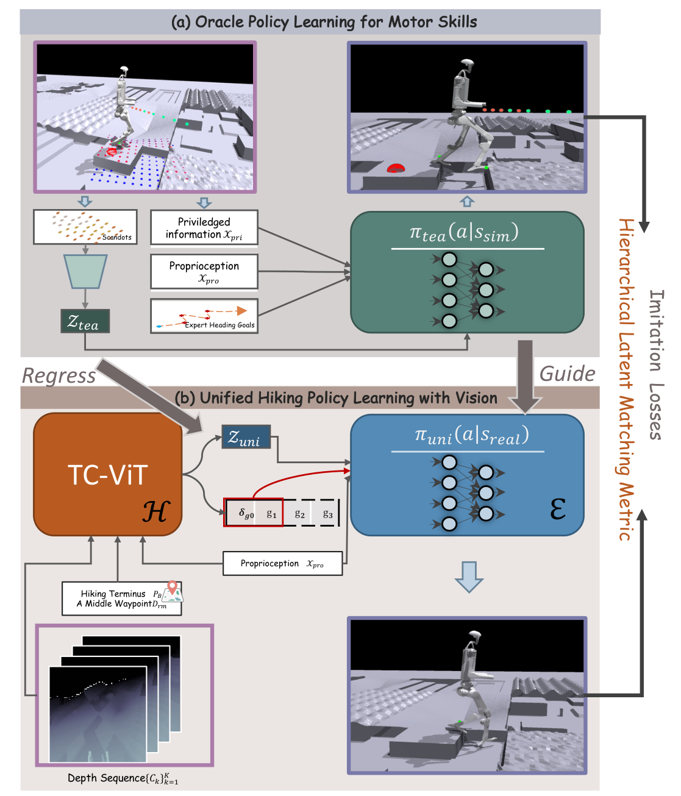

# LEGO-H：面向复杂山径的人形机器人一体化技能学习

复杂山径不是单一地形技能。机器人既要从视觉判断短期路线，又要根据身体尺寸、当前速度和可执行动作决定是跨、跳、侧身还是绕开。传统导航先给固定局部目标、低层策略再盲目跟随，两个模块的误差往往在障碍前才暴露。LEGO-H保留高低层功能分工，但让导航表示和运动执行在同一策略训练中相互影响。

## 高层不是输出一条刚性轨迹

TC-ViT读取视觉与机器人状态，预测一串按时间排列的局部导航目标；未来目标帮助理解趋势，只有最近目标进入当前locomotion module。这样高层可以提前看见转弯或障碍，又不会要求低层机械追踪一条早已因接触扰动失效的长轨迹。感知与控制频率不同，系统用最近可用目标进行异步协调。

> **主要方法图：** Figure 3，PDF第4页。a先用特权地形和专家导航目标训练oracle motor policy；b把导航模块H与locomotion模块E组合成视觉闭环的统一hiking policy。来源：[原论文](https://arxiv.org/abs/2505.06218)。

## 特权教师怎样把技能交给视觉学生

Oracle接收本体感觉、当前目标、地形真值和环境参数，用PPO学出多种运动技能。视觉学生除了RL回报与普通动作模仿，还使用Hierarchical Latent Metric：先用带随机关节mask的VAE学习教师动作内部的关节协同结构，再比较教师与学生在这个结构空间中的一致性。目的不是逐关节死跟动作，而是在跨视觉模态蒸馏时保住“哪些关节应一起动”的身体合理性。

论文在Unitree H1和G1上比较了不同尺寸本体，观察到同一路径下会出现不同下台阶或侧身策略。它说明统一训练可以连接导航决定与身体能力，但不能理解成完全端到端、没有层级：H和E仍是明确模块，oracle、目标序列和动作结构损失也都是人工设计的归纳偏置。

## 应怎样评估这类系统

除任务成功率外，还应记录路径效率、碰撞、最小稳定裕度、动作饱和、导航目标跳变和失败发生在哪一层。若只看机器人最终是否到达，很难区分视觉路线判断正确但低层没执行，还是低层稳定但高层把它引向不可通行区域。截至2026-07-14，官方项目页仍标注`Code Coming Soon`，不能把论文与视频展示写成代码已经开源。

## 视觉目标怎样变成全身动作

高层TC-ViT接收场景视觉和机器人状态，输出带时间顺序的局部目标序列；低层只消费最近目标、本体状态和可用地形表示，产生全身关节位置目标。训练oracle可读取特权地形和环境参数，视觉学生通过动作模仿、RL回报和层级latent约束继承其能力。速度与目标进度奖励决定向哪里走，姿态、接触、能耗和动作正则决定怎样走，不能把高层目标预测的改进误写成低层稳定性提升。

系统采用异步视觉与控制，目标序列的时间基准、更新频率和过期处理直接影响转弯与起跳。真实山径还会出现深度空洞、强光、植被、移动物体和路径死端；论文的统一训练能协调已覆盖技能，但没有证明会生成训练库外的新动作。部署日志应同时保存原始视觉、预测目标、低层观测动作和接触事件，用分层失败标签评估高层、低层与状态估计。

## 原文与项目

[论文原文](https://arxiv.org/abs/2505.06218) · [官方项目页](https://lego-h-humanoidrobothiking.github.io/)
