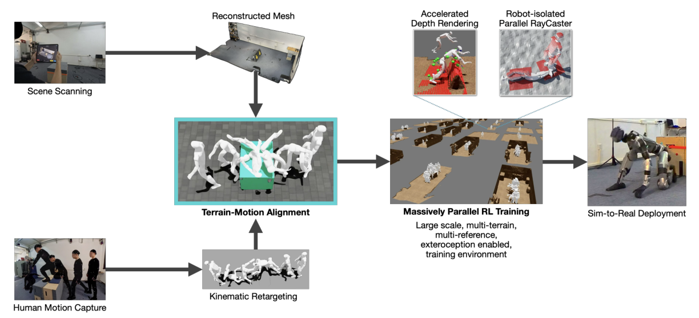

# Deep Whole-Body Parkour：基于深度强化学习的全身跑酷控制

普通Motion Tracking把参考动作当作与环境无关的时间序列：如果机器人起点与箱子偏了十厘米，仍按原时间伸手和翻越，动作本身可能很像，接触却必然失败。本文把真实场景扫描与人类示范空间对齐，生成“动作-地形”成对数据，再让策略同时读取参考动作、本体历史和机载深度，从而在起点、角度或障碍略有变化时主动修正全身接触。

> **主要方法图：** Figure 2，PDF第2页。真实环境扫描和人类示范先被处理、重定向并对齐成动力学可训练的motion-terrain pairs，随后用带外感知的大规模RL训练真机策略。来源：[原论文](https://arxiv.org/abs/2601.07701)。

## 数据准备决定任务是否可学

作者先扫描平台、栏杆等功能几何，同时采集与场景配准的人体动作；动作经GMR重定向到Unitree G1，场景网格被清理成可稳定碰撞的仿真模型。随后还要检查动作与静态地形是否穿透、关键手脚接触是否对齐，并通过rollout过滤机器人根本无法执行的组合。这里的数据不是“一个动作文件加一个随机地形”，而是包含接触时空对应关系的联合样本。

## 策略追踪什么，又根据视觉改什么

训练采用asymmetric PPO。Actor输入单帧带噪深度、8帧本体历史以及参考运动信息；critic可看无噪高度和更多特权量。奖励同时约束全局根状态、相对参考坐标系中的关键link位姿与速度，并加入动作平滑。相对坐标表达让策略既保持翻越、撑手、滚动等动作结构，又能根据实际障碍位置调整接触时机。

真机部署在29自由度Unitree G1上，头部RealSense D435i提供深度。系统仍会在普通行走策略与指定跑酷参考之间切换，因此它不是任意环境自主发现技能，而是“给定一段已配准技能后进行视觉闭环执行”。论文最有价值的进展，是把脆弱的开环参考回放变成对场景位置变化有反馈的多接触跟踪。

这种修正不是显式地先规划一条新轨迹，而是通过闭环策略隐式完成：参考窗口规定翻越动作的大致阶段，深度图指出障碍实际表面，本体历史反映身体是否已经提前或滞后，actor据此调整下一步关节目标。训练时对初始位置、朝向和场景几何做扰动，才能让这些偏差进入可恢复分布。若实际障碍超出深度视野、参考中要求的接触面不存在，或误差大到错过了撑手阶段，策略并没有一个通用重规划器把动作自动换成另一种技能。

## 证据边界与复现重点

当前实验覆盖少量动作与地形组合，跨场景规模和长期硬件可靠性仍待扩展。复现优先检查扫描坐标系、人体轨迹、机器人参考根坐标、相机外参和真机里程计是否一致；这些量只要有一个漂移，奖励看似收敛，手脚接触仍会错位。

验收时应把“动作外形跟踪”和“接触任务完成”分开：前者看关键link误差，后者看手脚是否落在有效区域、是否穿透、接触持续时间和整段成功率。仅展示一次翻越视频无法区分策略真的利用视觉，还是场景仍与训练参考几乎完全对齐。

## 原文、项目与代码

[论文原文](https://arxiv.org/abs/2601.07701) · [项目与开源基础设施](https://project-instinct.github.io/deep-whole-body-parkour/)
