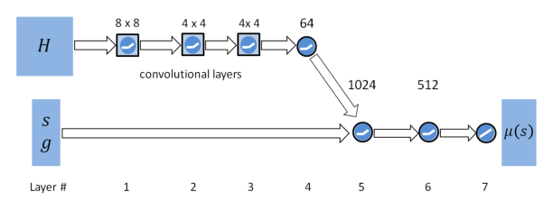

# DeepMimic：示例引导的物理角色技能深度强化学习

DeepMimic不是让网络“看视频后自己学会动作”，而是先给物理角色一条逐帧参考轨迹，再用强化学习寻找一套能在动力学和接触约束下追上这条轨迹的控制策略。它真正奠定的是Motion Tracking范式：动作数据规定“应该怎么动”，任务奖励规定“还要完成什么事”，策略负责在两者之间找到可执行解。

> **主要方法图：** Figure 2，PDF第4页。图中以地形任务为例：高度图经CNN编码后，与角色状态和任务目标拼接，再由MLP输出动作。来源：[原论文](https://arxiv.org/abs/1804.02717)。

## 参考动作怎样变成奖励

每个训练时刻都有一个相位变量，用它从动作片段中取出目标姿态。模仿奖励不是单一的关节角误差，而是同时比较关节姿态、关节速度、关键末端位置和质心位置；不同误差经指数函数转成奖励后加权。这样做的含义是：关节角负责动作外形，速度负责节奏，手脚位置约束接触几何，质心约束整体动态。如果只保留姿态项，角色可能“摆得像”却没有正确动量；如果权重和坐标系处理不当，几个目标也会互相打架。

策略观察当前物理状态、动作相位以及可选的任务目标，输出关节目标，再由PD控制器转成力矩。训练还使用Reference State Initialization：回合不总从动作第一帧开始，而是从参考片段的随机时刻初始化。这既扩大了状态覆盖，也让策略学会从动作中段恢复。严重偏离参考时提前终止，避免把算力浪费在已经不可恢复的轨迹上。

DeepMimic使用的是“当前相位对应的参考帧”，而不是后来tracker常见的多帧未来参考窗口。参考记录包含根节点、关节姿态和速度，策略状态则把根部信息改写到角色局部坐标系，以减少世界朝向带来的无关变化。动作端并不直接输出力矩，而是给出各关节的目标姿态，由低层PD闭环吸收一部分瞬时误差。这个设计降低了RL直接学习高频力矩的难度，也意味着PD增益、控制步长和角色惯量一旦变化，原策略的动作含义会随之变化。

## 为什么还能完成任务

总奖励由模仿奖励和任务奖励共同组成。前者维持动作风格，后者可以要求角色朝指定方向移动、击中目标或穿越地形。因此同一段跑步参考并不意味着只能原样回放，策略能根据目标改变朝向和落脚，同时尽量保持原动作的动态特征。论文还展示了受扰后的恢复，但恢复范围仍受训练状态覆盖和参考动作本身限制。

## 应该继承什么，不该照搬什么

DeepMimic最值得继承的是“把动作质量拆成多个可诊断物理量”，而不是它的具体奖励权重。它依赖相位、时间对齐和人工设计的跟踪项，面对大量风格混合、任意动作切换或真机模型误差时，维护成本会迅速上升。论文证据主要来自仿真角色，不能直接推出人形机器人能够Sim2Real；真机还要补执行器模型、延迟、状态估计、保护和域随机化。

它的泛化范围也受单个动作片段和相位变量约束：策略可以在训练扰动范围内修正落脚和朝向，却不等于能跟踪任意未见动作。后续通用tracker真正扩展的，正是动作库规模、参考窗口、条件接口和脱离固定相位后的恢复能力。

## 原文、项目与代码

[论文原文](https://arxiv.org/abs/1804.02717) · [项目页](https://xbpeng.github.io/projects/DeepMimic/index.html) · [代码](https://github.com/xbpeng/DeepMimic)
