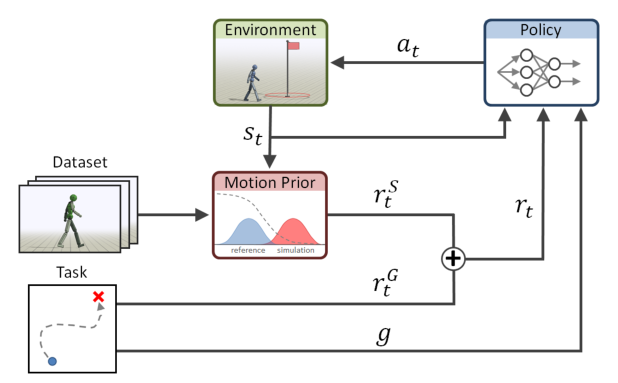

# AMP：面向风格化物理角色控制的对抗运动先验

DeepMimic要求参考动作与当前时刻一一对齐，AMP则把问题改成：策略产生的短时状态转移，能否和动作数据中的转移属于同一种运动分布。这样训练时不需要给每个回合指定一条完整轨迹，也不需要手写姿态、速度、末端等风格奖励；任务目标和动作风格由两套信号分别负责。

> **主要方法图：** Figure 2，PDF第4页。左侧无结构动作数据训练判别器并产生风格奖励，任务奖励与风格奖励相加后训练控制策略。来源：[原论文](https://arxiv.org/abs/2104.02180)。

## 论文框架：任务奖励与对抗运动先验共同训练控制策略

AMP把动作数据和任务目标分成两条训练支路。动作数据支路只需要一批没有任务标签、也不要求彼此连续的动作片段。训练时从片段中抽取相邻两帧身体状态，组成“真实运动”状态转移；与此同时，当前策略在物理仿真中执行动作，产生另一批状态转移。判别器接收这两类样本，学习判断一段短时运动更像动作库还是更像尚未训练好的策略。

判别器并不是比较角色是否走到某个世界坐标，而是观察根节点局部线速度与角速度、关节局部旋转与速度，以及手脚等末端相对身体的位置。采用局部身体量，是为了让判别结果集中在姿态、节奏和肢体协调上，而不是记住动作录制时面向哪个方向、站在什么位置。参考数据中的转移作为正样本，策略 rollout 中的转移作为负样本；判别器输出再转换成风格奖励，并用梯度惩罚抑制对抗训练中常见的过快饱和。

另一条支路计算任务奖励。它可以要求角色跟踪目标速度、朝指定方向移动或完成击打等任务，但不规定每一时刻具体应摆出什么姿势。风格奖励回答“动作是否属于示范分布”，任务奖励回答“动作是否完成当前目标”。两者相加后交给 PPO 更新 Actor，价值网络估计当前状态的长期回报，帮助策略判断一次动作会不会在后续导致失衡或偏离任务。缺少任务奖励时，策略可能只重复动作库中最容易骗过判别器的片段；缺少风格奖励时，策略又可能用高频摆动、异常姿态等方式投机完成任务。

Actor读取物理角色当前的本体状态以及任务需要的目标信息，输出各关节的 PD 目标。球形关节使用指数映射表示目标旋转，单自由度关节输出一个目标角度。PD控制器根据目标姿态与当前关节状态计算力矩，物理仿真得到下一时刻姿态、速度和接触结果，再形成新的策略观测以及判别器负样本。由此构成“观测与任务目标 → Actor → 关节目标 → PD与物理环境 → 下一状态 → 奖励与价值估计 → PPO更新”的闭环。

为避免策略只从固定站姿出发，训练会从参考动作中的不同状态初始化角色；当角色严重跌倒或偏离可接受状态时提前终止。判别器负样本还会进入回放缓冲区，避免它只记住最近一轮策略的错误。论文中的策略网络使用两层隐藏层，规模分别为1024和512，输出固定方差的高斯动作分布。网络规模并不是AMP的关键贡献，真正影响复现结果的是动作数据质量、判别器特征的坐标表达，以及任务奖励和风格奖励之间的尺度。

## 训练阶段与执行阶段的边界

判别器、参考动作数据和价值网络只在训练时使用。训练完成后，执行端只保留Actor、任务命令、本体观测、PD控制器和物理角色，不需要继续读取参考动作，也不需要为动作指定相位。因此AMP能根据任务命令在动作分布中选择行为，却不能保证精确复现某一段舞蹈的手势、节奏和接触时刻；这类需求仍需要显式参考动作跟踪器。

原论文验证对象是34自由度人形角色、59自由度霸王龙角色和64自由度犬类角色，证据全部来自物理仿真，没有真实机器人、执行器模型标定或Sim2Real实验。它奠定的是“用对抗判别器把动作片段变成运动先验”的训练思想，后续四足与人形工作才进一步补上真实传感器、域随机化和硬件控制链路。

## 原文、项目与代码

[论文原文](https://arxiv.org/abs/2104.02180) · [项目页](https://xbpeng.github.io/projects/AMP/) · [官方研究代码谱系](https://github.com/nv-tlabs/ASE)
