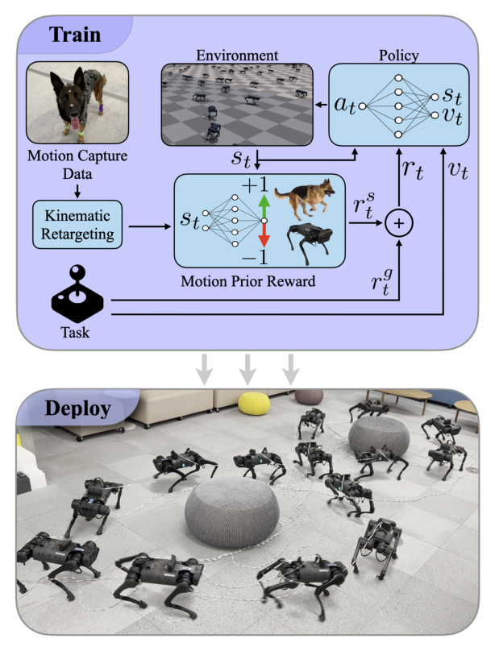

# AMP Locomotion：以对抗运动先验替代复杂奖励函数的四足运动控制

这篇工作的重点不是再次介绍AMP，而是做一个很有工程意义的检验：四足步态奖励通常包含抬脚、落脚、躯干姿态、对称性和能耗等大量规则，能否只保留速度任务奖励，再让一小段动作数据负责运动风格？作者用约4.5秒德国牧羊犬动作训练Unitree A1，并把策略部署到真机。

> **主要方法图：** Figure 1，PDF第1页。运动数据通过AMP约束行为分布，辅助任务奖励要求机器人跟踪速度指令，最终在A1上形成可切换的自然步态。来源：[原论文](https://arxiv.org/abs/2203.15103)。

## 论文框架：用犬类动作先验约束A1速度控制器

作者先把约4.5秒的德国牧羊犬运动重定向到Unitree A1。重定向使用逆运动学求机器人关节角，再以前向运动学检查脚端等关键部位的位置，关节与末端速度由相邻帧差分得到。动作片段覆盖慢速踱步、快步、小跑和转向，它们不带“当前应跟踪多少速度”的逐帧标签，只向判别器提供自然四足运动的短时状态转移。

每个控制周期，Actor读取A1关节角、关节速度、机身方向、上一时刻动作，以及用户给出的前向速度、侧向速度和偏航角速度命令。速度命令范围覆盖后退到快速前进、横移和左右转向。Actor使用三层MLP输出十二个关节目标角，策略以30 Hz运行，底层PD控制器把目标角转换为电机力矩。真机执行后的关节和机身状态回到下一周期，形成速度命令到关节动作的闭环。

训练仍有两类奖励。速度跟踪奖励要求机器人完成当前线速度和角速度命令；AMP判别器比较犬类参考转移与策略 rollout 转移，把接近示范节奏和姿态的结果变成风格奖励。策略因此可以在速度连续变化时自行选择和过渡步态，而不需要为踱步、小跑和转向分别编写状态机。这里“替代复杂奖励”指减少手工设计的抬脚高度、步态对称和姿态塑形项，并不意味着可以删除速度跟踪、动作平滑、关节安全与终止条件。

为了把仿真策略迁移到A1，训练会随机改变地面摩擦、机身附加质量、电机强度，并向机身速度施加扰动。论文使用5280个并行环境和分布式PPO训练约40亿步，报告在8张RTX 3090上约需14小时。判别器、动作数据和价值网络都只参与训练；真机运行时只保留速度命令、本体观测、Actor与PD控制器。

## 实机证据与适用边界

真实A1实验表明，AMP策略在多组速度下的机械运输成本约为0.93至1.12，低于论文中的手工奖励基线和不使用风格奖励的基线。这个结果支持“少量高质量动作可以替代一部分步态塑形奖励”，但数据只来自单一动物的短片段，机器人也是结构成熟的四足平台。将方法迁移到人形或更大动作空间时，仍需重新处理动作重定向、接触语义、执行器带宽与域随机化，不能把这项实验理解为任意动作数据都能直接生成稳定真机策略。

## 原文与项目

[论文原文](https://arxiv.org/abs/2203.15103) · [项目页](https://xbpeng.github.io/projects/AMP_Locomotion/index.html) · 论文未提供可核验的作者官方代码仓库
