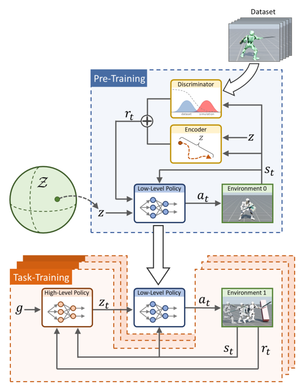

# ASE：面向物理仿真角色的大规模可复用对抗技能嵌入

AMP能让动作整体像数据集，却没有明确接口告诉上层“现在调用哪一种技能”。ASE在低层策略中额外加入潜变量 `z`：不同的 `z` 应产生不同、但都属于动作数据分布的行为。预训练完成后，低层控制器被冻结，新任务只需训练一个高层策略去选择 `z`，不用从关节动作重新学起。

> **主要方法图：** Figure 2，PDF第4页。上半部分预训练潜变量条件低层策略，下半部分在新任务中训练高层策略输出技能潜变量。来源：[原论文](https://arxiv.org/abs/2205.01906)。

## 论文框架：先学习可复用技能空间，再由高层策略选择技能

ASE把训练分成技能预训练和任务迁移两个阶段。预训练阶段输入是一批没有任务标签、没有统一动作顺序的运动片段。低层策略同时读取当前物理状态和技能潜变量 `z`，输出31维目标关节旋转，再由PD控制器驱动物理角色。角色执行动作后产生新的身体状态，这段状态转移同时送入判别器和技能编码器，两者分别解决“动作像不像数据”和“不同潜变量是否真的产生不同技能”两个问题。

判别器沿用AMP的思路，把动作库中的相邻状态当作正样本，把低层策略在仿真中的状态转移当作负样本。它产生的对抗奖励要求所有潜变量生成的行为都落在动作数据分布附近。只有这项约束时，策略最容易把所有 `z` 都忽略掉，反复生成少数安全动作，因为判别器只关心自然度，不关心技能之间是否可区分。

技能编码器因此接收策略生成的状态转移，并尝试从结果中恢复当时采样的 `z`。恢复越准确，说明潜变量对实际运动的方向、姿态和接触模式产生了可辨认影响。这个互信息目标迫使低层策略使用 `z`，避免潜空间坍塌；但如果没有判别器约束，编码器也可能通过高频抖动或其他无意义差异识别潜变量。两项目标必须同时存在，才能得到既自然又具有多样性的技能空间。

论文把潜变量限制在单位超球面上，并从均匀先验采样。编码器使用von Mises-Fisher分布描述方向型潜变量，使不同方向可以连续插值，而不会依赖潜变量长度表达额外信息。低层策略采用三层MLP，隐藏层规模为1024、1024和512；判别器与编码器共享特征网络，但使用不同输出头。策略和价值网络由PPO更新，判别器与编码器则分别由对抗分类和潜变量恢复目标更新。

预训练完成后，动作数据、判别器和技能编码器都不再参与下游任务。低层策略参数被冻结，高层策略读取任务状态与目标，输出一个未归一化向量，再投影到单位超球面得到 `z`。被冻结的低层策略把 `z` 与当前身体状态转换成关节目标，PD控制器作用于角色，任务执行结果形成下一时刻状态和任务奖励。高层策略只需要在已经具备动力学可执行性的技能空间里搜索，不再从31维逐关节动作开始探索。

## 可复用范围与方法边界

ASE中的潜变量没有预先规定语义，某一维并不固定对应“左转”或“跳跃”。技能含义来自动作数据与训练结果，需要通过rollout、速度分布和接触模式分析才能确认。下游策略能够调用的行为也不会超出预训练数据形成的技能覆盖；动作库没有双脚离地或特殊接触时，高层不能仅靠重新组合潜变量可靠地产生这些能力。

论文在固定的仿真人形角色上验证方法，状态为120维，动作是31维PD目标，没有真实机器人、状态估计、执行器延迟和Sim2Real证据。因此“可复用”主要指同一角色上的跨任务复用，而不是一个权重直接跨机器人本体。用于人形机器人时，还需要重做动作重定向、可部署观测、关节控制接口和潜变量切换平滑，并验证不同技能切换时是否出现关节突跳或接触失稳。

## 原文与项目

[论文原文](https://arxiv.org/abs/2205.01906) · [项目页](https://xbpeng.github.io/projects/ASE/)
