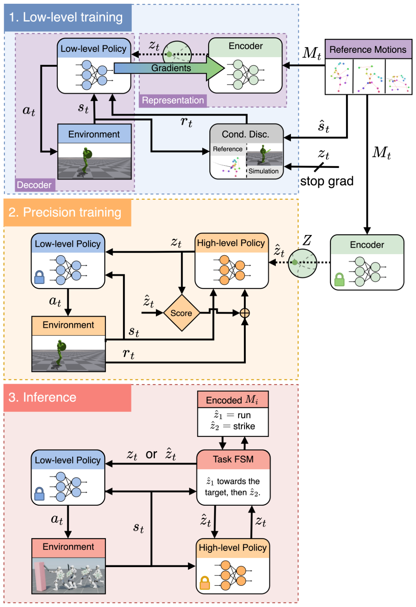

# CALM：面向可控虚拟角色的条件对抗潜变量模型

ASE强调无监督发现多样技能，但潜变量与原始动作片段没有稳定对应关系。CALM进一步让动作编码器、条件判别器和低层策略联合训练：一段参考动作先被编码成潜变量，低层策略必须产生与该潜变量所代表内容一致的状态转移。结果不是只有“多样”，而是上层可以更可靠地定向调用、插值和切换动作。

> **主要方法图：** Figure 2，PDF第3页。第一阶段联合学习动作编码器和低层策略，第二阶段冻结它们并训练任务高层，推理时高层策略或人工FSM都可给出潜变量。来源：[原论文](https://arxiv.org/abs/2305.02195)。

## 条件对抗学习怎样形成动作空间

编码器读取参考动作片段并产生紧凑表示 `z`。条件判别器接收状态转移和 `z`，判断该转移是否既真实又与指定动作内容相符；低层策略则根据当前状态和 `z` 输出控制。由于正样本的 `z` 来自对应参考片段，策略不能只生成任意一种自然动作来骗过判别器，而要保留片段的主要行为特征。

预训练完成后，编码器和低层控制器被冻结。面对击打、移动或交互任务，高层策略只需在较低维潜空间中搜索；人工有限状态机也能在若干动作编码之间切换。潜变量插值可以形成过渡行为，但“平滑插值”只说明表示空间连续，不等于每条插值轨迹都满足复杂接触约束。

## CALM和ASE不要混为一谈

ASE用互信息目标让不同潜变量产生可区分技能，重点是无监督技能发现；CALM用参考动作条件化判别器，重点是让潜变量与动作内容对应并可被定向控制。二者都采用“低层预训练、高层复用”，但潜空间的训练监督不同，适合的上层接口也不同。

## 对机器人行为基座的启发与限制

这篇给出的关键启发是：行为基座不仅要覆盖很多动作，还要有稳定、可查询的控制接口。真正落到人形机器人时，还需要明确接口是根速度、关键点、关节目标、语言还是混合mask，并补上本体观测、执行器和安全约束。CALM本身面向虚拟角色，不能当作真机通用控制已经成立的证据。

## 条件判别器约束的是哪一层

正样本由参考动作片段及其编码`z`组成，负样本来自低层策略在同一`z`条件下生成的状态转移。条件判别器既判断转移是否像数据，也判断它是否与指定片段内容匹配；低层策略接收当前角色状态和`z`，输出物理控制动作。预训练阶段没有具体任务奖励，任务目标只在冻结底层后由高层策略或FSM使用，因而“动作像什么”和“当前要完成什么”保持分离。

工程评测应同时检查编码一致性、潜变量插值、切换瞬间和下游任务利用率。若编码器把速度、朝向与动作语义混在一起，高层可能需要用复杂轨迹才能找到一个简单技能；若判别器只看局部关节，接触与根运动又可能失真。CALM没有提供真实机器人观测、动作频率、域随机化或Sim2Real，因此这些内容必须由后续机器人系统单独证明，不能从虚拟角色结果外推。

## 原文与项目

[论文原文](https://arxiv.org/abs/2305.02195) · [项目页](https://research.nvidia.com/labs/par/calm/)
