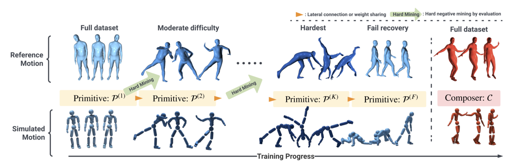

# PHC：面向实时仿真人的持续人形控制

PHC面对的不是某台真实人形机器人的关节、执行器和状态估计，而是SMPL仿真人。输入来自人体姿态或三维关键点，经过人体模型/逆运动学表示后成为参考；策略在物理引擎中连续跟踪这些目标，产生满足接触与动力学的全身rollout。本库关注它在数据链上的用途：把纯运动学人体动作变成经过接触与动力学检验的avatar动作入口，因此归入`动作数据入口与重定向/目标本体动作重定向`。策略训练、Motion Tracking、AMP和跌倒恢复仍是方法事实，不因目录调整而被省略。

> **主要方法图：** Figure 2，PDF第4页。训练从容易动作逐步扩展到困难动作，之后单独训练跌倒恢复primitive，并训练composer组合已冻结的primitive。来源：[原论文](https://arxiv.org/abs/2305.06456)。

## 输入、输出和数据关系

输入端是AMASS等人体动作中的SMPL姿态，或视觉系统提供的三维关键点/人体姿态目标；输出端不是离线IK文件，而是受物理引擎约束的仿真SMPL humanoid状态序列。控制策略每步读取当前avatar状态与参考目标，输出关节PD目标/控制动作，在接触、重力和碰撞下执行。根、关节、末端和速度的tracking reward保证语义动作不丢，AMP项约束恢复等非参考阶段仍保持自然。

因此PHC处在“人体动作恢复之后、真实机器人重定向/跟踪之前”的仿真人体跟踪环节：它能过滤纯运动学动作中不可持续的部分，产生有接触结果的avatar rollout；但这个SMPL avatar与Unitree G1、H1等机器人在自由度、质量、执行器和足底结构上不同，不能把输出直接当真机参考，也不能把仿真覆盖率当成机器人真机成功率。

## 逐级补长尾，而不是反复遗忘

第一阶段在全量动作中训练初始跟踪策略，并根据rollout识别失败片段。新增primitive主要学习这些失败样本，已有primitive冻结，避免为了补少数困难动作破坏已经学会的能力。多个primitive并非简单平均动作，而通过乘性组合和composer形成最终控制。作者还加入fail-recovery primitive，用较简单的站起和移动数据学习从偏离参考的状态回到可控区域。

tracking奖励仍比较参考与角色的根、关节、末端等状态；AMP风格项用于让恢复过程更自然。论文报告在其仿真设置下对AMASS获得很高的动作覆盖率，并避免依赖外部稳定力。这一数字说明长尾分治有效，但它与数据预处理、成功阈值和虚拟角色模型绑定，不能直接当作真机成功率。

## “Perpetual”解决的是什么

普通跟踪器一旦摔倒或与参考相位错开就终止，PHC希望实时avatar持续运行，因此把恢复作为正式能力，而不是评测时删掉的失败。它更接近一个可长期接收动作流的物理化系统。不过composer仍建立在固定SMPL本体和仿真动力学上，面对机器人关节限位、执行器延迟、热、电气保护和真实状态估计没有证据。

## 证据边界：仿真虚拟人，不是真实机器人

论文实验对象是物理仿真中的virtual humanoid/avatar。`humanoid`在这里指仿真人体角色，不能因为标题中有Humanoid Control就当作机器人实机实验，也不能把论文演示视为Sim2Real证据。若后续工作使用PHC生成或筛选动作，再重定向到真实机器人，本体适配和实机部署属于后续系统新增的证据。

## 工程上值得借鉴的两点

第一，按失败集合组织curriculum，比按动作名称平均采样更有效；第二，把恢复数据和恢复成功标准单独建档。复现时应保存每条motion的成功率、失败姿态和由哪个primitive负责，否则只能看到总体均值，无法判断新增模块究竟补了什么。

如果把PHC用于动作数据处理，还应保存人体源ID、关键点/SMPL版本、IK或形态拟合配置、物理化前后轨迹、接触变化和失败片段。这样后续机器人重定向失败时，才能判断问题来自视觉恢复、avatar物理化还是机器人本体映射。

## 原文、项目与代码

[论文原文](https://arxiv.org/abs/2305.06456) · [项目页](https://zhengyiluo.github.io/PHC-Site/) · [代码](https://github.com/ZhengyiLuo/PHC)
