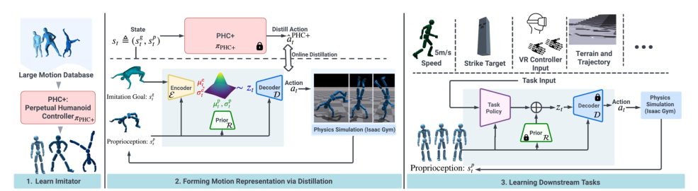

# PULSE：面向物理控制的通用人形运动表征

PHC解决了大规模动作跟踪，却仍是一个以参考动作作为输入的复杂模仿系统。PULSE把预训练PHC当教师，用变分信息瓶颈把“当前身体状态下，下一步该怎么追参考”压缩为潜变量，再训练统一decoder把状态和潜变量还原成动作。下游任务不再输入整段参考轨迹，只需学习输出潜变量。

> **主要方法图：** Figure 2，PDF第4页。预训练模仿器提供监督，变分encoder把运动意图压入潜变量，decoder在本体状态条件下输出动作，prior约束潜空间可在没有参考动作时采样和控制。来源：[原论文](https://arxiv.org/abs/2310.04582)。

## 蒸馏的输入输出关系

训练时，posterior encoder能看到当前本体状态和未来参考信息，生成潜变量 `z`；decoder接收当前状态与 `z`，拟合教师动作。另一个只依赖本体状态的prior学习posterior分布，KL约束使潜变量保持连续并可在下游使用。训练结束后冻结decoder和prior，下游策略根据任务目标产生 `z`，decoder再输出关节动作。

这里的关键不是普通动作自编码，而是decoder始终以当前物理状态为条件。相同潜变量在不同姿态下会给出不同纠偏动作，因此潜空间包含了教师已经学到的平衡和接触反馈，而不是纯运动学pose embedding。

## 下游为什么更容易学

直接RL必须同时发现“怎样保持人形稳定”和“怎样完成任务”；PULSE把前者的大部分搜索限制在教师覆盖的动作流形附近。论文在移动、目标到达和交互类仿真任务中展示了更自然的探索。代价是能力上限受教师和AMASS数据决定：如果任务需要训练库没有的接触、载荷或关节用法，潜空间可能成为约束而非帮助。

## 不要把Universal理解成跨机器人通用

这里的universal主要指同一虚拟humanoid上覆盖多类人体动作并服务多个下游任务，不代表一个decoder可直接迁移到不同关节拓扑或真机。用于机器人时还需处理重定向、动作尺度、本体差异、执行器动态和安全接口。评估也不能只看任务回报，应同时看潜变量使用范围、动作自然度和是否出现prior之外的失稳状态。

## 教师数据怎样变成可调用行为

posterior看到当前身体与未来参考，给出能解释教师下一步动作的latent；decoder以当前物理状态和latent输出关节控制，prior只从当前状态约束latent分布。训练正例不是简单的人体pose，而是PHC在仿真中闭环执行动作时产生的状态、参考与控制对，因此平衡和接触反馈通过教师动作进入decoder。下游策略只接收任务目标并产生latent，任务奖励不再直接搜索完整关节空间。

PULSE没有AMP判别器，归入这条子线是因为它学习可复用行为表示，而不是因为使用对抗奖励。复现应保存教师版本、参考窗口、posterior/prior KL、latent尺度和decoder动作接口，并比较下游直接RL、冻结decoder及微调decoder三种设置。若新任务需要训练动作库外的持续物体接触或负载，prior可能把搜索强行拉回旧分布；这时应明确扩数据或开放残差，而不是把失败解释成高层不会规划。

## 原文、项目与代码

[论文原文](https://arxiv.org/abs/2310.04582) · [项目页](https://zhengyiluo.github.io/PULSE-Site/) · [代码](https://github.com/ZhengyiLuo/PULSE)
