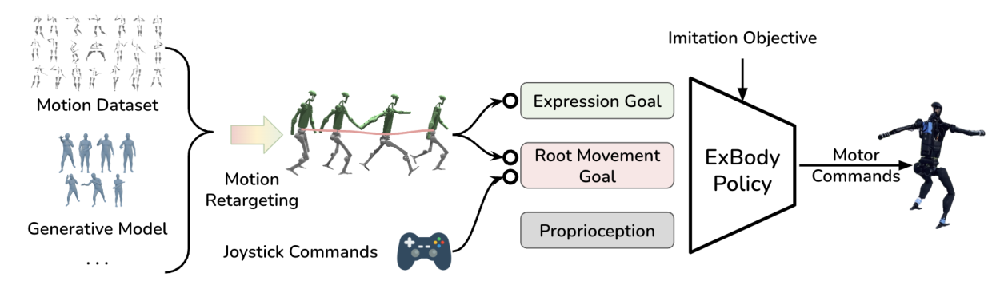

# ExBody：人形机器人的表现型全身控制

把整段人体动作逐关节重定向给人形机器人，腿部往往最先出问题：人体腿长、质量分布和接触时序与机器人不同，精确追腿会牺牲平衡。ExBody做了一个很重要的任务拆分：上半身继续追踪表达动作，腿部不追人体腿轨迹，只要求机器人根部完成速度和朝向目标，让RL自行找到适合本体的落脚。

> **主要方法图：** Figure 2，PDF第2页。不同来源人体动作先重定向，随后被拆成upper-body expression goal与root movement goal，共同训练H1全身策略。来源：[原论文](https://arxiv.org/abs/2402.16796)。

## 论文框架：把上肢表达目标与下肢移动目标拆开

ExBody先从CMU动作库中整理约780段人体动作，再把人体骨架映射到19自由度Unitree H1。人体肩、髋等球形关节不能直接复制给由多个转动关节组成的机器人，作者使用指数映射把球形旋转分解到机器人对应关节。这个重定向结果并不会作为全身逐帧参考直接交给策略，而是被拆成两类命令：上肢表达目标保留手臂和躯干的动作语义，根部移动目标只描述机器人整体应该怎样移动。

上肢目标包含九个上半身关节目标和18维关键点位置，用来表达挥手、摆臂、舞蹈等身体动作。根部目标包含三维线速度、身体滚转与俯仰、偏航方向以及身体高度。这样，同一段上肢动作可以重新组合不同的站立、前进和转向命令；腿部不必复制人体参考中的每一次屈膝和落脚，而是根据机器人自身比例、质量和接触状态寻找可执行步态。

每个控制周期，Actor读取机身角速度、滚转与俯仰、当前偏航和目标偏航之间的差值、19个关节的位置与速度、上一时刻动作，以及两类目标命令。策略刻意不读取当前机身线速度、绝对身体高度和世界坐标偏航，这些量在真机上往往需要外部定位或状态估计才能准确获得。Actor输出19个目标关节位置，底层PD控制器根据目标与当前关节状态计算力矩，机器人运动后的IMU和编码器数据再进入下一周期。

奖励也沿两类目标拆分。上半身关节和关键点跟踪项要求表达动作保持可辨认，根部速度、姿态、偏航和高度项要求机器人完成移动命令；动作平滑、关节安全、能耗和接触相关约束负责限制腿部解。腿并不是没有训练信号，而是没有被人体腿轨迹逐帧锁死。一个全身Actor同时输出腿、腰和手臂关节目标，因此上肢摆动改变质心与角动量时，腿部可以在同一策略内部主动补偿，而不是等待两个独立控制器事后协调。

训练在物理仿真中使用强化学习和动力学随机化。完整参考状态、奖励计算需要的人体目标以及仿真中的精确状态只服务于训练；部署到H1后，保留的是可测本体观测、上肢表达命令、根运动命令、Actor和PD控制器。论文没有披露一个可用于复现的统一控制频率，也没有在方法说明中完整列出Critic的特权输入，因此这些信息不应根据相似工作补写。

## 能力边界

ExBody适合“上身动作需要保留，腿部首先保证平衡和移动”的表达型全身控制。它主动牺牲了人体腿部动作的逐帧一致性，因此不适合腿部接触本身就是任务语义的踢击、跨栏、跪地或精确舞步。所谓未见组合泛化主要来自训练时对“上肢动作 × 根运动命令”的重组，并不意味着策略能零样本跟踪动作库之外的任意全身运动。复现时应分开报告上肢跟踪误差、根速度误差、足端滑移和跌倒率，避免一个总奖励掩盖上身表达与下身可行性之间的取舍。

## 原文、项目与代码

[论文原文](https://arxiv.org/abs/2402.16796) · [项目页](https://expressive-humanoid.github.io/) · [代码](https://github.com/chengxuxin/expressive-humanoid)
