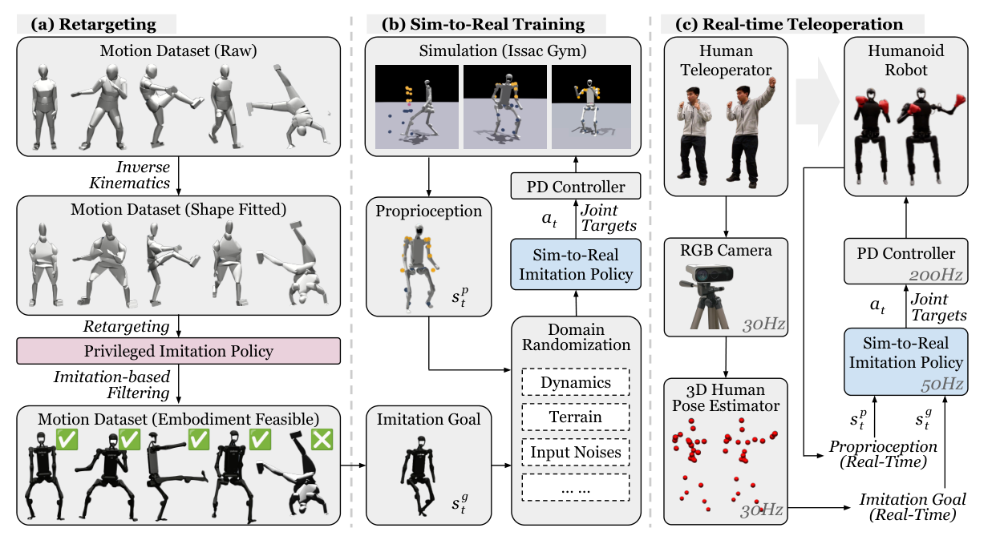

# H2O：人到人形机器人的实时全身遥操作学习

H2O试图让普通RGB相机中的人体动作实时驱动人形机器人。最容易误解的地方是把它当成一个pose retargeting算法：事实上，人体姿态只解决“想做什么”，真正决定真机能否跟上的，是先建立结构对齐、再用物理策略过滤不可行动作，最后训练只依赖可部署观测的模仿控制器。

> **主要方法图：** Figure 4，PDF第4页。左侧对齐SMPL与机器人并过滤不可行动作，中间训练Sim2Real模仿策略，右侧以单目人体姿态流实时控制H1。来源：[原论文](https://arxiv.org/abs/2403.04436)。

## 论文框架：从人体视频到H1关节目标的三阶段闭环

H2O先处理离线动作数据，再训练真机控制器，最后接入实时人体视频。第一阶段从AMASS取得人体动作，并调整SMPL身体形状，使人体主要刚体与19自由度Unitree H1的躯干、手臂和腿具有更一致的几何关系。随后使用逆运动学把人体动作转换为机器人参考。单纯运动学重定向只保证关键点接近，不保证机器人能承受对应的惯性、力矩和接触，因此约一万段初始参考不能直接全部用于训练真机策略。

作者先训练一个“特权模仿器”执行这些参考。这个策略能读取仿真中的完整刚体位置与速度，不加入面向真机的域随机化，目的不是部署，而是检验每段重定向动作在当前机器人动力学下能否被追踪。能够稳定执行的约8500段动作被保留下来，失败动作被过滤。论文把这一步称为sim-to-data：物理仿真不只消费数据训练策略，也用执行结果反过来清洗数据，避免最终控制器同时面对“必须追踪”和“物理上无法追踪”的矛盾目标。

第二阶段使用过滤后的动作训练可部署Tracker。Actor的本体观测包含19个关节位置、19个关节速度、三维根线速度、三维根角速度、三维投影重力和19维上一时刻动作。动作目标来自肩、肘、手和踝等八个关键刚体，每个刚体提供目标位置、目标与当前位置误差以及目标速度。Actor把当前身体状态和关键点目标转换为19个目标关节位置，PD控制器计算力矩，H1执行后的状态重新进入下一周期。

训练奖励并不只看八个关键点。关节位置与速度、刚体位置与旋转、线速度与角速度等完整全身模仿项共同约束策略，使稀疏目标仍能对应稳定的全身姿态；动作平滑、能耗和安全惩罚限制高频补偿。PPO的价值网络和仿真真实状态只在训练时使用。训练还随机改变摩擦、连杆质量、躯干质心、PD增益、力矩噪声、控制延迟和地形，让Actor在部署时能够承受机器人模型与真实执行器之间的差异。

第三阶段把实时RGB视频接入同一控制接口。HybrIK以约30 Hz从相机图像恢复人体姿态，再经过与离线数据一致的本体对齐和重定向，生成八个关键刚体的目标流。Tracker不是把人体关节角直接复制给电机，而是结合目标流与机器人当前状态闭环生成关节目标，因此能吸收一定范围内的视觉抖动、延迟和动力学偏差。

需要特别说明的是，H2O并非仅靠单目相机和机器人内置传感器完成全部状态估计。论文真机系统使用外部动作捕捉以50 Hz提供机器人根线速度，机器人内置传感器以200 Hz更新本体状态。单目RGB负责获取操作者动作，不等于机器人端已经摆脱外部定位。视觉估计、重定向、状态获取、策略推理和PD执行共同决定端到端延迟，只报告人体姿态网络帧率无法说明完整遥操作性能。

## 实机证据与边界

论文在Unitree H1上完成实时全身遥操作，证明“人体视频 → 重定向目标 → 闭环Tracker → 关节控制”可以贯通真实硬件。它没有解决手指级精细操作，也无法消除单目遮挡、深度歧义和快速动作造成的姿态跳变。可行性过滤还可能删除最困难但最有价值的动作，因此工程系统应记录失败原因，区分重定向错误、策略能力不足和硬件不可达，而不是把所有失败样本直接丢弃。

真实部署还需要目标限速、关节限位、通信失联后的保持或回中、跌倒保护和人工急停。论文没有把这些工程安全机制全部描述为统一模块，不能从演示视频反推其实现细节。

## 原文、项目与代码

[论文原文](https://arxiv.org/abs/2403.04436) · [项目页](https://human2humanoid.com/) · [代码](https://github.com/LeCAR-Lab/human2humanoid)
