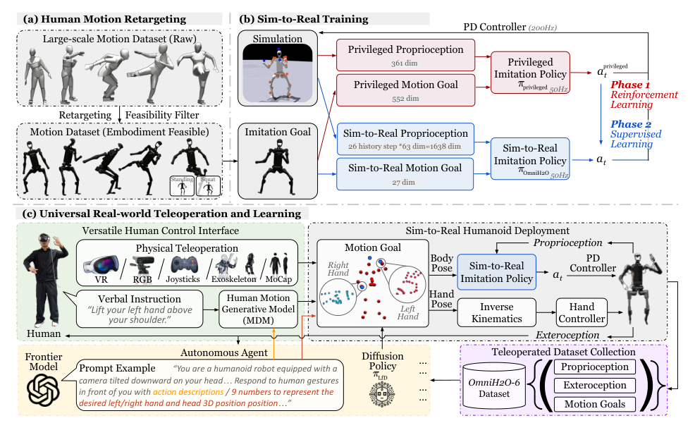

# OmniH2O：通用灵巧的人到人形全身遥操作与学习

H2O仍需要较完整的人体姿态目标。OmniH2O问得更进一步：低层策略能否只接收头部和双手三个关键点，就自行补全下肢、躯干和平衡动作？如果成立，VR、RGB人体估计、语言生成动作或自主Agent都可以通过同一个稀疏接口控制机器人，不必分别训练底层控制器。

> **主要方法图：** Figure 3，PDF第4页。动作重定向与过滤生成可行数据，特权teacher先学全身跟踪，student再通过DAgger蒸馏为只依赖本体历史和稀疏关键点的真机策略。来源：[原论文](https://arxiv.org/abs/2406.08858)。

## 论文框架：特权Teacher训练全身跟踪，Student压缩为稀疏真机接口

OmniH2O先把人体动作重定向到机器人，并用物理模仿器过滤不可执行参考；同时为站立、下蹲等状态补充更稳定的参考变体。处理后的动作库首先用于训练Teacher。Teacher能看到完整全身参考、精确刚体状态和训练环境信息，论文汇总的输入规模为913维。它通过PPO学习全身跟踪，输出目标关节角并由PD控制器执行。Teacher的作用是建立一个能在仿真中稳定完成完整动作的高质量控制器，而不是直接部署到真机。

真正部署的Student只接收头部和双手三个关键点目标。每个关键点包含目标位置、目标与当前位置之差和目标速度，三处关键点合计27维。仅凭当前一帧头手位置无法判断人体刚才向哪个方向移动、机器人是否正在失衡以及动作目标是否短暂丢失，因此Student还读取当前帧加之前25步的本体历史。每一步包含关节位置、关节速度、根角速度、投影重力和上一时刻动作，共63维；26帧展开后为1638维，再与27维稀疏目标拼接成1665维输入。

论文最终采用MLP处理这个显式历史窗口，而不是用GRU保存隐状态。作者比较了MLP、GRU和LSTM，显式25步历史的MLP表现最好。这里的历史承担两项任务：一是从连续关节和机身变化中推断速度、接触和扰动趋势，二是在头手目标相似时为下肢补全提供动作上下文。它不会真正理解操作者未表达的脚部意图，只会按照训练动作分布选择更可能的全身解。

Student使用DAgger从Teacher学习。训练时先让Student在仿真中实际 rollout，使它进入由自身误差造成的偏离状态；Teacher随后在这些状态上给出应执行的动作，Student用动作均方误差拟合Teacher。若只在Teacher的理想轨迹上做一次行为克隆，Student部署后出现小误差便可能进入训练数据从未覆盖的状态，并让误差持续累积。DAgger反复收集Student访问到的状态，专门补上这类分布偏移。

部署后，Teacher、完整全身参考、仿真真实状态和价值网络全部退出。VR头显或人体姿态系统只需生成头、左手和右手的目标流，Student结合本体历史输出身体目标关节角，策略以50 Hz运行，底层PD控制以200 Hz执行。真实H1系统使用两块Orin NX，视觉输入可来自60 Hz的ZED相机，论文报告系统延迟约20 ms。上层目标短暂丢帧时，历史窗口可以延续已有运动趋势，但它不能无限期替操作者生成新意图。

手部控制需要与身体策略分开理解。OmniH2O的身体Student负责H1全身平衡和手腕等身体关节目标；灵巧手或夹爪动作由VR手部信号经过逆运动学或现成手部控制器生成，并不是Student从三个关键点中自动推导出所有手指动作。真实系统因此仍要处理两套控制接口的时间同步和安全边界。

## 稀疏接口的价值与边界

论文报告Student在仿真动作集上的成功率为94.10%，接近Teacher的94.77%，并高于论文复现的H2O结果87.52%。稀疏接口让VR、单目人体恢复或上层自主模块可以复用同一个低层控制器，也便于遥操作采集真机任务数据。但头手轨迹相同的动作可能对应不同脚步、跪地或接触语义，Student只能根据历史和数据偏好猜测。需要精确脚接触、踢击或特定下肢动作时，应增加脚部、根姿态或模式命令，而不能把稀疏补全当成无歧义的全身控制。

## 原文、项目与代码

[论文原文](https://arxiv.org/abs/2406.08858) · [项目页](https://omni.human2humanoid.com/) · [代码](https://github.com/LeCAR-Lab/human2humanoid)
