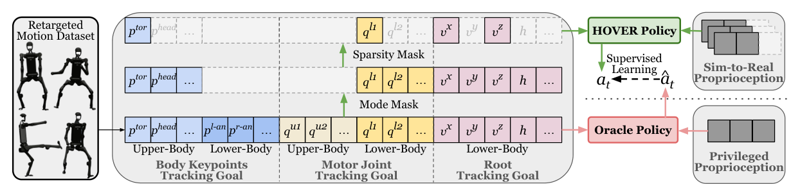

# HOVER：面向人形机器人的通用神经全身控制器

机器人系统常分别维护速度行走、上身跟踪、全身跟踪和关键点遥操作策略，切换时容易出现状态不连续。HOVER的核心不是再做一个更大的tracker，而是训练时随机遮掉不同身体部位和不同形式的目标，让同一student学会在“命令给多少就控制多少，其余自由度负责稳定”这一规则下工作。

> **主要方法图：** Figure 2，PDF第2页。Oracle先掌握完整动作跟踪，student在本体观测与上下身独立的mode/sparsity mask下蒸馏，形成多模式控制器。来源：[原论文](https://arxiv.org/abs/2410.21229)。

## Mask不是缺失值处理，而是控制协议

Oracle在特权仿真信息和完整命令下产生稳定动作。训练student时，对上半身与下半身分别选择命令模式，并在关节或关键点维度继续随机稀疏化；mask本身也作为输入，告诉网络哪些目标有效。于是完整pose、部分关节、稀疏关键点、根速度等接口都可被编码到统一命令张量中。

student通过蒸馏学习Oracle动作，同时在自己的状态分布上采样，避免只会处理理想轨迹。推理时上层改变mask即可改变控制模式，不必更换网络。未指定的自由度并非固定不动，而是在运动先验与平衡要求下自动补全，这使上身遥操作与下身行走能够在同一闭环内耦合。

统一接口背后仍有明确的数据语义：完整参考可表示为目标关节姿态、关键刚体位置与根运动，速度控制则只保留根部线速度和角速度；mode与sparsity mask决定其中哪些维度参与当前决策。student同时读取真实部署可得的关节状态、机身姿态与历史动作，输出全身关节目标，再交给PD层执行。Oracle所处的完整跟踪任务负责提供稳定动作标签，student的蒸馏误差与自身rollout共同处理“换成稀疏命令后状态分布已经改变”的问题。

## 相比OmniH2O多了什么

OmniH2O选择头和双手这一固定稀疏接口；HOVER把“指定哪些身体目标”本身也变成条件，可覆盖十余种模式。代价是训练分布更复杂：若mask组合采样不平衡，常用模式可能被大量稀疏组合稀释；不同命令形式的尺度和坐标系也必须统一。

## 判断它是不是行为基座

不能只数支持多少模式，要看模式切换是否连续、未指定部位是否稳定、复杂接触是否在训练中出现，以及真机在不同接口下是否共用相同保护边界。HOVER展示了统一神经全身控制接口的可行性，但任务级规划、物体交互和跨本体泛化仍不由这一个策略解决。

它也没有把所有命令都变成同一种物理含义。关键点、关节姿态和速度目标的坐标系、尺度与更新时间仍需由上层正确提供；模式切换若突然改变大量有效维度，等价于给tracker一个不连续参考。工程上应对mask变化做过渡，并单独测试低频上层命令、通信抖动和目标丢失时的保持策略。

## 原文与项目

[论文原文](https://arxiv.org/abs/2410.21229) · [项目页](https://hover-versatile-humanoid.github.io/)
