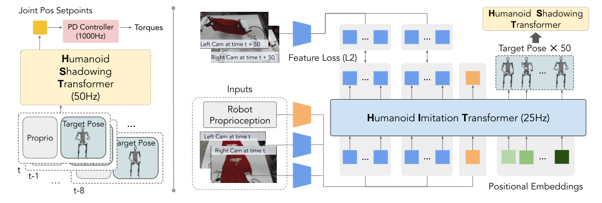

# HumanPlus：基于人体示范的人形机器人影随与模仿

HumanPlus包含两个容易被混在一起的阶段。Humanoid Shadowing让机器人实时跟随人体动作，用来完成技能演示和采集机器人自身数据；Humanoid Imitation再根据机器人第一视角图像与本体状态预测未来身体目标，驱动同一个低层控制器自主执行。前者是人到机器人，后者才是视觉到动作。

> **主要方法图：** Figure 4，PDF第5页。系统由两个decoder-only Transformer组成：低层Shadowing Transformer做全身控制，高层Imitation Transformer从第一视角观测预测后续目标。来源：[原论文](https://arxiv.org/abs/2406.10454)。

## 低层Shadowing Transformer负责物理执行

低层模型以约50 Hz运行，读取一段本体历史和目标人体姿态，输出关节目标给PD控制器。时间上下文让网络从历史推断速度、相位和扰动趋势，而不是把每帧独立映射。它先在仿真中利用大规模人体动作训练并做Sim2Real，然后接收在线重定向目标，使机器人能跟随操作者完成多种全身任务。

这一步采到的数据比纯人体视频更适合机器人学习：图像来自机器人真实相机，动作来自机器人实际执行，状态和控制时间戳也可对齐。人类示范因此被“翻译”为本体内的数据，而不是要求高层策略直接理解人和机器人之间全部结构差异。

Shadowing链路仍需把人体信号先变成机器人可接受的目标表示。操作者姿态经过估计与重定向后形成随时间变化的全身参考，低层Transformer读取参考窗口、本体历史和已执行动作，输出关节位置目标；PD环才负责实际电机控制。历史上下文可缓解短时噪声，却不能修复持续坐标漂移。采集时必须同时保存原始人体目标、重定向目标、机器人实测状态与最终动作，之后才能判断示范偏差来自操作者、映射还是执行。

## 高层Imitation Transformer预测目标，不直接打力矩

高层读取第一视角视觉、本体状态和历史序列，预测未来的身体目标，再交给低层shadowing策略执行。身体相机与手部观测频率不同，系统采用异步输入而非强行假设所有传感器同步。这样的层次拆分把视觉任务学习与高速平衡控制隔离：高层可以较慢规划，低层持续闭环稳定身体。

高层输出的仍是低层熟悉的身体目标，而不是直接覆盖全身关节。这个接口使视觉模型预测略有延迟时，tracker还能根据当前状态修正；同时也限定了高层能表达的动作范围。若任务成功依赖抓取力、手指状态或物体不可见面，仅靠第一视角和身体目标不足，需要额外物体/触觉观测。异常目标应由低层限幅与安全状态机拒绝，而不能假设Imitation Transformer永远输出训练分布内轨迹。

## 结论不要跨过数据边界

论文展示了从人类影随到自主模仿的完整链路，但自主能力依赖采集任务和视角分布。遮挡、相机外参变化、物体状态未观测以及长时误差累积仍会造成失败。复现时应把遥操作成功率、数据清洗比例、高层目标误差和低层跟踪误差分开统计，否则无法知道失败发生在哪一层。

## 原文、项目与代码

[论文原文](https://arxiv.org/abs/2406.10454) · [项目页](https://humanoid-ai.github.io/) · [代码](https://github.com/MarkFzp/humanplus)
