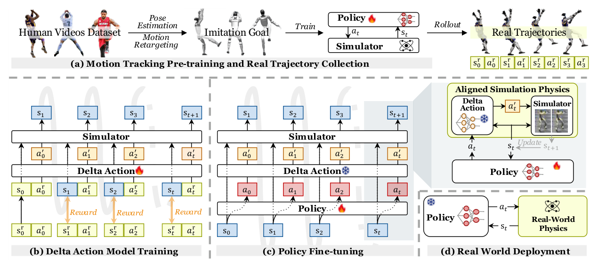

# ASAP：面向敏捷人形全身技能的仿真与真实物理对齐

常规域随机化是在不知道真实误差方向时扩大参数分布。ASAP换了一个角度：先把预训练tracking policy放到真机跑，再在仿真中重放相同动作，比较两边状态轨迹；一个delta-action model学习怎样修改仿真中的动作，才能让仿真rollout更像真实机器人。随后在这个被修正的仿真里微调原策略。

> **主要方法图：** Figure 2，PDF第2页。流程依次为动作跟踪预训练与真机采集、delta-action model拟合、插入修正模型后的仿真微调，最终只部署微调后的基础策略。来源：[原论文](https://arxiv.org/abs/2502.01143)。

## Delta模型学的不是最终控制策略

对一段真机动作序列，系统记录控制命令和真实状态；在仿真中从对应初始状态执行同样命令，得到另一条轨迹。训练delta模型时，目标是找出一个附加动作，使下一步仿真状态靠近真实状态。它吸收的是未建模执行器、结构柔性、接触和延迟等误差在动作空间中的综合效果。

数据对齐至少需要策略版本、动作命令、真机关节/基座状态、仿真状态、初值和精确时间戳。delta模型以当前仿真状态、原动作及相关历史为条件，输出仿真侧动作修正；监督来自下一步或短时轨迹与真机的差异。若真机和仿真坐标、滤波与控制延迟没有对齐，模型会把记录系统误差学成“物理修正”。

微调阶段冻结delta模型，把它串在策略动作与仿真机器人之间，形成“更像真机”的训练环境；基础tracking policy继续用RL适应这个环境。部署时delta模型被移除，只把已经适应过误差的基础策略放上真机。因此ASAP不是在线残差控制，也不是在真机上直接强化学习。

这也决定了它没有部署时在线适应：温度、磨损、载荷或地面变化后，必须重新采集对齐轨迹、检查delta误差并再微调。安全上应限制真机数据采集动作范围，先从低能量技能覆盖模型，再逐步扩展，而不是为了辨识高动态区域直接冒险探索。

## 为什么可能比盲目随机化有效

随机化覆盖的是设计者猜测的参数范围，delta模型利用真实轨迹给出有方向的误差监督，尤其适合难以用单个质量或摩擦参数描述的复合偏差。但它只能校正采集数据覆盖的状态和动作区域；新载荷、新地面或温度变化超出数据分布后，模型未必有效。

## 论文证据应怎样表述

工作在Unitree G1上展示敏捷全身技能，但真实数据与delta建模并非覆盖全部关节：受机器人和采集条件限制，文中实际系统辨识重点落在踝部4个自由度，并使用有限动作片段。它证明了“真实轨迹反哺仿真微调”的路线，而不是已经得到完整通用数字孪生。工程落地必须保留真机/仿真同动作对齐误差、delta幅值和微调前后稳定性对照。

评估应加入未参与拟合的动作、地面和速度，比较原仿真、普通域随机化、delta修正与二者组合，才能判断模型是在记忆采集轨迹还是确实改善了可迁移物理。

## 原文、项目与代码

[论文原文](https://arxiv.org/abs/2502.01143) · [项目页](https://agile.human2humanoid.com/) · [代码](https://github.com/LeCAR-Lab/ASAP)
