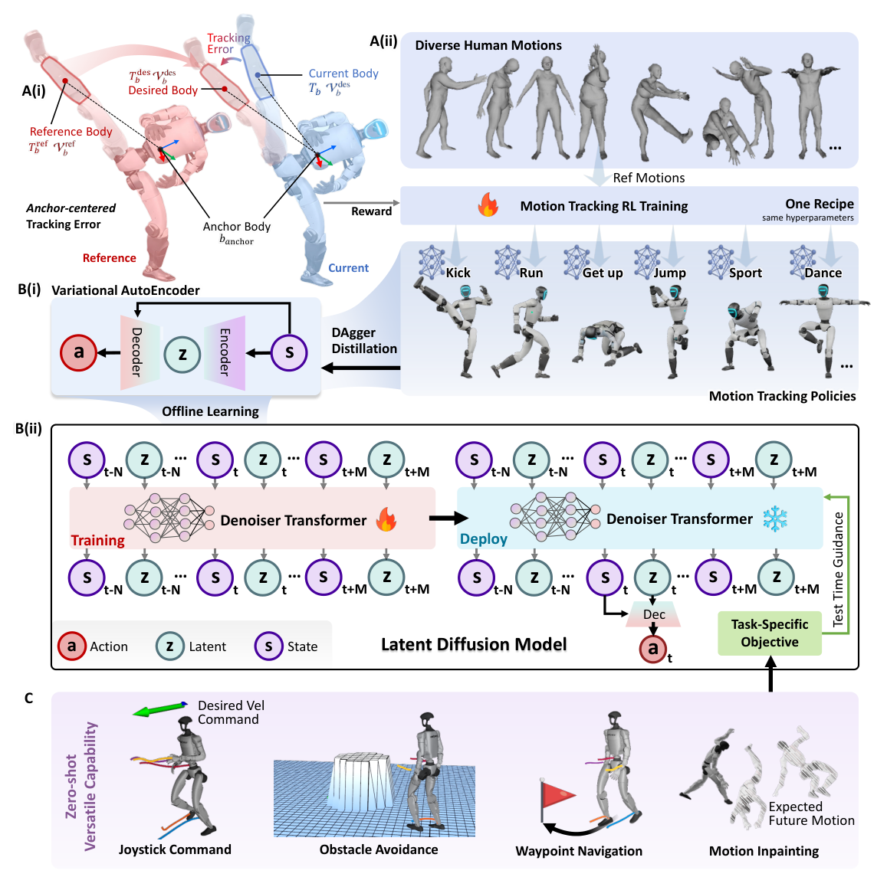

# BeyondMimic：基于引导扩散从动作跟踪到通用人形控制

动作跟踪器可以把一段参考动作稳定地做出来，却不知道如何根据一个新速度、新路径或新障碍重新组合已学动作。BeyondMimic把这两个问题分开处理：底层用强化学习追求动作的可执行性和受扰恢复，上层用扩散模型学习这些动作如何随时间变化，再在推理时用任务代价改变未来轨迹。

> **主要方法图：** Figure 7，PDF第30页。该图展示从参考动作跟踪、VAE/DAgger行为蒸馏、状态—潜变量扩散，到测试时任务引导的完整链路。来源：[原论文](https://arxiv.org/abs/2508.08241)。

## 论文框架：从参考动作到测试时任务引导

框架的第一个输入是已经重定向到目标机器人的参考动作。每一帧包含浮动基座和关节的位置、姿态与速度，再经正向运动学转成身体链接的位置、旋转、线速度和角速度。论文不是训练一个策略直接覆盖全部动作，而是为每段动作训练独立跟踪策略，但共享同一套观测、奖励、随机化和超参数。“统一配方”指降低新动作的调参成本，不是单一多技能Actor。

跟踪时，参考动作会先以骨盆或躯干为锚点重新放到机器人当前位置和偏航方向上，高度和身体局部关系保持不变。这一步是为了把“动作样式”和“世界坐标中必须回到某个点”分开。机器人被推离原轨迹后，策略可以在新位置继续做同一动作，避免为追回绝对坐标而产生过大动作。

跟踪策略的观测由参考动作的进度线索、锚点位姿误差、IMU速度、相对默认姿态的关节位置、关节速度和上一时刻动作组成。其中参考关节状态只用来告诉策略运动进行到哪里，真正的跟踪奖励在任务空间比较多个目标身体的位置、旋转、线速度和角速度。这样可避免只抄关节角却破坏手脚空间轨迹。额外只保留关节软限位、动作变化率和非手脚自碰撞三类正则项。

策略输出归一化的关节位置设定值，加到默认站立角后交给电机位置PD环计算力矩。这些设定值是塑造闭环力矩的中间量，并非要高精度开环回放的关节轨迹。作者按电机反射惯量设置较低的关节阻抗，是因为过高增益会放大噪声和冲击，也会把学习控制退化成僵硬的动画回放。训练时的Critic额外读取各身体相对锚点的真实位姿，用完整信息评估价值；它不进入真机控制环。

## 潜在行为空间与扩散轨迹

直接对PD设定值序列做扩散学习存在两个问题：关节动作中会出现尖锐的力矩补偿，不符合扩散模型偏好的平滑分布；大型生成网络的推理延迟又会使动作落后于最新身体状态。因此论文先用条件VAE把多个专家策略蒸馏成潜在行为接口。编码器读取参考进度和锚点误差，输出表示当前运动意图的潜变量；解码器把这个潜变量与当前重力方向、IMU速度、关节状态和上一动作结合，复现专家的关节设定值。

VAE采用DAgger训练，而不是只学习专家产生的理想状态。学生解码器自己上机滚动后会逐渐偏离专家轨迹，DAgger会在这些学生真正遇到的状态上再查询专家动作，让解码器学会从小误差中恢复。重建损失训练动作复现，KL项把潜空间约束成可连续采样的分布。真正执行时，参考动作编码器不再是必需的输入端，上层扩散模型直接给出潜变量，解码器仍每个控制周期读取最新本体状态，所以它是闭环控制器，不是开环动画播放器。

第二阶段用VAE在不同动作上的滚动数据训练扩散模型。数据中不再保留原始参考动作，只包含过去、当前和未来的机器人状态与动作潜变量。状态记录根部位姿与速度，以及目标身体相对根部的位置和速度。扩散Transformer学习将加噪轨迹还原成时序连续的状态—潜变量轨迹。之所以要同时预测未来状态和潜在动作，是因为速度、路点和障碍距离都定义在状态空间，而机器人最终必须执行动作；联合轨迹直接建立了“某个潜在动作会把身体带到哪里”的时序关系，不需要另外训练一个高维前向动力学模型。

为了让扩散模型不只见过干净轨迹，数据采集时还会向VAE动作加入时间相关噪声，并丢弃无法恢复的回合。这样得到的误差带让模型同时看到正常动作和可恢复偏差，否则离线训练的轨迹模型在真机上稍微偏离数据分布就可能累积失败。

## 测试时任务引导与真机闭环

推理时，扩散模型先从噪声中生成一段候选状态—潜变量轨迹。用户的目标不需要在训练数据中拥有标签，只要可以写成对预测轨迹可微的代价：摇杆控制比较预测根速度与指令速度，路点导航比较未来根位置与目标点，避障使用符号距离场惩罚各身体靠近障碍，关键帧补全则把指定时刻的姿态固定下来。每一步去噪都叠加代价梯度，使生成轨迹既向任务目标移动，又尽量留在从人体动作学到的可执行分布中。

去噪完成后，系统只取当前时刻的潜变量，由VAE解码器结合最新本体观测输出关节位置设定值，再由PD环驱动机器人。环境中实际发生的位姿、速度和关节状态会成为下一次滚动生成的起点。因此扩散层负责短时未来和任务约束，解码器与PD层负责用当前真实状态完成闭环执行。

独立动作跟踪策略在50 Hz运行，扩散版控制为给去噪留出时间改为25 Hz。真机上扩散Transformer使用RTX 4060 Mobile和TensorRT，20步去噪约需20 ms，并在独立线程异步运行；轻量VAE解码器在CPU上同步运行。训练期的Critic、专家跟踪策略和VAE编码器都不参与这条测试时控制链；真机保留状态估计、扩散模型、VAE解码器、PD控制器和硬件通信。

## 实验证据与边界

论文用约2.5小时的人体动作训练跟踪策略，在高保真仿真中验证全部动作，并将30段、总计15分钟的代表动作部署到Unitree G1。扩散控制展示了速度指令、路点导航、障碍规避和关键帧动作补全。但路点导航和避障实验使用了动作捕捉系统提供环境上下文和定位，不能等同于只依靠机载视觉完成未知场景自主导航。

这条路线的训练成本没有消失，而是被前置为大量动作专家、DAgger蒸馏和离线轨迹采集。引导权重仍需轻量调整：权重过大会把轨迹推出已学的可执行动作分布，过小则无法满足新任务。复现时应分开记录去噪延迟、任务代价、动作自然性和受扰后恢复，不能只用生成视频判断闭环控制质量。

与Heracles相比，BeyondMimic更强调用测试时代价把已有运动分布重新组合成新目标；Heracles更聚焦跟踪失配后的短时参考修复。二者都在tracker上方生成运动条件，但“任务规划”和“失败恢复”的主问题不同，不应因为都使用生成模型而合并成同一种方法。

## 原文、项目与代码

[论文原文](https://arxiv.org/abs/2508.08241) · [项目页](https://beyondmimic.github.io/) · [代码](https://github.com/HybridRobotics/whole_body_tracking)
