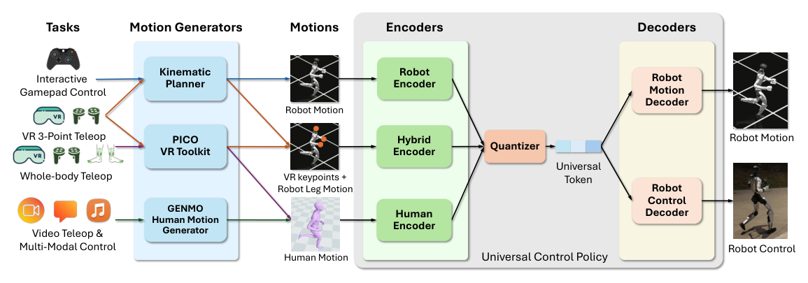

# SONIC：面向自然人形全身控制的大规模动作跟踪

SONIC的主张不是发明一种新的跟踪奖励，而是系统验证模型、数据和算力一起扩展后，低层全身控制是否会出现更强的未见动作泛化和统一接口。作者把网络从约1.2M扩到42M参数，动作数据扩到100M帧以上、约700小时，并投入约21k GPU小时，训练同一个Unitree G1控制策略。

> **主要方法图：** Figure 7，PDF第14页。机器人动作、人体动作和稀疏上肢关键点与下肢动作的混合命令，分别经过三个编码器映射到统一运动token；控制解码器输出关节目标，运动解码器负责重建机器人参考动作并约束token语义。来源：[原论文](https://arxiv.org/abs/2511.07820)。

## 论文框架：异构动作命令如何进入同一控制器

不同上层接口的原始数据结构不同。机器人动作编码器读取未来多帧的关节位置和速度；人体编码器读取SMPL三维关节位置，不要求人体关节数和机器人一致；混合编码器只用当前帧头部与双手关键点表示实时上肢意图，同时读取未来多帧下肢机器人动作保持行走与平衡。多帧未来信息让控制器在起跳、转向或接触到来之前提前改变支撑和身体姿态，而不是到目标帧出现后再被动追赶。

三个MLP编码器会把各自命令映射到共享潜在空间，再由有限标量量化（FSQ）压成两个离散运动token。离散化不是为了给动作人工分类，而是把高维、连续且跨本体的命令压成紧凑的身体接口。论文选择FSQ而不是VQ-VAE，是因为FSQ不需要维护可能坍缩的码本，也不需要commitment loss和EMA更新，直通梯度还能让PPO直接改造token表示。这样从视频、VR、运动规划器或VLA来的命令可以改变输入编码器，而不需要更换低层身体控制器。

## 两个解码器与四类训练信号

控制解码器同时读取token和最近10个控制步的本体历史，本体观测包括关节位置与速度、根部角速度、根坐标系中的重力方向和上一动作。历史窗口让策略看到关节是在接近还是远离目标，并从连续身体响应中补偿速度不可测、接触变化和执行延迟。解码器输出29个关节的目标角，再由G1的关节PD环生成力矩。同一token在不同扰动状态下可以产生不同的关节修正，所以它代表运动意图，不是可以开环回放的固定动作。

运动解码器只读取token，尝试恢复同步的机器人参考动作。它不直接驱动真机，而是在训练时检查token是否仍保留了根运动、肢体配合和未来趋势。当输入是人体姿态时，“人体编码器—token—机器人运动解码器”同时承担隐式重定向：人体关键点必须翻译成可由G1表达的机器人动作。

联合训练中，PPO奖励比较根位置与方向、身体链接相对位姿和速度，并额外约束头、双腕和双踝的末端误差；头手角速度和足部加速度惩罚用来抑制抖动和硬接触。重建损失要求三种token都能恢复同一机器人动作，token对齐损失直接拉近同一动作的三种编码结果，cycle consistency再检查人体token解码为机器人动作并重新编码后是否回到原语义。缺少这些约束时，三个编码器可以各自形成互不相通的编码，VLA或VR端产生的token就无法稳定调用同一个低层控制器。

训练期Critic可以读取根部线速度、全身链接位姿和无噪观测，用更完整的仿真状态稳定PPO价值估计。真机Actor只保留带噪本体观测、当前命令编码器、FSQ和控制解码器；Critic和用于辅助监督的运动解码器不进入必需控制链。

## 真机上的多频率闭环

机载Jetson Orin上，控制环以50 Hz读取IMU、关节位置与速度和参考命令，经编码器和控制解码器生成关节目标；500 Hz命令写入线程持续把最新目标发给Unitree底层接口；操作员输入以100 Hz更新；使用生成式运动规划器时，它以最高10 Hz重规划约2秒的未来全身轨迹。规划器负责把手柄速度和转向意图变成短时参考，SONIC负责根据当前身体反馈执行这条参考，两者不是同一个模块。

外部VLA有两种接入方式：三点接口预测头、双手、基座高度和导航命令，再经运动规划器与混合编码器执行；全身接口则直接预测64维运动token与14维手部关节。后者可以绕过机载动作编码器，但仍由SONIC控制解码器和PD环完成平衡与全身执行。因此论文展示的VLA驱动Loco-Manip不意味着VLA网络直接以50 Hz输出全部电机命令。

## Scaling结论怎样读才准确

论文报告随模型、数据和计算增加，跟踪性能与未见动作泛化持续改善；这比只比较一个大模型和一个小基线更有价值。但三者在实验中相互耦合，不能简单归因于“Transformer更大”。数据清洗、重定向、采样和机器人可行性仍是扩展的前提。

## 它不是端到端大脑

SONIC解决的是参考条件下的身体控制，不负责从开放场景直接决定长期任务。上层VLA连接的是universal token接口，底层仍处理平衡、接触和扰动恢复。官方在2026年公开了训练代码、检查点和部署栈，但跨本体仍需准备新机器人模型、重定向数据、关节映射和执行器配置，不能直接复用G1权重。

大规模结果也依赖训练数据进入策略前的重定向、可行性筛选和采样配比。100M帧并不代表100M帧都同等可靠；视频恢复噪声、脚接触错误和重复动作会直接进入tracker的目标分布。复现时除了总帧数，还应记录各来源占比、剔除规则、动作长度分布和未见测试集与训练库的去重方式。

## 原文、项目与代码

[论文原文](https://arxiv.org/abs/2511.07820) · [项目页](https://nvlabs.github.io/GEAR-SONIC/) · [代码与文档](https://github.com/NVlabs/GR00T-WholeBodyControl)
