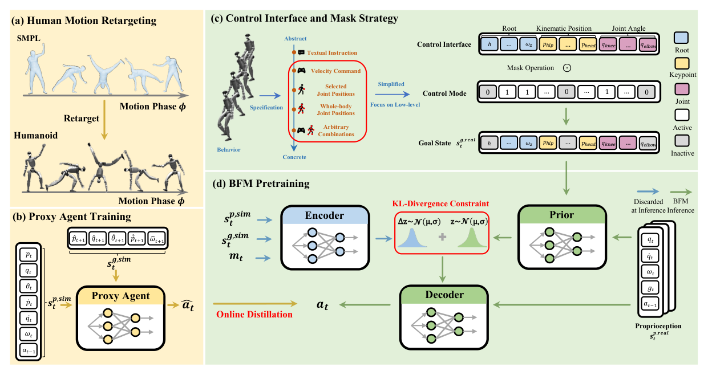

# BFM：人形机器人行为基座模型

很多Whole-Body Controller只能接受一种命令：速度策略不懂关节目标，全身tracker又不适合稀疏关键点。BFM先把这些任务抽象为“机器人应到达怎样的目标状态”，再用mask表示当前给出了哪些目标。一个CVAE在大规模机器人行为数据上学习多解分布，使同一模型能接受从抽象指令到具体关节目标的不同控制粒度。

> **主要方法图：** Figure 2，PDF第3页。人体动作经重定向后训练特权proxy imitator，proxy rollout构成预训练数据；BFM再以统一控制接口和masked online distillation学习。来源：[原论文](https://arxiv.org/abs/2509.13780)。

## Proxy Agent先把人体动作变成机器人行为

直接用运动学动作训练生成模型会保留不可执行片段。作者先在仿真中训练能访问完整信息的motion imitation proxy agent，让它执行重定向动作；由此产生的状态、目标和动作包含平衡与接触反馈。BFM学习的是proxy在物理环境中的行为分布，而不只是人体关节序列。

统一接口把根运动、关键点、关节角等目标放入一套条件表示，通过mask指明有效部分。训练时随机改变控制模式，并在线收集当前模型访问到的状态，由proxy提供动作监督，减少离线蒸馏中的分布偏移。CVAE encoder在训练时将完整行为压成latent，decoder根据当前本体、masked目标和latent输出动作；推理时可从条件prior采样，得到同一稀疏目标下不同但可行的补全。

## 新行为怎样接进来

论文还用潜变量组合、调制和残差学习扩展新行为，目的是在不重训整个底座的情况下增加技能。这里的“文本控制”更接近文本被上层转换成已有行为条件或潜变量，并不是大语言模型直接生成电机力矩。低层可做什么仍受proxy数据、目标接口和本体能力约束。

## 为什么当前标为观察

论文和真机展示说明统一行为分布建模有潜力，但“foundation”应由覆盖、复用成本和外部复现共同证明。截至2026-07-14，官方项目页仍标注`Code In Coming`；读者应把演示、论文结果和可复现实物分开。尤其要检查不同控制模式是否统一评测、稀疏命令下是否模式坍塌，以及新增行为需要多少数据和微调。

## 统一接口下的观测、动作和数据来源

BFM的部署输入由机器人本体状态、masked目标和从条件prior采样的latent组成，输出低层关节动作；根目标、关键点或完整关节参考只是同一条件张量的不同有效子集。训练标签来自proxy agent在物理环境中执行重定向动作的rollout，而不是直接复制AMASS帧。CVAE重建/蒸馏目标维持动作一致性，online distillation让proxy在BFM自己访问的状态上重新标动作，减少离线数据分布外失稳。

不同mask模式应分别报告数据量、跟踪误差、失败率和latent多样性，不能用完整参考模式的表现代表稀疏关键点或速度命令。真实部署还要说明动作频率、PD接口、状态估计、域随机化和保护机制；论文当前开放状态不足以让外部团队核对这些合同。新增行为若需要新的接触、物体或地形状态，也不能只在latent上插值，必须确认proxy与条件表示能够表达相应信息。

## 原文与项目

[论文原文](https://arxiv.org/abs/2509.13780) · [项目页](https://bfm4humanoid.github.io/)
