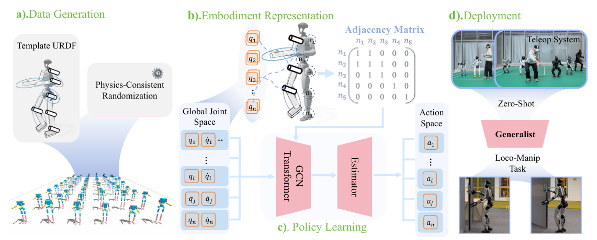

# XHugWBC：面向跨人形运动的可扩展通用全身控制

普通RL策略的观测和动作按某台机器人固定关节顺序展开，换本体后维度、语义和动力学都变了。XHugWBC从训练分布、表示和网络三处同时处理：生成物理一致的随机形态，把机器人关节映射到全局语义空间，再用显式建模形态结构的策略学习一个跨人形控制器。

> **主要方法图：** Figure 2，PDF第3页。左侧生成不同形态与动力学本体，中间将本体状态和动作投影到全局语义关节空间并构图，右侧训练共享策略和状态估计模块。来源：[原论文](https://arxiv.org/abs/2602.05791)。

## 论文框架：把不同人形映射到统一关节语义与图结构

XHugWBC先从一套模板人形生成训练本体。形态随机化不会只改变腿长或躯干比例，而是同步调整几何、质量、惯量和关节参数，使每个虚拟机器人仍然对应物理一致的刚体系统。这样，策略训练时看到的不是一批外形不同但动力学相互矛盾的模型，而是覆盖肢段比例、质量分布和关节能力变化的本体族。跨本体策略能够适应新机器人，首先依赖这一训练分布提供足够的动力学变化。

不同机器人随后进入统一的32槽关节语义空间。每个髋、膝、腰、肩等关节按身体含义放到固定槽位，而不是沿用各自URDF中的名字和索引；目标机器人不存在或不可控的关节由可控性标记屏蔽。映射后的观测包含最近五步根角速度、投影重力、统一关节位置与速度和上一时刻动作，再拼接当前机器人可控制哪些关节以及全身运动命令。缺失关节使用mask而不是填成普通零值，是为了避免网络把“不存在的手腕自由度”误解为“存在但目标角度为零”。

运动命令不仅包含根部前后、侧向和偏航速度，还包含身体高度、骨盆姿态、腰部偏航/俯仰/滚转以及步态相位与支撑设置。上肢干预标记允许外部遥操作器或上层控制器接管部分上肢命令，策略在观测中知道干预已经发生，从而让下肢针对手臂运动带来的质心和角动量变化进行补偿。若外部上肢动作在策略输入中完全不可见，下肢只能把它当作随机扰动，难以形成稳定的协同响应。

统一关节槽位再按机器人真实运动链构造成embodiment graph。GCN先在相邻关节和连杆之间聚合局部信息，使膝关节能够读取髋、踝和腿段的状态；Transformer第一层使用拓扑mask限制注意力范围，保留“哪些关节直接相连”的结构约束，后续层再开放全局注意力，用于协调双腿、腰和双臂等远距离部位。固定MLP只能记住某个向量下标之间的关系，而图结构让网络学习关节在身体拓扑中的作用，这是跨本体输入维度统一之后仍然需要结构建模的原因。

真机难以直接获得准确根线速度和身体高度，因此Actor内部包含状态估计模块。估计器根据可部署本体历史预测这两个量，并在仿真中用真实状态监督。Actor解码器把图节点特征、全局命令和估计结果合并，在统一语义空间输出每个可控节点的动作，再经过逆映射还原为目标机器人的真实关节顺序。目标关节量随后进入各机器人配置的低层关节控制器，执行后的IMU和编码器反馈进入下一控制周期。

Critic只参与训练，它使用与Actor相同的结构，但不需要状态估计器，可以直接读取仿真中的骨盆与躯干线速度、躯干高度、连杆碰撞关系和形态参数。完整状态帮助价值网络判断当前动作在不同形态上是否会导致跌倒或自碰撞，Actor始终依赖真机可获得的历史观测与估计值。强化学习奖励负责速度、姿态、接触和平滑等控制目标，形态表示解决的是本体之间的输入输出对齐，两者不能互相替代。

## 零样本跨本体的实际边界

论文在12个未参与训练的仿真人形和7台真实人形上评估同一策略。“零样本”指不为测试机器人重新更新网络权重，并不意味着无需适配。新机器人仍要提供正确URDF、关节语义映射、坐标轴、限位、动作尺度、PD参数和通信接口，而且本体形态与执行能力不能远离训练分布。论文未披露统一控制频率；截至2026-07-26，官方项目页仍标注`Code Coming Soon`，因此无法从官方实现确认各平台的推理与底层控制配置。

对工程团队而言，可复用资产不仅是策略权重，还包括统一本体schema、映射自检工具、物理一致的形态生成器和分层跨机器人评测。否则每台机器人仍会在隐蔽的坐标转换与配置代码中重复适配，所谓通用控制器也无法稳定维护。

## 原文与项目

[论文原文](https://arxiv.org/abs/2602.05791) · [项目页](https://xhugwbc.github.io/) · 截至2026-07-26，官方代码仍未发布
