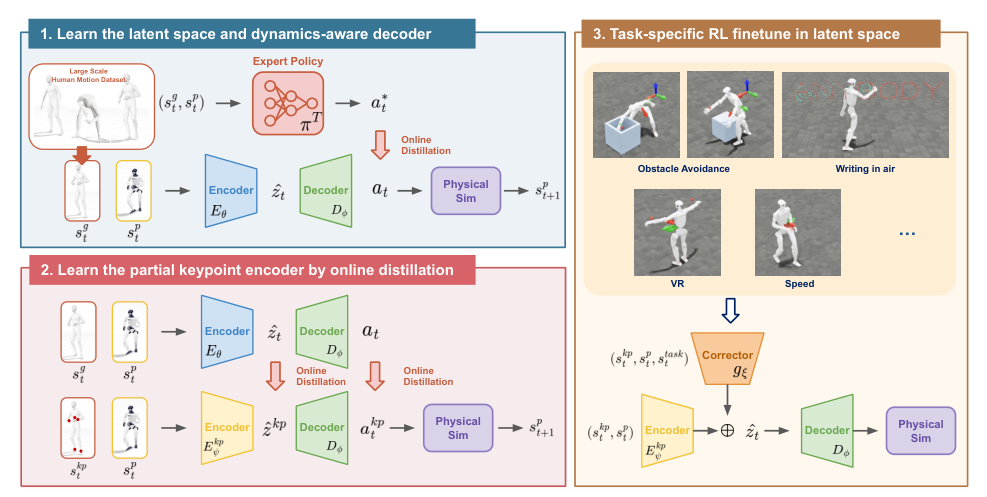

# AnyBody：基于任意关键点引导的自由式人形全身控制

已有稀疏控制器通常预先规定输入是头和双手，或限定若干command mask。AnyBody希望部署时才决定给哪些身体关键点：这次只给双手，下次增加脚和头，甚至不同时间使用不同子集。方法先建立统一latent motion space，再训练一个masked Transformer把任意关键点集合投到这个空间。

> **主要方法图：** Figure 2，PDF第4页。完整动作teacher先蒸馏出球面latent和动力学感知decoder，随后冻结它们，训练任意关键点encoder；下游任务还可在latent中加入轻量残差。来源：[原论文](https://arxiv.org/abs/2606.29209)。

## 第一阶段先把“怎样稳定执行”压进decoder

特权teacher在大规模无结构动作库上做全身tracking。在线蒸馏时，deterministic encoder把完整运动目标编码到单位球面latent，decoder读取latent与当前本体状态并拟合teacher动作。球面约束固定latent尺度，降低不同动作表示的漂移；更重要的是decoder始终看到当前状态，因此包含接触与平衡反馈，不是静态pose解码器。

第二阶段冻结latent空间和decoder。每个关键点目标被当作token，缺失点通过masked self-attention自然忽略；Transformer encoder根据任意子集预测teacher latent。训练中随机抽取子集，才使部署时的自由组合成为分布内问题。最终同一decoder把不同输入组合转成全身动作。

每个token至少要携带“哪个身体点、目标在什么坐标系、目标位置/姿态是什么以及对应时间”这些信息；否则集合式注意力无法区分左手目标和右脚目标。decoder除latent外还读取当前关节状态、机身运动与历史动作，输出机器人全身关节目标，所以同一个稀疏目标在站立失稳和稳定站立时会产生不同补偿。完整动作teacher提供的不是一条离线补全轨迹，而是每个闭环状态下可执行的动作标签。

## 任意子集不等于任意意图都可辨识

关键点越少，满足约束的全身动作越多，模型只能按训练分布补全。例如只给双手轨迹时，跪姿和站姿可能都合理；若任务必须指定脚接触，就要把脚或根姿态加入条件。所谓free-form解决的是接口可变，不消除信息不足。

## 下游任务如何突破动作先验

作者把冻结decoder视为motor prior，在latent层训练轻量残差以适配移动、空中书写和障碍触达等任务。残差过大可能离开已学运动流形，所以评估要同时看任务回报与动作稳定性。与HOVER相比，AnyBody更强调集合式任意关键点输入；与OmniH2O相比，它不锁定三个关键点。

这种残差适配也说明“通用tracker”并非所有任务都无需训练。关键点条件能指定几何目标，却不包含物体质量、接触力或任务成功逻辑；遇到推门、承重等动力学交互，仍需额外状态、奖励或上层策略。输入点临时丢失时，系统还要定义是保持上一目标、逐渐退化到动作先验，还是立即交还平衡控制。

测试集还应覆盖训练中较少见的关键点组合，而不能只随机遮掉常用的头手输入。

同时要报告这些组合的稳定性。

## 原文与项目

[论文原文](https://arxiv.org/abs/2606.29209) · [项目页](https://hazel-hammer.github.io/anybody-project-page/) · [官方代码（Apache-2.0）](https://github.com/hazel-hammer/Anybody)
