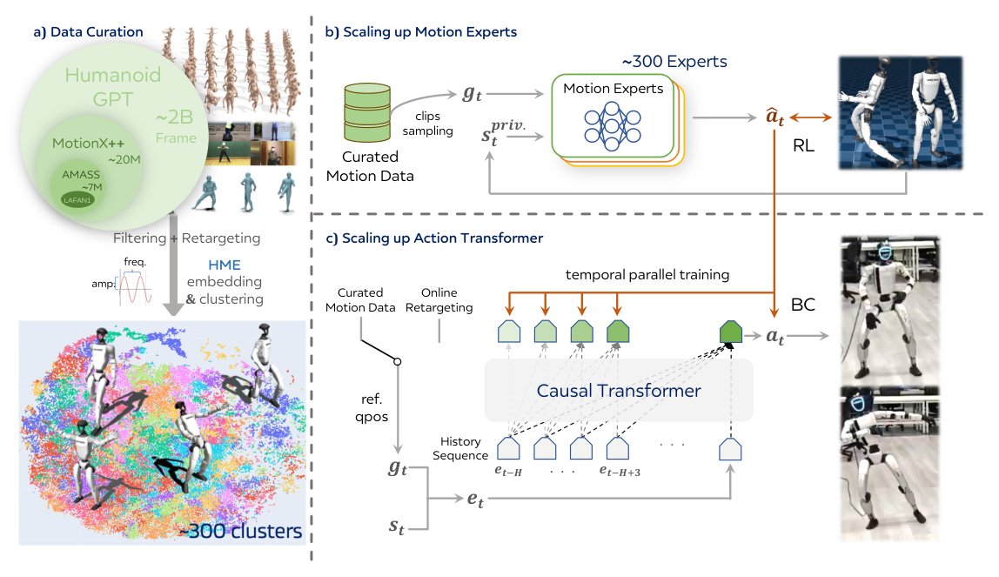

# Humanoid-GPT：面向零样本动作跟踪的数据与结构扩展

标题里的GPT容易让人误以为它是语言模型。这里的核心是用causal Transformer建模本体与动作目标的时间序列，并把大规模RL专家监督蒸馏进一个generalist tracker。系统处理的是重定向后的运动命令，目标是未见动作零样本跟踪，不是从自然语言直接生成力矩。

> **主要方法图：** Figure 2，PDF第3页。动作数据经整理与聚类后分别训练PPO专家，再通过并行DAgger监督单个因果Transformer；部署模型接收未见或在线重定向动作。来源：[原论文](https://arxiv.org/abs/2606.03985)。

## 为什么不直接在20亿帧上做一个PPO

作者汇集主要mocap与自有数据，形成约2B帧的G1重定向语料。动作分布极不均衡，普通步行会淹没高动态长尾，因此先用Harmonic Motion Embedding等表征和质量/多样性规则做整理与聚类。每个簇训练PPO tracking expert，让专家分别解决对应动作的接触和稳定问题。

generalist训练时运行student自己的rollout，各专家在这些状态上给出动作标签，并行DAgger不断补充student偏离后的纠正样本。因果Transformer用历史本体、目标关键点和过去动作预测当前PD目标，RoPE等序列结构支持可变长度上下文。与简单MLP相比，它能利用更长时间关系判断动作相位和恢复趋势。

参考端并不是只给当前姿态：目标关键点或机器人运动按时间形成序列，与历史本体状态和已执行动作一起进入因果上下文。这样模型可以从前后运动趋势判断当前该加速、制动还是准备接触，而不必依赖单一显式相位。输出仍是每个控制步的关节位置目标，真实机器人上的PD与安全层没有被Transformer取代。专家标签来自各动作簇上的PPO闭环策略，因此DAgger学到的是“student已经偏离参考后专家会怎样纠正”，而不是简单复制离线参考关节角。

## Zero-shot具体指什么

论文中的zero-shot是训练后直接跟踪未出现在训练集的机器人参考动作或在线重定向轨迹，不做该动作专属微调。它仍要求输入已被转换成模型接受的G1关键点/动作表示；视频恢复、人体到机器人重定向和任务规划不是Transformer自动完成的。

判断泛化时至少要检查动作级去重、来源级留出和动态难度分桶。相邻切片即使文件名不同，也可能来自同一原始动作；若只随机划帧，零样本指标会被高估。长上下文还带来部署状态管理：丢帧、重置和通信暂停后，缓存应清空还是续接，都会影响恢复轨迹。

部署记录应注明实际上下文长度、缓存占用和端到端控制周期，避免只报告离线推理速度。

## 与银河通用公开系统口径的关系

[北京市科委转引的公司发布材料](https://kw.beijing.gov.cn/xwdt/kcyx/xwdtyqqy/202606/t20260624_4712945.html)把AstraBrain-WBC 0.5描述为面向人形机器人全身实时运动控制的系统组件，其中的大规模动作数据、专家蒸馏、因果Transformer和29自由度控制链与Humanoid-GPT高度相关。这里可以把Humanoid-GPT作为理解WBC技术路线的公开研究依据，但现有来源没有明确宣布论文模型与产品版本完全相同，也没有公开WBC与上层任务规划、世界动作模型或灵巧手模块的真实调用接口。

因此本页只解释Humanoid-GPT论文能够证明的动作跟踪链路。公司发布中的AstraBrain命名、数据系统和演示应单独按公司材料记录，不能反向写成论文已经验证了完整的Agent、WAM、WBC和Dex系统。

## 当前开源范围要写清

从官方仓库当前公开内容看，推理代码、ONNX检查点和G1真机部署模块已经提供，但训练代码和完整训练数据仍列在待办中。因此可以验证发布模型的推理与部署，尚不能完整复现2B帧训练结论。读者评估时还应区分数据记忆、同分布新片段与真正结构不同的未见动作。

## 原文、项目与代码

[论文原文](https://arxiv.org/abs/2606.03985) · [项目页](https://qizekun.github.io/Humanoid-GPT/) · [代码](https://github.com/GalaxyGeneralRobotics/Humanoid-GPT)
