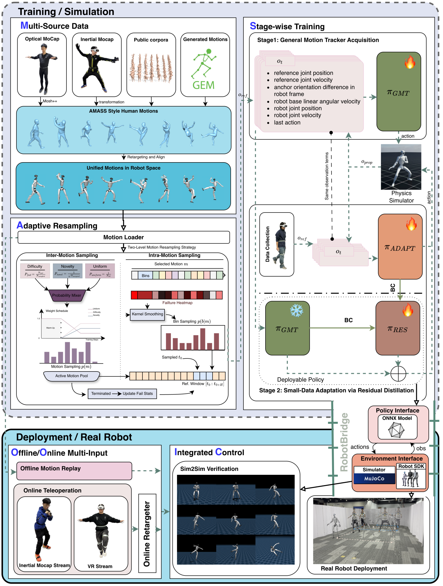

# MOSAIC：通过快速残差适配弥合通用人形动作跟踪与遥操作的Sim2Real差距

一个在离线mocap上很强的tracker，接入VR或惯性动捕后仍可能在真机崩溃：在线信号带延迟、噪声、漂移和人体动作分布偏差。直接用接口数据微调整个模型会损害原有技能。MOSAIC保留通用tracker，只训练一个additive residual吸收特定接口误差，再把通用与适配能力共同蒸馏到部署系统。

> **主要方法图：** Figure 2，PDF第4页。多源动作、两级自适应重采样和通用tracker构成第一阶段；接口数据训练适配策略与残差模块，RobotBridge统一离线回放和在线遥操作部署。来源：[原论文](https://arxiv.org/abs/2602.08594)。

## 通用策略先覆盖动作长尾

动作库混合光学mocap、惯性mocap与生成动作。两级adaptive resampling既提高难动作采样，也持续关注当前策略失败片段；面向移动遥操作的奖励强调world-frame一致性，避免机器人局部看似跟上、全局位置和朝向却持续漂移。这个阶段得到覆盖广的general tracker。

## 适配阶段只学习“接口造成的差”

针对PICO VR和惯性动捕，作者各收集约30分钟小规模数据，训练interface-specific adaptation policy。随后用通用策略和适配策略作为两类teacher，将差异压到加性residual模块：基础输出保留通用能力，残差只在当前接口需要时修正。相比全量fine-tuning，这种参数与功能隔离更容易避免灾难性遗忘，也便于为新设备单独版本化。

部署动作可以理解为`a = a_base + Δa_interface`：base读取标准化参考和本体状态，残差额外吸收该设备特有的延迟、漂移和姿态噪声。残差必须限幅，否则接口突跳会直接覆盖通用tracker的平衡动作；训练也要包含student自身rollout，因为错误修正会改变下一时刻状态。这里适配的是“参考信号如何作用于同一机器人”，不是重新辨识全部电机和地面动力学，载荷或摩擦变化仍可能落在接口残差的训练范围之外。

## RobotBridge为什么不是附属工程

真实系统还要统一动作格式、时间戳、坐标系、网络通信和安全状态。RobotBridge把离线motion replay、不同可穿戴接口与机器人部署接到同一协议，使算法对比不被各自临时代码污染。对复现者而言，这类部署接口与数据集和模型同样重要。

## 证据与待验证项

官方已公开代码和多源数据，并展示长时遥操作、延迟噪声测试及高动态动作。当前仍应观察残差在新地面、载荷和不同机器人上的外推，以及接口失联或突跳时的保护逻辑。小数据快速适配成立，不代表所有Sim2Real误差都能由一个动作残差吸收。

复现报告应同时记录采集端帧率、网络到达间隔、坐标变换更新时间、策略控制频率和端到端延迟分布，并分别测试base、全量微调和残差版本。只比较平均跟踪误差会掩盖偶发长延迟，而真机摔倒往往由这些尾部事件触发。

每个接口版本还应保存残差幅值分布和标定参数，便于判断设备更新后是否已经超出原适配范围。

## 原文、项目、代码与数据

[论文原文](https://arxiv.org/abs/2602.08594) · [项目页](https://baai-humanoid.github.io/MOSAIC/) · [代码](https://github.com/BAAI-Humanoid/MOSAIC) · [数据集](https://huggingface.co/datasets/BAAI-Humanoid/MOSAIC_Dataset)
