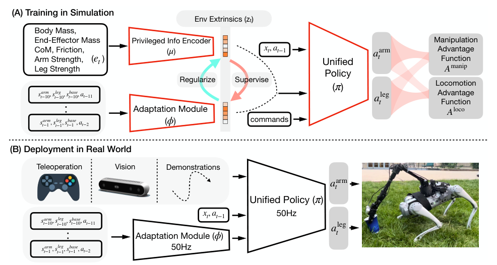

# Deep Whole-Body Control：操作与运动统一策略学习

四足加机械臂常用两个独立控制器：腿追速度，臂追末端，两者通过基座扰动被动耦合。本文用一个策略同时读取腿、臂、基座、末端目标和移动命令，直接输出18个关节目标。真正的难点不是网络维度，而是训练早期操作回报和移动回报会把策略拉向不同局部最优。

> **主要方法图：** Figure 2，PDF第2页。训练时策略以环境extrinsics为条件，部署时由本体历史adaptation module在线估计该latent，无需真机微调。来源：[原论文](https://arxiv.org/abs/2210.10044)。

## Advantage Mixing怎样避免“只伸手不走路”

策略输入包含基座和关节状态、足端接触、上一动作、末端位置姿态命令、机身速度命令以及环境latent，输出腿和臂的目标关节位置。作者分别计算manipulation advantage与locomotion advantage：训练初期让臂动作更多受操作优势更新、腿动作更多受移动优势更新，使两个子任务先形成有效探索；随后逐渐混合总优势，让全身学会协调。没有这一过程时，策略很容易停在原地追末端，因为走路初期会暂时降低操作回报。

统一策略的收益不是形式上的“一个网络”，而是腿可以移动和倾斜基座扩大机械臂工作空间，手臂受力时腿也能主动补偿。论文通过独立策略、未协调单策略和完整方法对比，说明协调来自共享状态与联合优化，而不是简单拼接输出。

末端目标描述的是手应该到达的位姿，并不等于系统显式知道杯子或按钮的完整动力学。接触效果主要通过末端误差、基座响应和任务过程间接体现；抓手开合仍由外部逻辑给出。因而擦拭、按压等成功条件需要由任务层定义，低层策略负责在移动和受力时保持末端可达与身体稳定。遇到物体滑移或目标检测变化，论文中的底座不会自己重新识别物体并规划新抓取点。

## Regularized Online Adaptation和RMA的差别

特权encoder从仿真环境参数得到 `z_mu`，部署adaptation module从近期本体历史估计 `z_phi`。两者与策略在线联合训练，同时正则 `z_mu` 不要远离 `z_phi`。这一步反过来约束特权表示必须能被真实传感器历史推断，避免传统两阶段teacher先学出student无法模仿的latent。真机只运行统一策略和adaptation module，控制频率为50 Hz。

## 适用边界

实验平台是定制四足移动机械臂，不是双足人形；任务包括擦白板、拿杯、按按钮等，接触与步态复杂度仍有限。它最值得人形团队继承的是多目标优化和“让特权latent可估计”的思路，而不是直接照搬动作空间。抓手开合也由外部逻辑控制，不在策略输出内。

迁移评测应记录末端位姿误差、足端滑移、基座偏差、关节饱和和任务完成率，并在固定基座、独立腿臂、统一但无advantage mixing和完整方法之间对比。只有任务成功率提高而身体代价同时可控，才能说明全身协调真的形成。

接触任务还应保存物体终态和抓手状态，避免把末端到位误当作交互成功。

## 原文与项目

[论文原文](https://arxiv.org/abs/2210.10044) · [项目页](https://manipulation-locomotion.github.io/)
