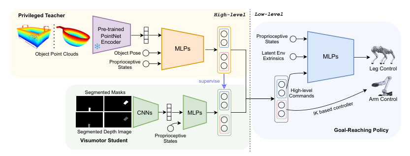

# VBC：面向腿式移动操作的视觉全身控制

让图像策略直接输出所有腿和臂关节，既难训练又难Sim2Real。VBC把任务拆成两个频率层：低层goal-reaching controller接收机身速度与末端位姿目标，负责稳定执行；高层视觉策略根据物体深度图不断更新这些短期命令。高层学“下一步去哪、手往哪伸”，低层学“身体怎样做到”。

> **主要方法图：** Figure 3，PDF第4页。低层RL控制B1腿部并以IK控制Z1机械臂；高层特权teacher读取物体状态，视觉student读取分割深度并通过DAgger蒸馏。来源：[原论文](https://arxiv.org/abs/2403.16967)。

## 低层并非真正全关节RL

低层命令包括末端位置与姿态、前向速度和偏航速度。RL策略读取基座、腿、臂、接触、上一动作、步态时序和环境latent，输出12个腿关节目标；机械臂目标则通过Jacobian伪逆IK转换成关节角。随机采样不同末端目标与移动速度后，腿会通过弯曲、移动和调整基座扩大手臂可达空间。这里的whole-body指系统协同，并不意味着一个策略直接输出全部19自由度。

## 高层从特权状态转成视觉

任务teacher能访问物体点云特征、准确位姿和本体状态，用RL输出末端增量、移动速度与抓手开合。部署student只看物体mask、分割深度、本体和上一高层动作，通过DAgger在student访问到的状态上学习teacher纠正。相机位姿、深度噪声、高低层调用比率和机械臂PD参数都在训练中随机化。

高层真正闭环的是“物体相对机器人如何变化”：分割深度给出目标表面几何，头部和腕部视角互补遮挡，上一高层动作帮助网络判断自己刚刚要求身体怎样移动。teacher的准确物体状态只在训练中提供动作监督，真机没有这一捷径。接触本身没有被表示成精确力轨迹，抓取、开门等结果主要通过物体运动和任务奖励判断；因此目标mask漂移后，视觉student可能继续对错误区域输出合理但无效的末端命令。

## 真机系统仍有人为入口

平台是Unitree B1加Z1机械臂，头部与腕部各有RGB-D相机。实验开始时需要人工标注目标物体，TrackingSAM约10 Hz传播mask；只要某一相机可见目标即可继续追踪。因此论文证明的是“给定目标分割后的自主视觉loco-manipulation”，还不是开放场景语言找物。

失败恢复依赖高层下一次视觉观测重新给命令，低层只负责短时可达与稳定。复现时应分开报告分割保持率、物体遮挡时长、低层goal-reaching误差、抓取或开门成功率和重试次数；只比较最终成功率无法判断视觉与身体控制各自贡献。

还应测试两个相机同时失去目标时，系统能否停在稳定姿态，而不是沿上一命令继续推进。

## 为什么这篇仍值得人形团队看

它把视觉策略和高频身体控制的责任边界画得很清楚，也说明高层频率抖动本身应进入随机化。迁移到人形时要重新处理双足稳定、双臂耦合和更强接触，但“特权任务teacher、视觉student、可复用goal-reaching底座”仍是有效结构。

## 原文与项目

[论文原文](https://arxiv.org/abs/2403.16967) · [项目页](https://wholebody-b1.github.io/)
