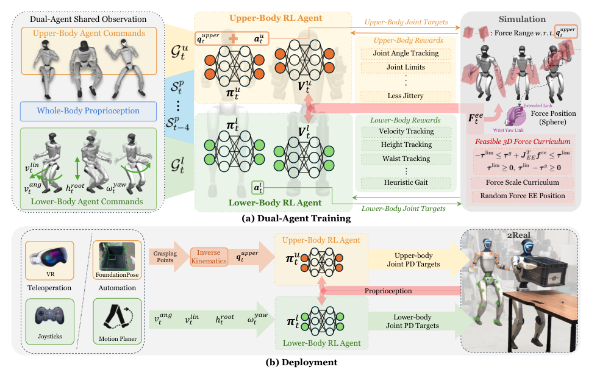

# FALCON：力自适应人形移动操作学习

搬重物、拉车和开门的难点不只是末端到位，而是未知外力经手臂传到全身。单体whole-body RL同时探索行走和手臂跟踪，样本效率低；腿RL加上身IK又无法主动适应外力。FALCON联合训练上下身两个Agent，各自优化清晰目标，却共享全身本体观测，使腿和手臂能感知彼此造成的动态变化。

> **主要方法图：** Figure 2，PDF第4页。下身Agent追移动、步态和高度，上身Agent追关节目标；训练中在末端施加受关节力矩约束的随机3D外力，部署可接VR或FoundationPose与规划器。来源：[原论文](https://arxiv.org/abs/2505.06776)。

## 论文框架：共享全身观测的上下身双策略与可行外力课程

FALCON把全身控制拆成下身Actor和上身Actor，但没有把机器人状态割裂开。两个Actor都读取最近五步全身关节位置与速度、根角速度、投影重力和历史动作，因此腿部能够观察手臂受力后引起的身体倾斜和关节变化，上肢也能观察行走造成的基座运动。下身目标包含根线速度与角速度、支撑状态、根高度和腰部偏航；上身目标是需要追踪的肩、肘、腕关节姿态。

两个Actor分别输出下身和上身的目标关节位置，随后按真实关节顺序拼成完整动作并交给PD控制器。机器人与物体接触后，未知负载和阻力会改变关节误差、机身姿态和下一时刻本体观测，两套策略据此共同调整。共享观测的意义在于让上下身在动作生成前就感知彼此造成的动力学影响，而不是等两个独立控制器分别输出冲突动作后再由限幅器被动处理。

训练中的Critic可以额外读取仿真真实根线速度和末端外力，用更完整的信息评估当前状态的长期回报；这些量不进入部署Actor。下身奖励约束速度、步态、身体高度和稳定性，上身奖励约束目标姿态和动作平滑。PPO根据两部分任务结果更新Actor，PD与物理仿真产生的下一状态又回到五步历史中，形成“全身观测与上下身目标 → 两个Actor → 拼接关节目标 → PD与接触环境 → 本体反馈”的闭环。

未知外力不能在训练中任意采样。若从一开始就在末端施加远超当前关节能力的随机力，手腕和手臂会长期饱和，策略只能学习躲避或僵硬保护。FALCON根据末端Jacobian把笛卡尔外力转换为关节负载，再结合重力补偿和关节力矩上限计算各方向的可行力范围；训练随着策略能力提升逐步放大全局外力尺度。施力点还会沿腕部到末端随机移动，使相同外力产生不同力矩臂，覆盖提、拉、推时接触点变化带来的力矩差异。

部署时不需要力传感器，也没有单独的外力估计网络。质量、阻力和接触反力通过关节偏差、基座变化和连续本体历史隐式进入Actor，策略再调整腿臂关节目标来维持手部参考与身体平衡。物体几何状态仍由上层系统提供：遥操作可以直接给出上肢目标，自主系统则使用FoundationPose、外部定位、逆运动学和任务状态机生成目标。FALCON处理的是目标执行过程中的全身受力适应，不负责识别要操作哪个物体或决定下一项任务。

## 实机能力与系统边界

论文在Unitree G1和Booster T1上展示搬运、拉车和双臂开门，实验覆盖0至20 N负载以及最高约100 N的拉车受力。它没有直接控制期望接触力，也不保证对训练范围外的冲击、柔性物体和持续滑移安全；论文也未披露统一控制频率。接触突然脱开时，Actor会观察到本体状态变化，但是否重新抓取、重新规划或结束任务仍由上层判断。

完整系统因此还需要接触检测、物体状态更新、关节饱和与足端滑移监测，以及参考中断后的卸力或站稳策略。只报告手部跟踪误差会遗漏真正的任务结果，开门、推车或搬运还应检查物体是否到达目标状态、接触是否持续以及机器人是否越过安全边界。

## 原文、项目与代码

[论文原文](https://arxiv.org/abs/2505.06776) · [项目页](https://lecar-lab.github.io/falcon-humanoid/) · [代码](https://github.com/LeCAR-Lab/FALCON)
