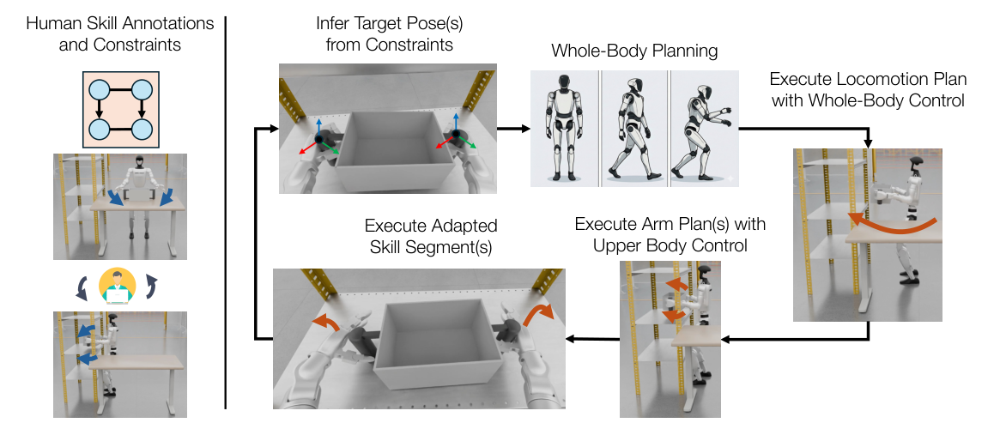

# HumanoidMimicGen：基于全身规划的移动操作数据生成

一条遥操作示范只覆盖一个机器人起点和物体位置，直接行为克隆几乎必然过拟合。HumanoidMimicGen不靠生成模型凭空扩动作，而是把示范标注成双臂skill segment和先后/协同约束；场景变化后重新推导目标位姿，用全身规划把移动、手臂过渡和原示范中的操作片段重新拼成成功轨迹。

> **主要方法图：** Figure 2，PDF第3页。左侧示范带每条手臂的skill annotation和约束，右侧先由约束确定执行顺序与目标位姿，再依次执行移动规划、手臂规划和适配后的技能片段。来源：[原论文](https://arxiv.org/abs/2605.27724)。

## 什么被复用，什么被重新计算

源示范被分成相对物体坐标系的技能片段，保留抓取、抬升、按压等局部接触运动。新场景采样后，约束决定目标物体、左右臂关系和技能precedence；规划器先求可到达的机器人站位，再生成移动轨迹和上肢过渡，最后将局部技能对齐到新物体姿态。低层采用分层混合动作空间和whole-body controller执行，失败轨迹被过滤，只把成功的状态、图像和动作写入数据集。

作者从每项任务一条PICO示范生成约1000条数据，构建9任务G1仿真benchmark，并用GR00T N1.6等策略做模仿学习比较。数据扩增的核心价值是覆盖起点、物体位姿和过渡路径，而不是重复原轨迹加噪声。

## 真机结果应该怎样解读

真机阶段不是只用合成数据零样本部署，而是simulation与real demonstrations共同训练。论文四项真机任务中，real-only平均成功率约0.51，co-training约0.71，即提高20个百分点。这个结果支持“规划生成数据能补充真机数据”，不能写成合成数据已经完全替代真实采集。

## 自动化仍有明显人工前提

技能切分、双臂约束、先后关系、仿真场景、初始分布和成功条件都需人工定义；规划器也依赖准确对象模型与碰撞几何。它适合结构明确、可由有限技能段描述的工厂任务，对柔性物体、未知接触和感知误差仍有限。评估时应同时报告生成成功率、过滤比例、轨迹多样性和训练后任务成功率。

## 一条生成样本里实际保存什么

论文把示范形式化为状态、观测、动作三元组序列。状态包含机器人关节构型、末端和物体的SE(3)位姿；观测包含本体感知与机器人相机RGB；动作是全关节位置控制目标。生成阶段可以读取特权状态做规划，但训练的视觉策略只使用可部署观测。运动噪声用于把机器人推到偏离专家轨迹的状态，写入标签的仍是未加噪的专家动作，从而形成带纠偏状态的行为克隆样本。

九个G1任务各从一条PICO VR遥操作示范开始，HumanoidMimicGen为每个任务收集1000条**成功**轨迹；规划失败、候选构型耗尽或最终任务条件不满足的episode会丢弃。这个成功过滤保证标签可用，却也可能让数据缺少临界失败和恢复状态，因此使用时还应记录尝试总数、拒绝原因、场景参数和随机种子。项目当前公开了论文与Benchmark说明，但不能在没有明确数据包和许可证的情况下把这些轨迹视为可自由再分发的开放数据集。

## 原文与项目

[论文原文](https://arxiv.org/abs/2605.27724) · [项目页](https://humanoidmimicgen.github.io/)
