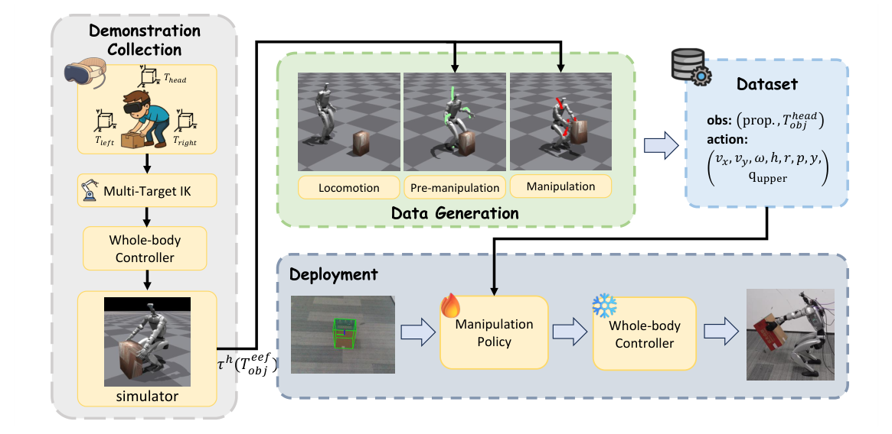

# DemoHLM：从单次示范到可泛化人形移动操作

DemoHLM同样从单条示范扩数据，但它的落点更偏工程化控制层次。操作者只在仿真里完成一次任务，系统把末端轨迹记录在物体坐标系中，并拆成locomotion、pre-manipulation和manipulation三段。新起点下前两段重新生成，真正接触物体的轨迹则相对物体重放和调整。

> **主要方法图：** Figure 1，PDF第4页。VR示范形成物体中心轨迹，仿真扩增记录本体、相机坐标物体位姿和高层命令，行为克隆策略再驱动冻结的whole-body controller。来源：[原论文](https://arxiv.org/abs/2510.11258)。

## 三阶段分别解决什么

移动阶段根据机器人与目标物体的相对位姿生成 `vx、vy、yaw` 命令，直到进入操作范围。预操作阶段在当前末端和物体坐标中的示范起点之间插入平滑过渡，避免起始偏差造成突跳。操作阶段主要保持示范末端相对物体的轨迹，使推、按、抬等接触效果随物体位置一起移动。三个阶段的高层命令都交给RL训练的通用全身控制器，后者把上肢目标、躯干运动和移动命令转成关节控制。

只保留成功rollout后，训练高层behavior cloning policy。其输入包含机器人本体和相机坐标中的物体6D位姿，输出whole-body controller接受的高层命令。因此策略不是直接从RGB学物体，也不是直接输出电机力矩。

扩增样本至少绑定初始机器人位姿、物体位姿、阶段标签、末端或移动命令、实际本体轨迹和成功结果。只保留成功数据能给行为克隆提供干净监督，却会丢掉“何时应该重试或退出”的负样本；部署时若物体跟踪跳变、抓取失败或阶段切换过早，策略没有从失败轨迹中学到恢复。三阶段状态机应设置超时、位姿误差和接触结果检查，而不是仅按固定时间推进。

## 真机闭环实际依赖哪些模块

Unitree G1增加2自由度颈部、RealSense D435和并联夹爪；底层PD以500 Hz执行。头部RGB-D配合FoundationPose/增强跟踪模块提供物体6D位姿，高层策略持续修正移动与末端命令。论文在多项任务上展示仿真到真机，但成功率随遮挡和物体跟踪质量下降。截至2026-07-14，作者官方GitHub仓库只包含README和项目页文件，没有DemoHLM训练、控制或部署实现，因此不能标为开源代码。

物体坐标表达带来的泛化主要针对平移、旋转和起点变化；物体尺寸、铰链约束、摩擦或质量改变后，原末端轨迹未必产生同样结果。验收要分别变化位姿、几何和动力学，并记录进入操作范围的成功率、接触保持、物体终态误差与低层保护触发。

阶段切换日志也应保留，便于定位失败发生在导航、过渡还是接触操作阶段。

## 和HumanoidMimicGen的区别

DemoHLM强调对象坐标轨迹和固定三阶段pipeline，人工建模更少、结构也更明确；HumanoidMimicGen支持多技能、双臂约束与部分顺序规划，更适合长时复合任务。两者都不是“任意任务一条视频就能学会”，都依赖仿真示范、对象模型和已有whole-body controller。

## 原文与项目

[论文原文](https://arxiv.org/abs/2510.11258) · [项目页](https://beingbeyond.github.io/DemoHLM/) · [官方仓库（仅README与项目页文件）](https://github.com/BeingBeyond/DemoHLM)
