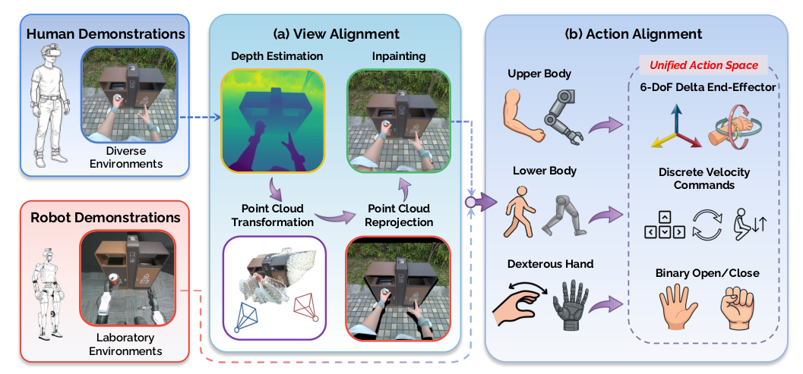

# EgoHumanoid：基于机器人无关第一视角示范的野外移动操作

真人可以低成本在商店、家庭和户外采集第一视角示范，但人的相机更高、手臂更长、移动方式也不是机器人速度指令。EgoHumanoid没有把人体视频直接和机器人数据混合，而是同时做view alignment与action alignment，再用少量真机遥操作数据锚定机器人执行分布。

> **主要方法图：** Figure 3，PDF第5页。人体第一视角先通过深度反投影、视点变换与生成式补洞近似机器人相机；上肢转为相对末端位姿，下肢转为离散移动命令。来源：[原论文](https://arxiv.org/abs/2602.10106)。

## View Alignment改的不是颜色，而是观察几何

人体相机图像先估计深度并反投影成点云，再从机器人相机高度和姿态重投影。视点移动后产生的空洞由生成模型inpainting，使策略看到更接近G1头部相机的构图。若只做普通图像增强，桌面高度、手物相对位置和可见区域仍与机器人不同，策略很容易用错误几何相关性学习。

## Action Alignment怎样绕开人体关节差异

上身不使用人体关节角，而用连续帧之间的6D末端delta pose；平移与SO(3)旋转分别平滑后降采样到20 Hz。人体骨盆轨迹被量化为前后、横移、转向、站立/下蹲等离散移动原语，手部则转为二值开合。机器人遥操作数据也用相同协议，因此两种本体的数据可以进入同一个动作头。

作者微调 `pi0.5`，输入第一视角RGB和语言，输出统一动作，不加入不兼容的人/机器人proprioception。batch中控制人类与机器人数据比例，避免数量更多的人类数据淹没少量但执行准确的机器人监督。

统一动作随后仍要由机器人侧执行栈解释：离散移动原语交给现成locomotion policy，连续末端delta由上肢或全身控制器转成关节动作，抓手命令控制开合。视觉策略主要从图像判断物体和任务进展，并滚动输出下一段动作；它不直接观测接触力，也不在像素模型中求全身平衡。物体是否抓住通常由后续视觉变化和任务结果间接反映，短时滑移或负载突变仍依赖低层鲁棒性。

## Robot-free修饰的是数据采集，不是全部训练

策略仍与真机遥操作数据共同训练，并由现成低层locomotion policy执行离散移动命令。论文在4类G1任务上报告加入人体数据后平均提升，并在机器人数据未覆盖场景中获得更明显增益。它说明人类数据能扩环境与任务分解覆盖，不说明人体动作可完全替代机器人接触数据；精细力控和本体特有失败仍需要真机样本。

部署失败可来自视点变换伪影、语言歧义、离散移动量化、低层跟踪或真实接触，必须在日志中保存每层输入输出。若抓取失败但图像仍像成功示范，策略可能继续移动；可用物体检测、夹爪状态或任务阶段检查触发重试。评测应同时给人类数据比例、机器人数据量、未见场景成功率和每次任务的人工干预次数。

因此本库把EgoHumanoid归入`LocoManip与物理交互`，并保留`机器人无关示范`标签。视角和动作对齐是重要的数据方法，但论文最终交付、训练和验收的是G1在开放场景中的移动操作策略，而不是一个可独立复用的数据集或批量生成平台。

## 原文与项目

[论文原文](https://arxiv.org/abs/2602.10106) · [项目页](https://opendrivelab.com/EgoHumanoid) · [代码](https://github.com/OpenDriveLab/EgoHumanoid)
