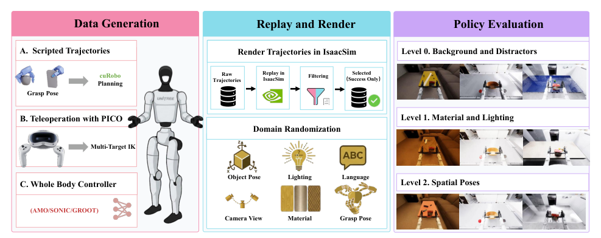

# SIMPLE：面向人形移动操作的仿真策略学习与评测

人形loco-manipulation benchmark同时需要稳定的高频接触和足够真实、多样的视觉。SIMPLE没有要求一个仿真器两者都做到最好，而是让MuJoCo作为动力学真值端，Isaac Sim同步状态并离线或在线渲染。策略看到Isaac图像、发出动作，真正推进机器人和物体状态的是MuJoCo。

> **主要方法图：** Figure 2，PDF第4页。MuJoCo中通过规划和VR遥操作生成轨迹，成功轨迹在Isaac Sim中离线回放并随机化渲染，最后按统一协议评测多类策略。来源：[原论文](https://arxiv.org/abs/2606.08278)。

## 数据管线为何拆成采集与渲染

自动管线用cuRobo规划双臂，脚本和whole-body controller负责机器人移动；复杂任务也可通过PICO在MuJoCo低延迟遥操作。原始状态动作轨迹以50 Hz记录，之后反复送入Isaac Sim，改变物体实例、材质、灯光、相机、背景干扰和语言描述。这样无需重新操作，就能从一条物理轨迹生成多种视觉观测。

每条episode应把MuJoCo动力学状态、Isaac相机帧、语言、任务阶段、高层动作、低层控制器版本和成功结果绑定到同一时间轴。Isaac只渲染并不推进物理，因此状态同步和相机外参必须逐帧校验；任何延迟都会让图像中的手物关系与动作标签错位。离线视觉变体共享同一物理轨迹，增加的是外观覆盖，不是新的接触行为。

资产经过碰撞网格处理、稳定落姿和抓取姿态预计算。论文配置约60项全身任务、1500余件Objaverse对象加GraspNet资产、50个室内场景，并渲染6000个episode用于比较VLA、world-action model和经典模仿策略。

## 评测分层在测什么

难度逐级加入背景干扰、材质/灯光和空间初始位姿变化，使研究者能区分感知鲁棒性与布局泛化，而不是只给一个混合成功率。系统用统一Gym接口接入策略，并把高层上肢目标与移动命令交给低层控制器。这种接口公平性很重要：比较的是高层策略，不应让每个模型暗中使用不同WBC。

策略输出应统一到明确的中层命令、更新频率和动作范围，低层WBC checkpoint、PD与手部逻辑固定。评测记录物体终态、阶段成功、碰撞、跌倒和超时，并保留失败视频。对于world-action model，还需注明模型是否用生成未来、动作chunk还是直接回归，避免“同一Gym接口”掩盖在线计算预算差异。

## 它还不是现实替代品

论文只在少量任务上做真机零样本对照，不能由此证明所有仿真排名都能预测真实排名。当前对象是刚体，布料、绳索和食物等不支持；Isaac光追单卡吞吐约4 fps，批量视觉生成仍昂贵。公开benchmark最应继续补充的是版本锁定、隐藏测试、失败视频和多次真机相关性。

真机相关性应比较同一组策略的排序，而不只是挑最强模型部署；若仿真差异不能预测真实差异，benchmark更适合作为训练集而非评测代理。资产、随机种子、渲染器和低层控制版本都应写入结果清单。

数据划分还应按场景与物体实例去重。

## 原文与项目

[论文原文](https://arxiv.org/abs/2606.08278) · [项目页](https://psi-lab.ai/SIMPLE) · [官方代码（MIT）](https://github.com/physical-superintelligence-lab/SIMPLE)
