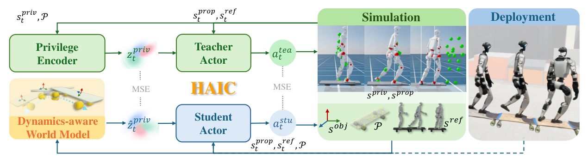

# HAIC：基于动力学感知世界模型的敏捷人形物体交互控制

机器人站上滑板或拉推车后，物体有独立惯性和非完整约束；相机又常被身体或物体遮挡。仅用本体历史的策略可以感到自己被带动，却难以显式区分物体位置、旋转、速度和加速度。HAIC训练一个object-centric dynamics world model，把这些高阶状态从机器人本体反馈和动作历史中恢复，再提供给student控制器。

> **主要方法图：** Figure 4，PDF第4页。特权teacher读取完整仿真状态，student只读取可部署本体观测；world model预测物体动力学并构造几何表示，随后与student进行非对称联合微调。来源：[原论文](https://arxiv.org/abs/2602.11758)。

## World Model预测什么

Object adapter读取过去的预测、机器人本体历史和动作，递推估计每个交互物体的位置、姿态、线角速度与加速度。预测的位姿进一步投影为静态几何占据/碰撞表示，使策略既知道“物体将怎样运动”，也知道“它现在占据哪里”。这里的world model是低维物体动力学状态估计器，不是生成未来视频，也不直接在模型中搜索动作序列。

## 两阶段训练为何要持续更新模型

第一阶段以完整状态teacher做RL，同时训练world model和student模仿teacher，使student先获得可用控制。第二阶段student用asymmetric actor-critic继续PPO fine-tuning，critic可看特权状态；world model也随student的新rollout持续更新。若模型只在teacher轨迹上训练，student探索稍有偏离就会遇到未见状态，预测误差反过来进一步带偏策略。

控制端把预测物体状态、几何表示、本体历史和任务命令一起输入student，输出全身关节目标。它不是先在world model中枚举动作再做MPC，而是让策略把预测状态当作额外观测；重规划发生在每个控制步的闭环动作更新中。训练奖励既要推动物体达到目标状态，也要约束身体跟踪、平衡和动作安全，否则模型预测得准也可能学不到有效接触。

## 真机任务说明了什么

论文在人形机器人上展示滑板、推车/拉车、多物体顺序交互，以及搬箱穿越坡面和台阶。对滑板而言，速度和加速度预测帮助处理起滑、减速与下板；对推车而言，多个物体状态分别估计。结果支持“显式预测交互物体动力学比仅堆本体历史更有效”。

## 仍需警惕的边界

模型依赖训练中定义的对象状态与几何投影，面对新拓扑、柔性接触和严重碰撞未必成立；预测误差阈值一旦超过策略容忍范围会快速失稳。所谓blind是部署不依赖直接物体观测，不代表不需要初始化、已知对象类别或安全监控。工程验证应同时画出物体状态误差、策略动作和任务成功，不能只展示成功视频。

多物体任务还需说明对象身份如何保持、初值从哪里获得以及接触后是否会交换顺序。失败恢复不是world model天然提供的：若物体已脱手或滑板翻转到训练外姿态，系统仍需要检测异常、停止动作或切换恢复技能。

## 原文与项目

[论文原文](https://arxiv.org/abs/2602.11758) · [官方项目页](https://haic-humanoid.github.io/) · [官方代码](https://github.com/ldt29/HAIC)

截至2026-07-14，官方仓库已包含环境、世界模型、训练、评估和Sim2Sim入口，但仓库未提供许可证文件；“代码可见”不等于已经获得不受限制的复用许可。
