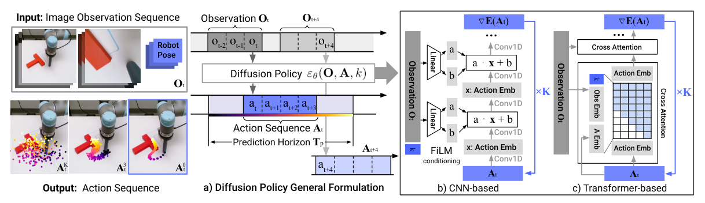

# Diffusion Policy：基于动作扩散的视觉运动策略学习

模仿学习里常见的MSE回归有个硬伤：同一个观测可能对应“从左边绕”和“从右边绕”两种都正确的动作，直接回归容易把它们平均成一条谁也不像的轨迹。Diffusion Policy的核心不是给机器人加一个“扩散模型标签”，而是把未来一段连续动作当作条件生成对象，同时保留多峰性和时序一致性。

> **主要方法图：** Figure 2，PDF第3页。左侧是“历史观测输入、未来动作段输出”的总体形式；中间和右侧分别是CNN与Transformer去噪网络。来源：[原论文](https://arxiv.org/abs/2303.04137)。

## 它究竟在生成什么

在时刻t，策略读取最近`To`帧图像与机器人状态，不是只输出下一个动作，而是从高斯噪声开始，经过K次去噪得到`Tp`步的未来动作序列。CNN版用FiLM把观测特征注入每层一维卷积；Transformer版让动作token通过交叉注意力读观测，并用因果mask限制动作之间的信息流。两者都在学一个条件动作分布，不是还原图像。

训练时向示范动作块加入不同噪声等级，网络回归噪声或等价的去噪方向；损失只要求生成动作分布贴近数据，不包含任务奖励、物理模型或在线成功信号。视觉、本体状态和时间历史共同构成条件，动作维度则由具体机器人接口定义，例如末端位姿、夹爪或关节目标。因此同一个Diffusion Policy架构换本体时仍要重做归一化、动作头和底层执行映射。

## Action Chunk和滚动重规划才是控制闭环

模型一次预测很长，但只执行前`Ta`步，然后用新观测重新生成。这个设计同时解决两个问题：动作段可以表达“接近、接触、拉动”这种跨多帧的意图，部分执行又避免开环轨迹在扰动下越走越偏。因此复现时不能只抄网络；`To/Tp/Ta`、推理耗时、动作归一化和控制器的执行频率是一组耦合参数。

滚动重规划也不是失败恢复的充分条件。新观测若已经离开示范分布，模型可能反复生成不同但都无效的动作；接触力、碰撞和关节限位仍要由低层控制器与安全层约束。用于人形时，更合理的是让扩散模型输出低频末端/身体命令或参考轨迹，再由Mimic、Locomotion或Loco-Manip底座维持平衡，而不是把多步去噪直接放进力矩环。

## 论文证明了哪一层

作者在Push-T等基准和多个真实机械臂任务上对比了显式回归、能量模型等方法，支持的结论是：对多模态、高维、时序相关的动作，扩散式动作块是很强的行为克隆基线。它没有解决数据集没覆盖的状态，也不会自动产生任务级推理或安全约束。用在高频全身控制时，多步去噪的延迟和接触失配仍要单独处理。

复现报告至少应包含动作预测长度、实际执行长度、去噪步数、控制频率、推理延迟分布、示范数量与失败后的人工复位规则；只给最终成功率不足以解释扩散动作块的收益。

## 原文与代码

[论文](https://arxiv.org/abs/2303.04137) · [项目页](https://diffusion-policy.cs.columbia.edu/) · [代码](https://github.com/real-stanford/diffusion_policy)
