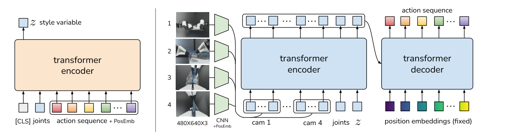

# ACT / ALOHA：基于低成本硬件的精细双臂操作学习

这项工作其实有两个不可分开的部分：ALOHA用低成本主从机采集高频双臂示范，ACT则学习这些示范里跨越多个时刻的动作协同。如果只把ACT理解成“Transformer做行为克隆”，会漏掉它真正解决的问题：细粒度操作中，单步预测容易累积误差，双臂动作又必须保持时序一致。

> **主要方法图：** Figure 4，PDF第4页。左边是只在训练时存在的CVAE编码器，右边是测试时真正执行的策略。来源：[原论文](https://arxiv.org/abs/2304.13705)。

## 训练时为什么要有一个“风格z”

ACT是Conditional VAE。训练时，编码器同时看当前关节位置和后面完整的k步示范动作，把这段动作压成潜变量z。z用来吸收同一任务中不同操作风格和时序差异，避免解码器把多种合法示范粗暴平均。解码器读多相机图像、当前关节状态和z，一次输出一段双臂关节目标。测试时未来动作当然不可见，所以整个编码器被丢弃，z取先验均值零；这一点不能与“在线采样多种风格”混为一谈。

训练目标由动作重建和KL正则组成：前者让chunk贴近示范，后者把潜变量约束到部署可用的先验。输出是ALOHA双臂关节位置与夹爪命令，真正的关节伺服、碰撞限制和硬件安全由平台控制器承担。模型不预测世界状态，也没有语言规划或任务级记忆；它属于action-chunking行为策略，是后来VLA常用动作头的重要前身。

## 动作分块和时间集成各解决一个问题

一次预测k步会缩短有效决策时域：模型不必在每一帧都重新发明剩余动作，也更容易学到两只手的配合。但长chunk又会弱化反馈，所以ACT在每个时刻都重新预测，对多个重叠chunk中指向当前时刻的动作做按新旧加权的temporal ensemble。它不是简单滑动平均：它用连续重规划保留闭环性，同时抑制chunk边界处的跳变。

当物体滑移或手已离开示范状态时，时间集成只能平滑多个预测，不能主动判断“抓取失败并重来”。完整系统还需视觉任务状态或成功检测决定继续、重试和复位。对人形双臂任务，ACT更适合输出上肢/末端动作块，低层全身控制器仍要处理腰腿补偿、负载和接触稳定。

## 证据强，但不是“50条数据什么都能学会”

论文在50 Hz的ALOHA上完成了穿线、装机等六类双臂任务，在其实验设置中通常用约50段、约10分钟的高质量示范取得很高成功率。这里的前提是任务边界明确、主从机采集贴近执行本体、示范质量高。换环境、换物体或进入示范外状态后，BC的分布偏移并没有被CVAE自动消除。

复现应记录chunk长度、temporal ensemble衰减、相机同步、示范成功率和各任务重置方式，并对单步BC、只分块、不做时间集成和完整ACT分别比较。

双臂任务还应记录左右臂时间对齐、夹爪状态和碰撞保护；动作块协调正确但底层不同步，仍会在精细装配中失败。

## 原文与开源

[论文](https://arxiv.org/abs/2304.13705) · [ALOHA项目页](https://tonyzhaozh.github.io/aloha/) · [ACT代码](https://github.com/tonyzhaozh/act)
