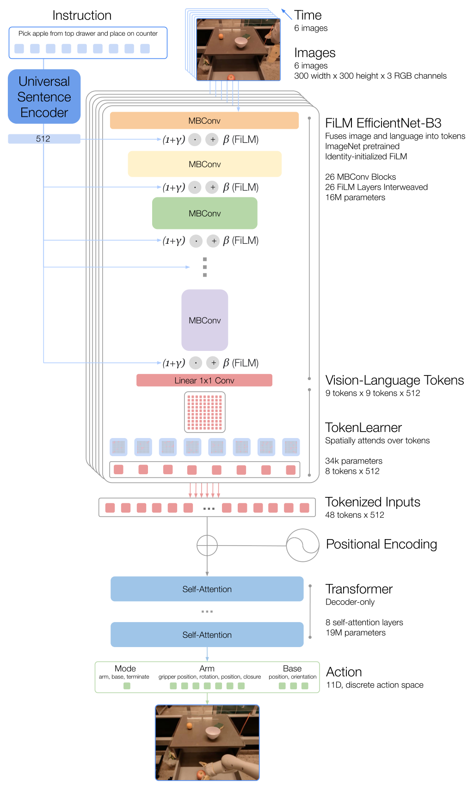

# RT-1：面向大规模真实世界控制的机器人Transformer

RT-1的关键不是第一次在机器人上用Transformer，而是把规模化数据、语言条件和实时执行放在同一个系统里。13台Everyday Robots在17个月中收集约13万段示范，覆盖700多个任务。这个量级让研究问题从“单任务是否能做”变成“一个模型能否容纳大量真机技能并在线跑”。

> **主要方法图：** Figure 3，PDF第6页。语言先调制视觉编码器，TokenLearner再压缩视觉token，最后Transformer自回归输出离散动作。来源：[原论文](https://arxiv.org/abs/2212.06817)。

## 六帧图像怎样变成机器人动作

模型一次读取最近6帧`300×300` RGB和一条语言指令。指令经Universal Sentence Encoder得到向量，用FiLM调节预训练EfficientNet-B3的中间特征：这意味着语言不是到最后才与视觉拼接，而是早期就改变“应该看什么”。每帧原本产生81个视觉-语言token，TokenLearner将它压到8个，否则时序视觉token的计算量很难支持3 Hz在线控制。

## 输出是一套离散化的机器人接口

解码器是decoder-only Transformer，自回归生成手臂末端的位移与旋转、夹爪、底盘运动和模式/终止等token。连续维度被均匀分成256个桶，再由机器人底层接口解析成命令。因此RT-1并不是直接预测电机力矩；它工作在一个已被定义好、由底层控制器托底的低频操作接口上。

训练本质是对示范动作token做交叉熵行为克隆：图像和语言是条件，数据中的下一步机器人命令是监督。模型没有显式预测下一帧环境，也不在内部搜索候选计划；所谓Transformer记忆主要来自六帧视觉上下文和自回归动作序列。每个新观测到来后再次推理，构成低频闭环，但失败检测、任务阶段和重新尝试仍依赖数据中见过的反应或外部系统。

模式与终止token是很重要的系统接口：它们允许策略在移动、手臂控制和任务完成之间切换，但含义由Everyday Robots执行栈预先定义。模型若错误终止或切错模式，底层无法仅凭运动控制判断语义是否正确。长任务需要记录上一技能结果、目标对象和重试次数，六帧视觉历史并不是持久记忆。

## 规模化给了它什么，没给什么

论文通过3000多次评测展示了已见任务、新目标和新背景下的泛化，也说明更大、更多样的真机数据会提升鲁棒性。但其泛化仍被数据中的动作原语和Everyday Robots本体接口所限制。RT-1没有借助大规模网页语义预训练，也不解决高频接触、全身平衡和硬安全保护；后来RT-2处理的正是前一个缺口。

迁移到人形时，VLA输出更适合作为末端增量、底盘/根速度或技能命令，由Loco-Manip与Locomotion控制器执行。若直接扩到全身关节token，3 Hz级策略无法独立处理落脚和扰动。复现也应把模型频率、动作量化误差、网络延迟与底层命令饱和单独报告。

评测应把语言选对目标、末端动作执行、任务完成和安全保护分层统计，并说明新任务是否只是训练原语的新组合。这样才能判断规模化数据带来的是语义泛化、控制鲁棒性还是两者兼有。

## 原文

[论文](https://arxiv.org/abs/2212.06817) · [项目页](https://robotics-transformer1.github.io/)
