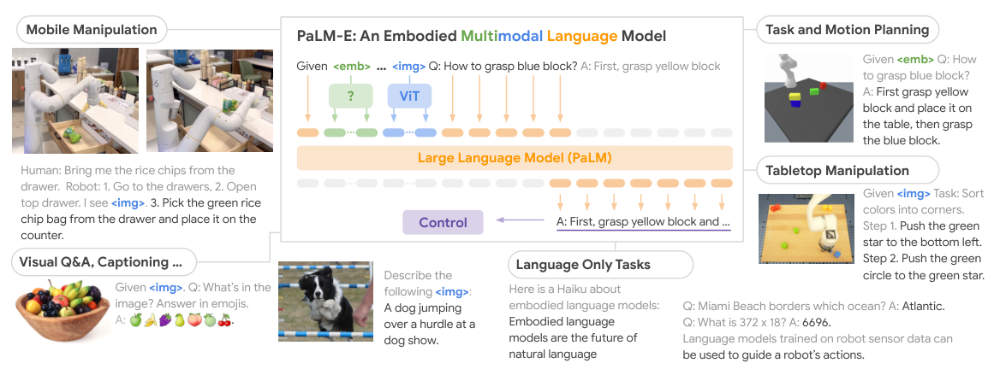

# PaLM-E：具身多模态语言模型

PaLM-E经常被简写成“多模态大模型做机器人”，但它真正关键的设计是输入接口：不把图像转成一句固定文字，也不为机器人单独搭一套语义网络，而是用可学习编码器把图像、3D感知和本体状态映射到LLM词嵌入空间，与文字交错排成一条“多模态句子”。

> **主要方法图：** Figure 1，PDF第1页。不同感知模态被插入文本token序列，同一模型同时学机器人规划、视觉问答与语言任务。来源：[原论文](https://arxiv.org/abs/2303.03378)。

## 它是怎样接上LLM的

图像可由ViT等视觉编码器处理，机器人状态或3D信息也由对应编码器转成与词向量同维的嵌入。这些连续嵌入可以出现在文字指令之前、之后或中间，然后与预训练PaLM一起端到端微调。训练目标仍是预测文字token，所以跨模态迁移发生在LLM的共享表示中：视觉问答、图像描述和语言任务的数据，可以改善机器人场景的概念理解。

机器人训练样本把当前多模态观测、任务文本和期望计划/答案排成序列，统一用下一token目标优化。模型内部状态更适合表示物体关系、步骤和语义记忆，而不是精确接触动力学。它可以在新图像到来后重新生成后续文本计划，但每轮是否任务成功、物体是否抓稳以及应该调用哪个可执行技能，都要由系统提供可观察反馈。

## 输出仍然是文字，不是电机动作

在机器人任务中，PaLM-E生成的是计划步骤、问题答案或可交给下游策略的文本命令。它还能在执行过程中继续接收新图像，根据环境变化重新规划。但从文本计划到机械臂轨迹之间，仍然需要技能策略、成功检测和底层控制。因此把PaLM-E当成后来意义上直接产生连续动作的VLA，会把系统层级搞错。

在人形栈中，它更像Agent/VLM层：输出“走到桌边、伸手拿杯”这样的技能调用或结构化目标，下层分别由导航、Mimic或Loco-Manip控制器实现。若技能库没有开门或跌倒恢复，语言模型知道这些概念也不能创造相应力控。长任务还需要外部记忆保存已完成步骤、失败原因和当前物体状态，不能只依赖上下文中的自然语言历史。

## 这篇最持久的影响

论文最大模型达562B参数，展示了规模增长与正向迁移，但对机器人而言更重要的是“任意感知编码器 + 统一LLM序列”这个接口范式。它证明了网页和视觉-语言知识可以帮助具身推理，却不能单凭这些证据推出运动学精度、接触鲁棒性或安全性。

评估应区分语义计划是否正确、技能是否可调用、底层执行是否成功以及失败后是否改计划；把四层成功率合并，会错误地把控制器问题归给大模型或反过来。

还应注明感知编码器和本体状态怎样标定到同一时间轴；延迟图像对应错误机器人状态时，语言推理正确也可能调用过期目标。

## 原文

[论文](https://arxiv.org/abs/2303.03378) · [项目页](https://palm-e.github.io/)
