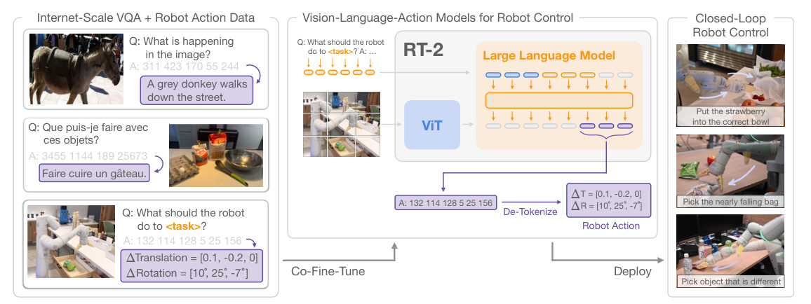

# RT-2：将网络知识迁移到机器人控制的视觉语言动作模型

RT-2之所以成为VLA标志性工作，不是因为它把VLM和机器人简单串联，而是把动作直接表示成词表中的token。这样，图像-文字网络数据和机器人示范可以用同一个下一token预测目标训练，语义概念不必先经过外部规划器再传给策略。

> **主要方法图：** Figure 1，PDF第2页。网页图文与机器人数据共同微调VLM；推理时产生动作token，再反离散化为闭环控制命令。来源：[原论文](https://arxiv.org/abs/2307.15818)。

## 动作token是怎样定义的

一个控制步被序列化为8个整数：终止信号、末端6维增量和夹爪。连续动作维度各自被分成256个桶，并以普通文本token形式输出。模型使用PaLI-X或PaLM-E架构，联合保留视觉问答、图像描述等网页任务和RT-1机器人任务；机器人推理时则限制输出格式，将token还原成动作后在线重复执行。

训练目标仍是统一的下一token预测，但机器人batch只在动作位置提供控制监督，网页batch提供视觉语言知识。两类数据共享模型参数，不共享物理动作来源；因此网页数据能改善“该拿哪个物体、某个概念意味着什么”，具体末端增量和夹爪时序仍由RT-1示范学习。动作token表示也固定了本体接口，换机器人必须重新定义范围、坐标和底层解析器。

## 网页知识真正迁移的是什么

网页预训练为策略提供了物体、属性、类别和简单语义推理，所以RT-2能对一些训练中未见的物体-指令组合做出更合理的动作，例如根据概念选取目标，或将学过的动作原语用到新语义条件下。但物理动作仍然来自机器人示范：网页图文不会平白教会模型一种从未出现在机器人数据中的接触技能。

## 系统落地还有两个现实约束

首先是频率：55B版本在云端TPU上约1–3 Hz，5B版本约5 Hz，适合慢速机械臂末端命令，不是人形平衡所需的高频反射环。其次是动作接口：离散化误差、网络延迟、底层轨迹跟踪和安全约束都在VLA之外。对人形机器人更现实的借鉴是“用大模型生成技能级条件”，而不是直接用它取代低层稳定控制。

RT-2每次看到新图像可以重新输出动作，形成视觉闭环，但没有显式长期世界状态或失败记忆。若抓取未成功而图像变化不明显，模型可能继续后续动作；完整Agent需要任务进度检测、历史记忆和重试策略。人形系统可让它输出末端/根目标或调用SONIC、Mimic、Loco-Manip技能，低层继续负责接触和平衡。

复现时应把网页任务保持率、机器人已见/未见语义、动作成功率、推理延迟和量化误差分开；只有语义正确但动作失败，不应被计成同一种泛化错误。

动作桶还应按训练分位范围检查饱和比例；新本体速度或工作空间超出原范围时，大模型只能反复输出边界token，并不会自动扩大控制域。

这类饱和应作为部署告警。

## 原文

[论文](https://arxiv.org/abs/2307.15818) · [项目页](https://robotics-transformer2.github.io/)
