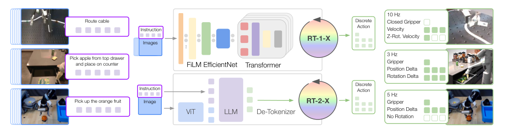

# Open X-Embodiment：跨本体机器人学习数据集与RT-X模型

Open X-Embodiment的价值先在数据基础设施，然后才在RT-X模型。60个数据集、22类本体、超过100万条轨迹被整理到相对统一的格式，使“跨机构、跨机器人联合训练”第一次有了足够大的公开实验底座。但这种统一主要发生在存储schema和常见末端动作层，并没有消除本体差异。

> **主要方法图：** Figure 3，PDF第4页。RT-1-X与RT-2-X都读图像和语言，输出离散化的末端动作；区别在于前者是机器人专用架构，后者由VLM将动作当作语言。来源：[原论文](https://arxiv.org/abs/2310.08864)。

## “统一数据集”实际统一到什么程度

数据会被转为标准episode/步格式，包括图像、自然语言任务、机器人状态和动作。联合模型主要对齐为7维末端动作：位移、旋转和夹爪，再做数据集级归一化。但不同数据集的坐标系、绝对/相对动作、控制频率、相机位置、夹爪语义和任务分布仍然不同。这是“粗粒度共享动作空间”，不是把关节级动力学重定向问题解决了。

每个episode还应保留本体、数据源、任务文本、观测键、动作语义和时间结构，否则统一张量会掩盖不可比数据。RT-X训练通过数据集混合采样，让图像和语言条件映射到共享末端token；它没有一个显式跨本体世界模型去预测每台机器人的动力学。动作最终仍由各平台自己的逆运动学、轨迹控制与安全接口执行。

## RT-X实验真正告诉我们什么

作者分别训练RT-1-X和大型RT-2-X，发现跨本体混合数据对许多小数据域有正迁移，大模型在新技能、新物体和新场景上尤其受益。但论文当时的RT-X训练实际选用了9种本体，不是22种全部进入同一个模型；RT-1-X在某些大数据域还出现容量不足。所以证据支持“数据多样性能帮助迁移”，不支持“训一次就可零样本控制任意机器人”。

模型遇到新本体时仍需校准动作范围，通常还要目标平台示范微调；环境反馈通过下一帧图像进入闭环，但任务级失败、跨episode记忆和重新规划不在数据schema中自动出现。对人形而言，末端7维动作只能覆盖高层操作意图，脚步、全身平衡和负载补偿仍需专用底座。

## 对人形数据建设的直接启发

要跨人形本体复用，仅保存RGB和一个“通用动作”还不够。还需显式保留机构参数、关节/末端映射、接触、时间戳、控制模式、低层跟踪器和质量标记。Open X-Embodiment是数据协作的起点，不是跨本体动作语义的终点。

复现实验应按数据源留一法评估，并报告各域采样权重、归一化规则、负迁移域与目标本体微调量，避免总体均值掩盖少数大数据集主导训练。

数据许可也要按源数据集保留，聚合仓库可访问不等于所有图像、语言与轨迹都允许相同方式再分发或商用。跨机构整合数据时，应同时记录统一schema和每个来源的授权边界。

失效来源还需可单独撤回。

## 原文与数据

[论文](https://arxiv.org/abs/2310.08864) · [项目页](https://robotics-transformer-x.github.io/) · [开源仓库](https://github.com/google-deepmind/open_x_embodiment)
