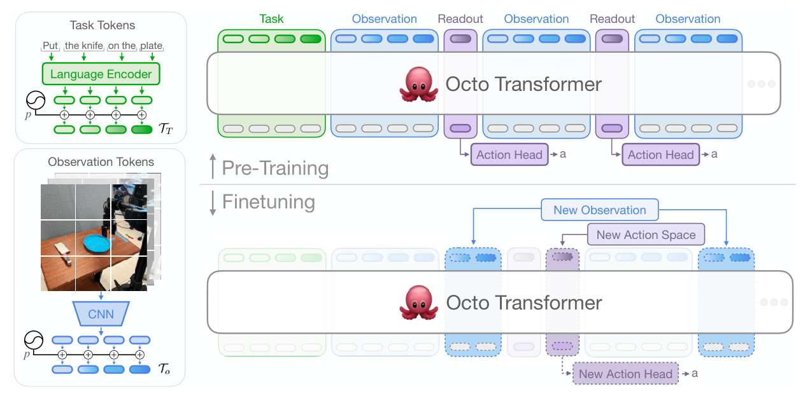

# Octo：开源通用机器人策略

Octo想解决的不只是“用Open X-Embodiment训一个大策略”，而是预训练模型到了新机器人后，如何增加新相机、新状态和新动作空间，而不推倒整个主干。因此它的主要贡献是一套可组合的token接口和注意力结构，再配上完整公开的权重与训练代码。

> **主要方法图：** Figure 2，PDF第3页。任务、观测和输出分别经tokenizer/readout接入Transformer；块状注意力允许微调时增减模态与动作头。来源：[原论文](https://arxiv.org/abs/2405.12213)。

## 主干不直接吐动作

语言指令由预训练语言模型编码，目标图像和当前观测由轻量CNN转成token。Transformer按时间步组织这些token，同时放入一组不携带原始信息的readout token；经主干融合后，readout才交给小型扩散动作头生成action chunk。这将“共享语义与时序表示”和“某个本体的动作维度”拆开了。

预训练使用多数据集行为克隆：主干学习任务、视觉与时间上下文，扩散头在噪声动作块上学习条件去噪。模型没有显式预测下一帧世界，也不在latent中做搜索；readout只是把共享表示转换成当前本体动作分布。部署执行动作块的一部分后读取新观测再预测，所以反馈来自滚动视觉闭环，而不是独立的世界状态更新器。

## Block-wise Attention为什么是迁移关键

同一时刻的观测token可以互相交互，并读取过去；任务token作为全局条件；readout只读它需要的上下文。由于这些接口在结构上就分离，适配新平台时可新增一个观测tokenizer或动作头，而不必改变预训练参数的形状。实验表明，约100条目标本体轨迹就可以做有意义的微调，但这是在任务和视觉分布与预训练有关联时的适配，不是不需数据的零样本控制。

新本体微调需要明确输入图像、proprioception、动作维度、归一化和控制频率；低层轨迹跟踪器仍负责把动作头输出变成安全执行。对于人形，可保留主干并替换为末端/身体命令readout，再接Mimic或Loco-Manip控制器；直接让通用扩散头输出高频全身力矩会丢失Octo原本的模块化优势。

## 它的“通用”边界在哪

Octo选用Open X-Embodiment中25个数据集、约80万条轨迹预训练，支持语言或目标图像条件，并在多个机械臂平台上评测。这个通用性指“可微调的跨平台策略底座”，而不是自带所有动力学、安全和任务知识。它主要工作在低频末端操作层，移到人形全身时仍需要重新定义状态、动作、接触与低层跟踪接口。

动作失败后的重试也不是架构自动提供的。需要数据中包含恢复行为，或外部Agent根据视觉/任务状态重新调用策略。评测应同时报告零样本、线性探针/头部适配、全量微调和目标平台数据量，才能看清预训练到底节省了什么。

适配后还需做预训练任务回归测试；新增动作头虽不改变主干形状，目标域梯度仍可能损害原有视觉与语言表示。模块化接口降低了改造成本，不自动保证无遗忘。

## 原文与开源

[论文](https://arxiv.org/abs/2405.12213) · [项目页](https://octo-models.github.io/) · [代码与权重](https://github.com/octo-models/octo)
