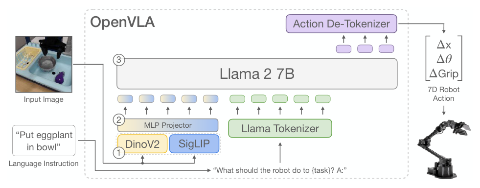

# OpenVLA：开源视觉语言动作模型

OpenVLA的意义不只是“RT-2的开源替代”。它将约97万条多本体真机轨迹、双视觉编码器和Llama 2 7B整合成了一条可下载、可微调、可部署的VLA基线。这使研究者可以真正检查动作词表、数据配比和微调方法，而不是只能从展示视频猜系统怎样工作。

> **主要方法图：** Figure 2，PDF第4页。DINOv2和SigLIP特征拼接后投影到Llama 2词嵌入空间，自回归输出7维机器人动作。来源：[原论文](https://arxiv.org/abs/2406.09246)。

## 为什么视觉编码器要用两套

DINOv2更擅长保留空间、几何和局部结构，SigLIP更偏向将图像与语言语义对齐。OpenVLA将两者的patch特征拼接，再通过投影层转到Llama 2的隐空间，与指令token一起进入LLM。这不是冗余堆叠：机器人同时需要知道“这是杯子”和“杯口在像素中哪里”，单一语义表示未必保留足够精细的操作线索。

## 动作怎样变成LLM词表的一部分

每个7维连续动作按训练数据的分位数范围分到256个桶。作者没有无限扩大LLM词表，而是重用Llama中256个最少使用的token ID作为动作桶，用标准下一token交叉熵训练，loss只计动作位置。这个方案简洁、易复用，但也带来量化误差，并且不显式建模一整段连续动作的分布。

输入是当前图像和语言指令，输出仍是单步末端位移、旋转与夹爪命令；机器人状态、动作范围和控制器由目标数据集约定。模型不维护显式物体状态，也不预测未来视频。每次获得新图像后重新推理提供低频反馈，长任务的完成检测、历史记忆和失败重试需要由外部Agent或包含恢复行为的数据补上。

训练数据来自Open X-Embodiment的混合轨迹，不同数据源使用不同相机、任务语言和动作统计。OpenVLA在预处理阶段统一图像/文本并按数据集动作范围离散化，但共享动作token不表示跨平台具有同一米制含义。微调到新机器人时，要用目标平台数据重新校准动作分位范围，否则相同token会对应错误速度或旋转幅度。

## “开源”让哪些工程判断可以被验证

官方给出模型权重、训练与微调代码，支持LoRA、量化和目标数据集适配。论文报告在RTX 4090上约6 Hz、BF16约15 GB显存，这足以应对许多机械臂末端控制，却仍不是人形动力学反射环。它的价值是可检查的VLA研究入口，不能把多本体预训练等同于对新机器人的即插即用；动作定义、相机和低层控制器仍需重做适配。

接入人形时，更稳妥的接口是让OpenVLA产生低频末端/根命令、动作token或技能选择，再由全身tracker执行。微调记录应包含目标本体轨迹量、动作分位数、LoRA/全量训练参数、推理频率和安全限幅；跨本体结果还要与从头训练的同数据基线比较。

官方开源让这些环节可以真正审计，但权重可下载不代表训练数据、依赖许可证和目标机器人驱动都已齐全。复现报告应区分模型前向成功、仿真动作正确和真机闭环成功三层。

## 原文与开源

[论文](https://arxiv.org/abs/2406.09246) · [项目页](https://openvla.github.io/) · [代码与权重](https://github.com/openvla/openvla)
