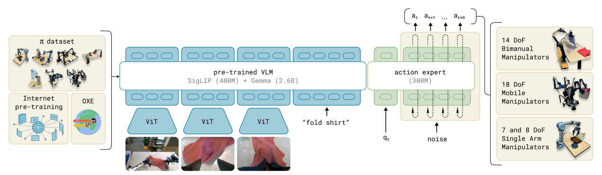

# π0：面向通用机器人控制的视觉语言动作流模型

π0没有让语言模型逐个吐离散动作token，而是将语义表示和连续控制分给两个尺度不同的模块：由PaliGemma初始化的VLM主干处理图像和语言，更小的action expert读本体状态和噪声动作，通过flow matching生成高频action chunk。这个分工直接面向VLA的两种不同计算需求：语义要大容量，动作要高速且连续。

> **主要方法图：** Figure 3，PDF第4页。多本体、开源与自有操作数据联合预训练，VLM与action expert共同建模条件动作流。来源：[原论文](https://arxiv.org/abs/2410.24164)。

## Flow Matching与扩散动作头有什么不同

训练时在真实动作段和高斯噪声之间选择一个连续时刻，构造中间的带噪动作，action expert学的是将它沿正确方向推向数据分布的速度场。推理时从噪声出发，用少量数值积分步得到完整连续动作段。与自回归离散token相比，它天然保留多维动作的相关性；与多步DDPM去噪相比，直线化的流可以用更少步数实时采样。

条件端同时包含多相机图像、语言指令和本体状态；动作段则按目标平台表示为关节或末端/夹爪控制量。训练目标是flow velocity回归，不显式预测未来图像、物体状态或奖励。VLM token负责语义与视觉上下文，action expert通过交叉注意力读取它们并结合当前本体，最后由本体接口层还原连续动作。

## 跨本体并不是共用一个固定动作向量

π0覆盖了移动操作、双臂和高灵巧任务等多种平台。不同本体的状态与动作维度仍通过对应接口层进入action expert，共享的是视觉-语言表示和大部分动作生成能力。预训练用自有高灵巧数据与Open X-Embodiment混合，再用高质量目标任务数据做后训练；这个“广泛预训练 + 目标分布后训练”比单纯追求一个零样本模型更贴近实际部署。

部署一次生成一段动作，只执行其前缀或按系统配置消费chunk，再用新图像与状态继续预测。反馈因此来自滚动观测，而不是内部长期世界模型；抓取失败、物体丢失和任务阶段切换是否会被修正，取决于训练数据是否包含相应恢复以及外部系统是否提供任务状态。对人形而言，action expert仍需接低层WBC/Mimic或关节伺服，不能把chunk频率等同于平衡闭环频率。

## 看展示时要问的三个问题

第一，论文声称数据总量超过1万小时，其中大量高价值自有数据并未完整公开，不能把权重/推理开源等同于训练资产完全复现。第二，50 Hz指执行action chunk的有效频率，不代表VLM每20 ms重新做一次全部视觉推理。第三，操作成功仍依赖本体的低层位置/末端控制、观测标定和安全层，不能从VLA成功率直接外推力控和接触安全。

复现应记录每种本体的数据占比、动作schema、chunk长度、积分步数、视觉更新与动作执行频率、后训练数据量和人工复位规则，并与相同数据的ACT/扩散动作头基线比较。

还应单独记录动作chunk接缝处的速度与加速度连续性。

## 原文与开源

[论文](https://arxiv.org/abs/2410.24164) · [官方解读](https://www.physicalintelligence.company/blog/pi0) · [openpi](https://github.com/Physical-Intelligence/openpi)
