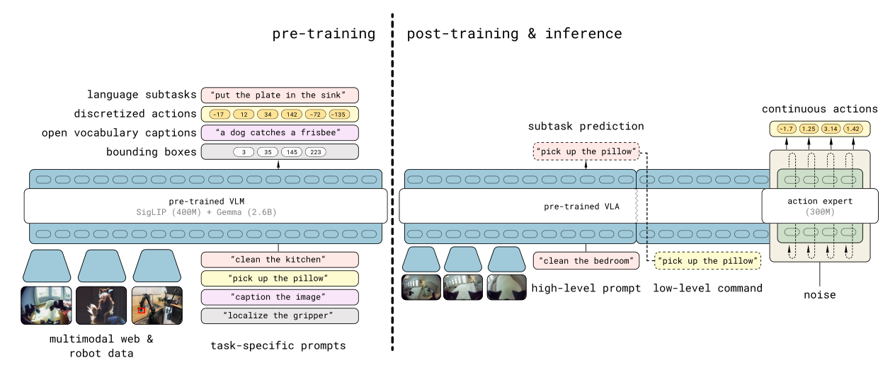

# π0.5：具备开放世界泛化能力的视觉语言动作模型

π0.5不是简单把π0换一批数据继续训练。它面向家庭移动操作的长时任务，把统一模型拆成两个训练阶段和两种推理节奏：预训练用离散表示吃下异构数据，后训练再为目标本体加入连续动作专家。执行时同一模型先产生语义子任务，然后以它为条件生成低层动作。

> **主要方法图：** Figure 3，PDF第4页。第一阶段用FAST动作token联合机器人、语义和网页数据；第二阶段对家庭移动操作同时训练高层子任务与连续动作流。来源：[原论文](https://arxiv.org/abs/2504.16054)。

## 第一阶段为什么又回到离散动作

Flow matching很适合精细连续控制，但不方便与文本、网页问答和只有语义标注的数据用同一个自回归目标混合。π0.5先用FAST将连续动作压缩成离散token，与多本体轨迹、高层语义预测和web数据共同预训练。这个阶段的目标不是达到最精细的底层控制，而是建立场景、任务、本体和动作语义之间的广泛对应。

FAST token保留一段动作的时序结构，使动作数据可以和“下一步子任务是什么”这类文本监督共用自回归训练接口；本体、相机和语言仍作为条件。后训练时连续flow expert重新接管精细动作输出，因此离散预训练表示负责迁移语义，连续头负责目标机器人控制。两阶段使用的动作表示不同，必须有明确的本体适配和对齐，不能把FAST token直接当成电机命令。

## 第二阶段如何变成真正的移动操作策略

后训练集中使用与目标家庭机器人最相关的数据，加入flow-matching action expert，并包含人类监督者给出的高层子任务。运行时，模型以较慢节奏输出“走到水槽前”、“拿起海绵”这类语义动作，再以当前子任务为条件高频生成action chunk。这是模型内的分层控制：两层共享表示，但不用同一频率重做全部决策。

子任务文本相当于短时记忆和动作条件，但长任务仍需根据新图像判断当前阶段是否完成，再生成下一子任务。若抓取失败，高层只有在观测与训练数据中能识别失败时才会改计划；否则连续动作头可能在错误前提下继续执行。移动底盘、双臂和夹爪的低层跟踪器仍处理运动学、安全与接触，π0.5不承担人形足端反射或全身力控。

## “开放世界”不能脱离数据语境

数据包含约400小时、近100个家庭的目标移动本体数据，同时混合其他机器人、网页和语义数据；论文中97.6%的第一阶段样本甚至不来自目标移动机器人。这支持“异构先验能改善新房间、新物体和长任务泛化”，但不等于模型可以离开目标本体的大量后训练数据。与π0一样，完整数据与训练管线并未全部公开。

评测应把高层子任务正确率、动作段执行成功率、长任务完成率、重规划次数和目标本体后训练数据量分别报告，并在新房间、新物体、新任务组合三种泛化上分开分析。

## 原文与开源

[论文](https://arxiv.org/abs/2504.16054) · [官方解读](https://www.physicalintelligence.company/blog/pi05) · [openpi](https://github.com/Physical-Intelligence/openpi)
