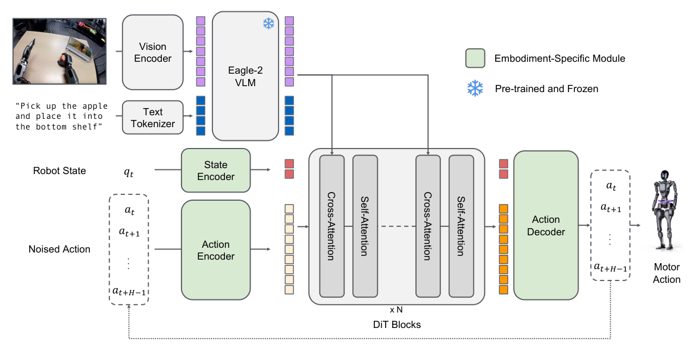

# GR00T N1：面向通用人形机器人的开放基座模型

GR00T N1采用明确的双系统分工：System 2是Eagle-2视觉-语言模型，负责理解图像与指令；System 1是用flow matching训练的Diffusion Transformer，负责把语义条件转成连续动作段。与一般机械臂VLA相比，这篇最值得看的是它怎样把人形、双臂和单臂的不同状态/动作维度接入一个共享动作模块。

> **主要方法图：** Figure 3，PDF第4页。Eagle-2产生视觉-语言token；每种本体的状态和带噪动作先经专用MLP投影，再进入共享DiT，最后用本体专用decoder还原动作。来源：[原论文](https://arxiv.org/abs/2503.14734)。

## 共享的是动作生成器，不是原始关节数组

每个本体都有独立的state encoder、action encoder和action decoder，将不同维度与语义的本体量投影到统一DiT宽度。动作编码器还同时读flow时刻和带噪action chunk，DiT内的交叉注意力读Eagle-2输出的图像/文字token，经过约4次积分步生成动作。因此它允许不同本体共享“某类语义和视觉条件下的动作模式”，同时保留本体接口差异。

训练时对真实动作块加flow时刻对应的噪声，DiT回归速度场；视觉语言主干和动作模块共同以机器人数据后训练。状态encoder告诉模型当前关节/末端处于哪里，专用decoder把共享隐表示还原到该本体动作空间。这个结构没有消除关节顺序、动作尺度与控制模式差异，只是把差异显式放在adapter中，便于共享中间动作生成器。

## Data Pyramid不是把所有数据一锅煮

作者将数据按规模与本体专用性组成金字塔：网络视觉-语言数据提供广泛语义；人类视频通过潜动作或逆动力学伪标签提供动作先验；仿真、神经视频生成和真机遥操逐步提供更接近目标本体的动作。预训练学跨本体共性，后训练再集中于具体机器人与任务，这比“数据越多越好”更精确。

人类视频和合成轨迹的动作标签质量决定它们能进入哪一层：只有外观和语义的数据不能直接监督精确关节动作，IDM伪标签还需做限位、接触和时序筛选。复现应按数据来源报告数量、动作可用率和后训练增益，避免把所有“小时数”当成同等真机监督。

## 120 Hz应该怎样理解

论文中System 1可以以最高120 Hz闭环产生/执行电机动作，但System 2的大视觉-语言推理并不是同频重做，高频性来自action module与chunk接口。真机证据主要是Fourier GR-1上的语言条件双臂操作，支持整个数据-模型-本体链路可运行，但不能由此外推为同一VLA已经解决动态平衡、复杂接触和长时安全。

action module连续消费视觉语言条件和本体状态，输出动作块，底层伺服再执行。新观测会更新下一块动作，但任务记忆、成功检测与失败重试仍需Agent层或数据支持。动态人形使用时，应让GR00T输出上肢/末端、根命令或运动token，再由Locomotion与Mimic层承担平衡。

评测应按本体报告adapter参数量、目标数据量、动作频率、低层接口和真机任务，而不是把所有平台混成一个平均成功率。这样才能判断共享DiT究竟迁移了多少能力。

## 从N1论文到N1.7工程版本

本页解读的是2025年的GR00T N1论文，它定义了Eagle-2视觉语言主干、DiT动作模块和本体专用适配器这一代架构。NVIDIA官方仓库目前已经转到GR00T N1.7；它是同一工程体系的版本演进，并没有对应一篇需要单独建立论文ID的新论文。因此，P060保留为论文基线，R057负责记录当前可下载、微调和部署的工程版本。

N1.7公开的是3B参数检查点，视觉语言主干换为基于Qwen3-VL的Cosmos-Reason2-2B，动作侧继续采用扩散式生成，并加入跨本体的相对末端执行器动作表示。官方仓库把LeRobot格式数据处理、后训练、推理、评测以及ONNX/TensorRT导出放在同一条链路中；NVIDIA给出的端到端工作流还将Isaac Lab-Arena仿真、Isaac Teleop采集和Isaac ROS/Jetson Thor部署连接起来。对开发者而言，N1.7更适合检查一套VLA怎样适配新本体和部署接口，N1论文则更适合理解共享动作模型为什么这样设计。

版本状态需要单独看：官方仓库将N1.7标为Early Access，生产部署支持和稳定特性仍以未来GA版本为边界。现阶段可以把它当作可研究、可微调的官方工程基线，但不应仅依据公开权重和演示推断其已经覆盖动态平衡、复杂接触或长期无人值守运行。

[N1.7官方仓库](https://github.com/NVIDIA/Isaac-GR00T) · [NVIDIA端到端工作流](https://developer.nvidia.com/blog/develop-humanoid-robot-policies-end-to-end-with-nvidia-isaac-gr00t/) · [N1.7 3B权重](https://huggingface.co/nvidia/GR00T-N1.7-3B) · [工作流文档](https://docs.nvidia.com/learning/physical-ai/gr00t-e2e-workflow/latest/index.html)

## 原文与开源

[论文](https://arxiv.org/abs/2503.14734) · [NVIDIA GR00T](https://developer.nvidia.com/isaac/gr00t) · [代码与权重](https://github.com/NVIDIA/Isaac-GR00T)
