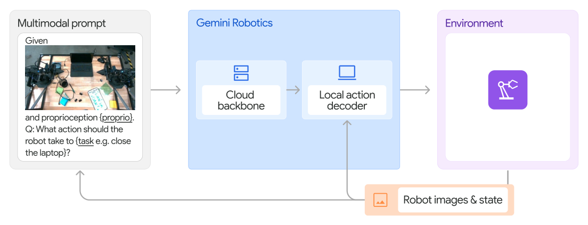

# Gemini Robotics：面向物理世界的通用机器人智能模型

Gemini Robotics将家族拆成两类能力：Gemini Robotics-ER专注具身推理、3D理解、指点和规划；Gemini Robotics则在Gemini基础上用机器人动作数据微调，直接产生action chunk。对工程最有价值的不是“Gemini会操作”这句话，而是它怎样用云端骨干与本地解码器隔离大模型延迟。

> **主要方法图：** Figure 14，技术报告第14页。云端VLA backbone读多视角图像、本体状态与指令，本地action decoder把骨干输出转成可连续执行的动作段。来源：[官方技术报告页](https://deepmind.google/models/gemini-robotics/)。

## 两级推理如何遮住网络与大模型延迟

云端骨干是Gemini Robotics-ER的蒸馏版，查询到响应延迟被优化到160 ms以内；加上观测、传输和本地解码，从原始观测到新action chunk约250 ms。如果每次只输出一个动作，这只有4 Hz。系统一次生成多个未来动作，本地decoder在下一个云端结果到达前继续以50 Hz输出，从而把“慢语义更新”和“快动作执行”解耦。

输入包含多视角图像、自然语言和机器人本体状态；云端主干形成语义/空间表示，本地decoder把它与当前状态结合，生成目标本体连续动作段。训练混合大规模多模态预训练与机器人示范后训练，动作监督仍来自真实或目标平台数据。模型没有让云端直接发高频力矩，本地层与机器人控制器共同承担时序连续性、动作解析和安全限幅。

## 通用性和适配性不要混为一谈

模型用ALOHA 2机队一年内采集的数千小时真机示范，再混合网页、代码、图像、音频、视频和具身问答数据。它能以开放词汇指令完成多种双臂任务，也可通过少量微调适配新技能和新本体。但报告中Apollo等新形态平台使用了专门适配数据，不是不改参数的跨本体零样本控制。

action chunk执行期间，下一次云端请求已在并行处理；新结果到达后依据最新观测更新后续动作。网络超时、视觉变化或动作失败时，本地端必须定义继续消费旧chunk、减速保持还是进入安全姿态。长任务的记忆与重新规划还要维护已完成步骤和物体状态，不能只依赖单次云端输出。

## 语义安全不是物理安全闭环

报告对ASIMOV等语义安全问答和安全宪法后训练做了评估，说明模型更能识别伤害性指令和视觉风险。但硬安全仍要由机器人级位置/力矩限制、碰撞检测、急停和安全控制器保障。对人形系统而言，Gemini Robotics验证了云端VLA与本地动作层的工程架构，并没有取代状态估计、WBC或底层保护。

评估应把云端决策延迟、chunk接缝、断网退化、技能成功率和物理保护触发分别统计。语义上拒绝危险指令与接触中限制力、摔倒后停机是两套不同证据。

数据与模型未完整开放时，应把“官方演示可核验”“技术报告有量化”和“第三方可复现”分开，避免把闭源服务能力写成公开基线。评估本地部署还需要记录带宽、算力与隐私边界。

## 官方来源

[模型与技术报告](https://deepmind.google/models/gemini-robotics/)
