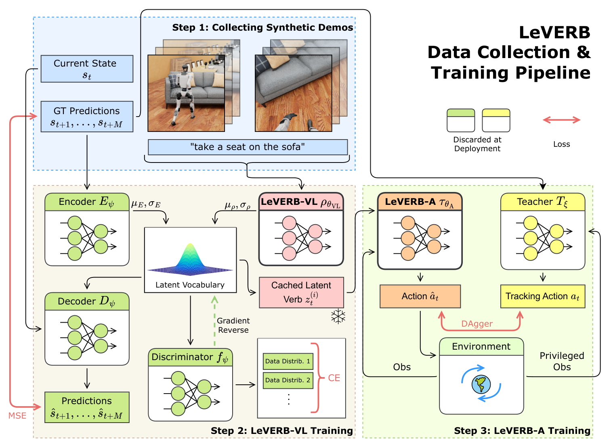

# LeVERB：基于潜在视觉语言指令的人形全身控制

人形VLA的核心矛盾是：视觉-语言需要容量与时间来理解场景，平衡和全身动力学却要高频反馈。LeVERB用一个256维潜变量z作为单向接口：上层LeVERB-VL以10 Hz从图像和指令中产生“往哪里走、做什么姿态”的潜动词，下层LeVERB-A以50 Hz将它转成关节位置动作。

> **完整训练管线：** Figure 3，PDF第5页。第一步在Isaac Sim中采集并标注合成示范；第二步用轨迹重建、潜空间判别和梯度反转训练LeVERB-VL；第三步将缓存的潜动词交给LeVERB-A，并用带特权观测的跟踪教师通过DAgger蒸馏动作策略。图中的绿色与黄色模块在部署时丢弃，只保留粉色上层和橙色低层。来源：[原论文](https://arxiv.org/abs/2506.13751)。

## 潜语汇怎样不被视觉和运动细节撕裂

LeVERB-VL是residual CVAE。视觉-语言先验给出一个潜分布，训练时另一个特权kinematics encoder读未来姿态序列，用残差补充具体运动细节；decoder由当前状态和z重建后续姿态。为了避免有图像与无图像样本形成两套不兼容潜空间，作者加入带梯度反转的判别器，逼迫z难以被识别出来源模态。这使z更像可由不同指令方式共享的运动意图，而不是图像特征的简单压缩。

上层输入由场景图像、语言指令和当前机器人状态组成，输出并不是关节或自然语言，而是固定维度潜动词。重建损失要求z保留未来身体轨迹，KL与模态对抗约束其分布可由视觉语言端预测。这个潜变量没有可直接检查的“向前走”字段，必须通过decoder重建和下层行为验证语义；若不同任务在z中纠缠，接口看似统一却难以调试。

## 低层不是与VLA端到端同训

作者先用可见未来参考动作的teacher通过PPO学各类跟踪技能，并加入domain randomization。随后冻结上层潜空间，从z的分布而非只取均值采样，用DAgger将多个teacher蒸馏到同一个Transformer student。这个采样细节很重要：如果student训练时只看理想潜命令，部署时上层稍有方差就会形成接口分布偏移。

LeVERB-A以50 Hz读取z、本体状态和历史，输出关节位置目标并由PD执行。它承担的是Mimic式物理跟踪与稳定，高层10 Hz只更新运动意图。视觉变化后理论上可重新编码新z形成闭环，但论文真机采用预录潜命令，因此不能据此断言真实相机误差、目标移动或失败后重规划已经验证。

## 真机证据必须按细节降级解读

论文在合成视觉benchmark中做了视觉闭环，也在Unitree G1上展示走到椅子并坐下等动作。但正文明确说明：真机试验是先在仿真中根据视觉闭环记录潜动词，再把这串潜命令在真机上开环回放给LeVERB-A。因此已验证的是低层动力学接口的sim-to-real可行性，不是真机视觉在环的端到端零样本闭环。项目的长时记忆、快视觉反馈和真机误差恢复仍属未解问题。截至2026-07-14，论文与作者官方页面均未提供代码入口。

更完整的验收应分别测潜动词分类/重建、低层跟踪、仿真视觉闭环、真机开环和真机视觉闭环，并记录上层更新延迟、z跳变和安全退化。只有最后一项才能支持“环境反馈驱动重新规划”的结论。

## 原文

[论文](https://arxiv.org/abs/2506.13751)
