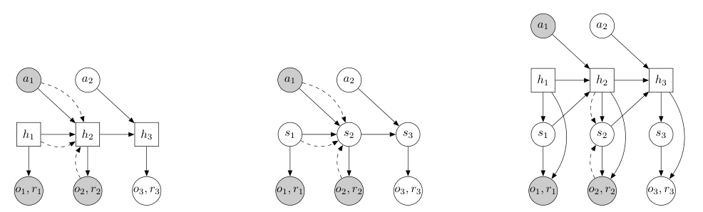

# PlaNet：基于像素输入的潜在动力学规划

PlaNet的问题设定很干净：环境动力学未知，智能体只看图像，但每一步都要通过规划选动作。直接在像素空间生成大量未来视频太贵，作者因此学一个紧凑的潜状态动力学，将“看到现在”与“试演未来”分开。它没有actor网络；每次真正要行动时，都现场在学得模型里做搜索。

> **主要方法图：** Figure 2，PDF第4页。纯确定RNN、纯随机状态空间模型和RSSM的对比说明：前者难表达多种未来，后者难长时记忆，RSSM同时保留确定记忆与随机状态。来源：[原论文](https://arxiv.org/abs/1811.04551)。

## RSSM为什么要把状态拆成h和s

确定隐状态h由上一时刻的h、随机状态s和动作递推，负责稳定携带长时信息；随机状态s由h给出先验，同时可根据当前图像经编码器修正为后验，负责表达局部不确定性。观测重建头和奖励头都从`(h,s)`预测。这样既能在当前看到图像时校正信念，又能在规划时不解码图像、只向前滚潜状态和奖励。

训练从真实交互序列优化变分目标：后验用图像更新潜状态，先验学习只靠历史和动作预测它，解码头重建观测并回归奖励。KL项把两者对齐，使规划时没有未来图像也能滚动。动作本身来自环境连续控制接口，世界模型不输出动作；它只回答候选动作序列可能导致哪些潜状态和回报。

## CEM怎样把世界模型变成控制器

每个真实时刻，PlaNet在一个参数化动作分布中采样大量未来动作序列，用RSSM向前预测潜状态和累积奖励，保留最好的elite序列反复更新分布。论文主要配置为12步规划、10轮优化、每轮1000个候选，最后只执行最优序列的第一个动作便重新规划。这是标准模型预测控制：模型误差可被下一帧部分修正，但搜索仍可能利用模型的虚假高奖励区域。

执行第一个动作后，新图像通过后验更新belief，再重新做CEM，因此记忆由RSSM的h承载，重规划由MPC显式完成。若候选动作触及真实机器人关节、碰撞或平衡边界，PlaNet原方法没有独立安全约束；人形应用需要把搜索空间改成低频技能、末端或运动token，并由Locomotion/Mimic底座验证可执行性。

## 论文证据的位置

实验是DeepMind Control Suite中的图像输入任务，包括接触、部分可观测和稀疏奖励。它证明RSSM + 潜空间CEM可以在仿真中实现数据高效的视觉控制，不是真实机器人长时部署证据。论文还提出latent overshooting强化多步先验，但附录明确报告最终RSSM并不依赖它；阅读时不应把这个次要正则项当成PlaNet成功的唯一原因。

复现应同时报告单步与多步预测、CEM计算量、真实回报、模型不确定区域和每步重规划延迟；漂亮的观测重建不代表潜状态对控制足够准确。

还应对候选动作加入环境或机器人可执行边界，防止搜索利用模型未见过的极端动作获得虚假高回报。

## 原文与代码

[论文](https://arxiv.org/abs/1811.04551) · [项目页](https://planetrl.github.io/)
