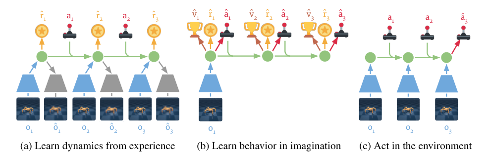

# Dreamer：基于潜在想象的行为学习

PlaNet有了潜动力学，但在环境的每一步仍要用CEM评估上千组动作。Dreamer的改变是把这项在线搜索成本提前到训练阶段：它从真实经验学RSSM，再从经验对应的潜状态出发，在模型里想象大量未来，训一个actor和critic。真正与环境交互时，只需前向跑actor，不做规划搜索。

> **主要方法图：** Figure 3，PDF第3页。左边用真实经验训世界模型；中间在RSSM中想象状态、奖励和动作，学actor-critic；右边把当前历史编码成模型状态后执行actor。来源：[原论文](https://arxiv.org/abs/1912.01603)。

## 世界模型学什么，行为模块又学什么

世界模型包含图像编码/重建、RSSM潜转移和奖励预测。它用replay buffer中的真实序列训练，不依赖actor对世界的猜测当监督信号。学行为时固定世界模型，从编码后的真实潜状态出发，actor采样动作，RSSM预测后续状态和奖励，critic估计每个状态的长期价值。因此世界模型学“动作会把世界带到哪里”，actor学“为了高回报应该选哪个动作”，两者不是一个损失。

真实环境每产生新图像、动作和奖励，就写入replay并继续更新世界模型；执行时历史经后验编码成当前belief，actor直接输出下一动作。与PlaNet不同，部署没有CEM内循环，重新适应环境主要依靠belief被新观测修正，以及后续训练用新数据更新模型和actor。单个episode内actor不会临时搜索一条全新计划。

## 为什么只想象H步也可以学长时行为

若只把H步内预测奖励相加，策略会短视；H过长又会让模型误差积累。Dreamer使用lambda return，把不同n-step预测和末端critic价值加权组合，用价值函数补上想象地平线之后的回报。critic回归这个目标，actor则将价值梯度穿过奖励模型和可微的RSSM转移反传回动作。这与PPO用环境采样轨迹做优势估计不同：Dreamer的actor更新大部分发生在学得模型中。

世界模型的观测、奖励和转移损失与想象中的价值目标共同决定行为，但物理安全不在其中自动出现。用于人形时可让actor输出低频身体命令或技能，限制想象动作落在已验证控制器接口内，并持续用真实失败回流校准模型；直接想象高频力矩会把接触模型误差放大到稳定环。

## 模型能被利用，也能把策略带偏

论文在20个图像控制任务上展示了数据效率和长时控制优势，但都是仿真环境。如果世界模型在数据外区域预测出虚假高奖励，actor会比CEM更充分地学会利用它。所以用于真实机器人时，数据覆盖、模型不确定性、真实回流和安全约束不是可选优化项，而是防止“在错的世界里学得很好”的核心。

评测应对比模型预测回报与真实回报，按想象地平线画误差，并统计策略进入数据外状态的比例；只看最终任务分数无法判断模型是否被利用。

在线数据回流还要保留策略版本与世界模型版本，避免新策略分布变化后继续用旧模型的可靠性结论。

## 原文与代码

[论文](https://arxiv.org/abs/1912.01603) · [项目页](https://dreamrl.github.io/) · [代码](https://github.com/danijar/dreamer)
