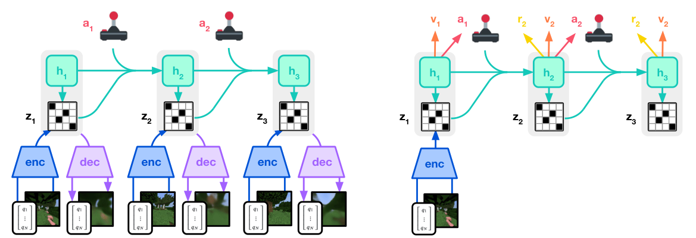

# DreamerV3：基于世界模型的跨领域通用控制

DreamerV3延续“RSSM + 潜空间actor-critic”的主线，但把大量容易被当作工程细节的稳定化方法变成了核心贡献。视觉像素、低维状态、连续/离散动作、密集/稀疏奖励的数值尺度差异很大，以往算法往往要逐域调参。V3试图用一套配置横跨多个控制和游戏域，“通用”首先指算法的数值鲁棒性，不是一个跨机器人的共享物理模型。

> **主要方法图：** Figure 3，PDF第3页。世界模型用离散z和递归h建模观测、奖励与继续信号；actor和critic只在抽象潜轨迹上学动作与价值。来源：[原论文](https://arxiv.org/abs/2301.04104)。

## 世界模型的表示为什么改成离散z

编码器把观测映射为多个类别变量，RSSM由历史h和动作预测这些离散z的先验，观测编码器给后验。训练同时包含重建/预测损失、先验追后验的dynamics KL和后验靠近先验的representation KL，通过stop-gradient分别更新两边。Free bits避免KL把表示压空，1% uniform mixture避免类别分布过早变得确定，这些都是让潜想象可长期训练的必要稳定器。

模型还预测奖励和episode继续信号，后者让想象轨迹知道何时应终止。执行时真实观测持续更新后验belief，actor从当前潜状态直接输出动作；训练时actor和critic则在RSSM想象轨迹上用lambda return优化。V3仍然没有语言任务规划或跨episode记忆，“跨领域”是同一算法配置适配不同环境，而不是一个权重同时控制所有机器人。

## Symlog和Two-hot在解决什么

不同任务的状态、奖励和回报可差几个数量级。Symlog在零附近近似线性，对大的正负值做对数压缩，使同一网络和学习率能处理不同尺度。奖励头和critic不直接做标量MSE，而是在symexp刻度的桶上用相邻两个非零权重表示连续目标，即two-hot分布损失。Actor则用批内回报的5%到95%分位区间做平滑归一化，让固定熵系数在各任务上意义相近。

这些稳定器提高的是优化鲁棒性，不修复现实接触模型。人形应用仍需定义视觉/本体观测、动作接口和奖励，并让低层控制器处理关节限位、平衡与碰撞。更现实的组合是世界模型在技能或短时运动参考层学习结果，再通过真机数据回流校准，而非让模型在线无保护探索全身动作。

## 钻石结果与机器人世界模型之间还隔着什么

DreamerV3以同一超参数配置覆盖150多个任务，并在无人类数据和curriculum的Minecraft环境中从像素学会获取钻石。这强有力地证明了稳定的潜想象能处理长时稀疏奖励，却没有真机、传感器漂移、未建模接触或安全下线的证据。把V3用于人形不是只换环境API：必须处理现实数据成本、模型偏差、离线预训练与安全的真机探索。

复现机器人版本时应报告真实交互量、replay组成、模型多步误差、想象/真实回报差、保护触发和策略更新后的回归测试，避免只展示样本效率曲线。

不同传感器缺失、控制延迟和接触模型偏差应作为独立扰动测试，而不是全部折叠进一个“真实环境”结果。

## 原文与代码

[论文](https://arxiv.org/abs/2301.04104) · [DreamerV3代码](https://github.com/danijar/dreamerv3)
