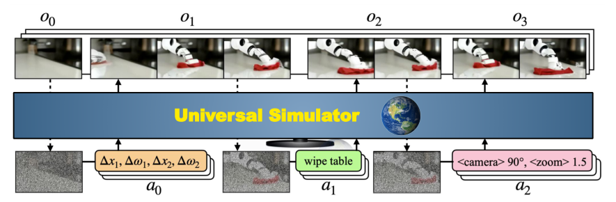

# UniSim：交互式真实世界模拟器学习

PlaNet和Dreamer的世界模型为控制学一个紧凑潜状态，UniSim则把接口改成`action in, video out`：给定历史观测和一个动作，生成执行后的一段图像。这个动作可以是语言指令、相机运动或机器人末端增量。统一的不是物理控制量，而是“条件作用下预测后续观测”这个生成任务。

> **主要方法图：** Figure 2，PDF第3页。视频扩散模型根据有限历史和不同模态的动作，预测可变长的下一段观测；将上段末帧迭代喂回可生成长时互动。来源：[原论文](https://arxiv.org/abs/2310.06114)。

## 异构数据是怎样被放进同一模型的

互联网图像贡献物体与场景多样性，人类活动视频贡献长时动作，导航数据贡献稠密视角变化，机器人/仿真数据贡献低层动作标注。语言动作由文本编码器转成条件，连续机器人控制则离散化并与语义嵌入组合。模型学的是条件视觉后果，所以可以从单帧开始让抽屉这类高层指令产生视频，也可用末端`delta x`产生短时机器人运动。

训练目标是条件视频扩散去噪：历史帧提供当前世界，动作条件说明施加什么变化，模型预测后续像素。它没有统一的可执行动作空间，语言、相机位移和机器人控制各自通过条件编码进入；因此生成相同形式的视频并不表示它们具有相同物理语义。模型内部也没有显式力、接触或关节状态，无法仅凭画面保证动作可执行。

## 生成视频怎样真正变成训练环境

高层应用中，策略根据当前和目标图像生成语言子动作，UniSim滚出视频，再从视频中学长时VLM策略；转到真机时，还需逆动力学模型把预测视频还原为可执行动作。低层应用中，机器人控制量直接作为UniSim条件，用REINFORCE在生成滚出上更新策略，再零样本部署到论文中的真实桌面机器人。这证明视频生成模型可以产生有用的策略信号，不代表它已具有仿真器的力学精度。

闭环使用时，真实执行后的新图像应替换生成历史，重新条件生成；若一直把模型自己的末帧递归输入，漂移会累积成场景变化。IDM或低层策略负责从视觉意图得到末端动作，机器人控制器继续处理接触与安全。长任务还需外部记忆保存已完成子任务，并用真实成功检测决定是否重新生成。

## 图像看起来对，物理仍可能是错的

论文自身报告了镜头漂移、场景幻觉、未见本体泛化有限，以及对不引起明显视觉变化的力量不敏感。对接触任务，相同的杯子画面可能对应稳定抓持或即将滑落，纯RGB预测无法自动区分。因此UniSim更适合做视觉分布扩展、高层策略训练和稀有场景数据生成，不应直接替代接触力学仿真。

评估必须同时做视频指标、动作可恢复率、真机任务成功和模型幻觉审计；视觉相似度高却无法经IDM还原为安全动作的样本，不应进入策略训练集。

## 原文

[论文](https://arxiv.org/abs/2310.06114) · [项目页](https://universal-simulator.github.io/)
