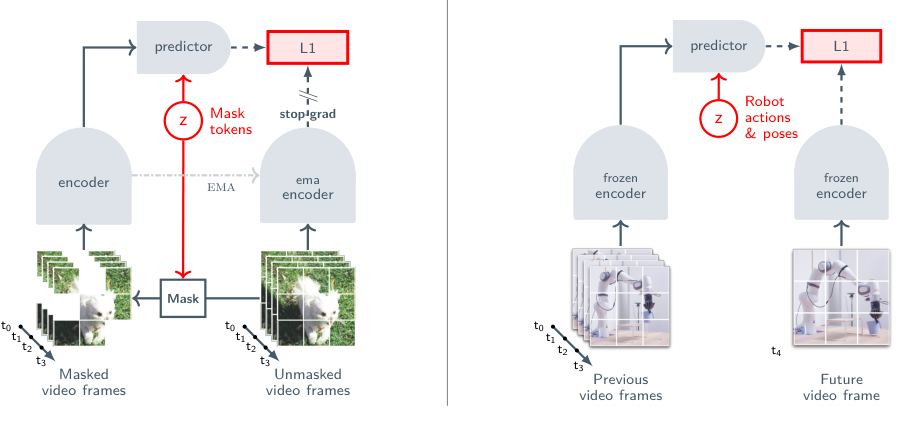

# V-JEPA 2：面向理解、预测与规划的自监督视频模型

V-JEPA 2先用大规模无动作网络视频学“哪些视觉变化是可预测的”，再用不到62小时DROID机器人数据学动作如何改变这个表示。它与视频扩散世界模型最直观的区别是：规划时不把每条候选动作解码成视频，只预测未来帧的潜表示，与目标图像表示计算距离。

> **主要方法图：** Figure 2，PDF第4页。左侧通过遮挡视频token、预测EMA encoder的表示做无监督预训练；右侧冻结编码器，用机器人图像、末端状态和动作训自回归动作条件predictor。来源：[原论文](https://arxiv.org/abs/2506.09985)。

## 两阶段训练中，网络视频和机器人数据各做什么

第一阶段将视频切成patch token后丢掉一部分，encoder只读剩余token，predictor根据可见上下文和mask位置预测被遮挡部分的目标表示；目标由encoder的EMA副本提供，用L1距离训练。此时模型不知道机器人动作。第二阶段冻结视频encoder，只训V-JEPA 2-AC predictor；它用block-causal attention根据过去帧表示、7维末端状态和动作，预测后续帧的表示。大规模视频提供物体与运动先验，小量机器人数据才提供可控性。

这里的“世界状态”是视频encoder给出的潜表示，不直接解码物体位姿、接触力或语言语义。动作条件是目标机械臂末端控制量，状态包含末端信息；因此AC predictor学习的是“在这类机器人接口下，某段动作会让视觉表示怎样变化”。换成本体或动作schema仍需新的动作条件数据，网络视频本身不能提供因果控制标签。

## 动作不是由模型一次直接输出

给定当前图像和一张目标图像，系统用CEM采样固定时域内的末端动作序列，让V-JEPA 2-AC预测它们导致的未来表示，以与目标表示的L1距离为代价反复筛选，只执行第一个动作后重规划。这是无任务奖励学习、以目标图像定义任务的MPC，不是一个语言条件行为克隆策略。

新相机帧会更新当前表示并触发下一轮CEM，因而环境反馈和重规划是显式的；模型没有把失败记成跨任务经验，也不会自动把“先开抽屉再取物”拆成长程步骤。目标图像距离还可能忽略触觉和遮挡状态，人形使用时更适合规划末端或技能级动作，再交给Loco-Manip与全身控制器验证可行性。

## 真机实验很有意义，但边界也很清楚

模型只用DROID中约23,000条、不区分成败的短轨迹后训练，随后零样本部署到两个新实验室的Franka上，用未标定单目RGB完成reach、grasp和pick-and-place。潜空间规划每步约16秒，已比对照的视频生成模型约4分钟快很多，仍远非高频反应控制。任务依赖明确目标图像、短规划时域和受限末端动作，还未支持语言目标、长时组合技能或人形全身接触。

复现应记录候选数、规划时域、每步延迟、潜距离与真实成功的相关性、目标图像选择规则和低层控制失败。只比较规划速度不能证明潜空间代价与物理任务一致。

## 原文与开源

[论文](https://arxiv.org/abs/2506.09985) · [官方页](https://ai.meta.com/vjepa/) · [代码](https://github.com/facebookresearch/vjepa2)
