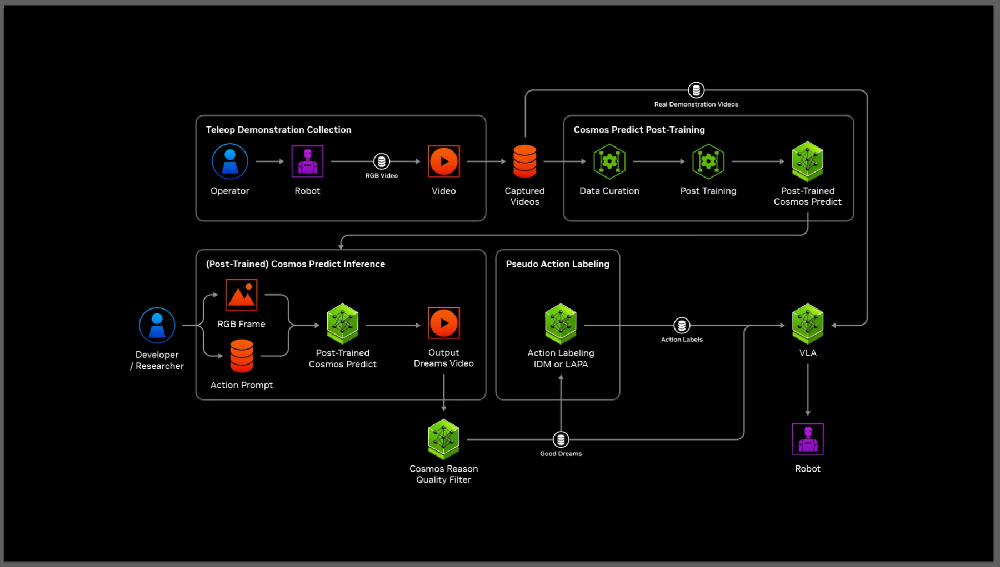

# GR00T-Dreams：面向人形机器人学习的合成轨迹生成

GR00T-Dreams是NVIDIA在2025年发布的一套blueprint/参考工作流，不是一篇单一模型论文。它的出发点是真机遥操太贵：先用少量某本体、某环境的真实示范教Cosmos这台机器人和任务的外观/运动，再用文字生成新场景和新动作视频，最后把合格视频反推成可训练的机器人动作。

> **主要方法图：** NVIDIA官方Figure 1，GR00T-Dreams blueprint architecture。链路包含真实遥操、世界模型后训练、视频生成、推理筛选、IDM动作标注和VLA后训练。来源：[NVIDIA技术博客](https://developer.nvidia.com/blog/enhance-robot-learning-with-synthetic-trajectory-data-generated-by-world-foundation-models/)。

## 五步管线中，每步在补哪个缺口

1. 先采集少量真实遥操轨迹，用来post-train Cosmos Predict-2，给世界模型注入目标机器人的外观、运动约束和环境。
2. 从一张初始图像和新语言指令生成大量2D视频“dreams”，扩展物体、背景和行为组合。
3. 用Cosmos Reason判断动作是否成功、场景是否合理，过滤明显失败或幻觉视频。
4. IDM读“前帧 + 后帧”，预测中间的3D动作段，把纯像素视频转成带动作标签的neural trajectory。
5. 将神经轨迹与真实数据共同训练或后训练VLA，再回到真机检验。

每条合成样本至少应保存初始图像、语言条件、生成视频、筛选分数、IDM动作块、目标本体schema和来源模型版本。只有视频而没有动作对齐，不能训练VLA；只有IDM动作而没有可追溯视频和筛选记录，也无法定位标签错误。合成数据与真实数据的batch比例、动作归一化和任务去重会直接影响后训练结果。

## 最容易被忽略的是IDM误差

视频看起来成功，不代表从两帧能唯一恢复动作。同一个末端位置变化可能对应不同关节轨迹、力量和接触历史，视频又可能隐藏遮挡和滑动。IDM如果在数据外反推出不可执行动作，会把视频幻觉转化为策略标签污染。因此真正可靠的管线需要不只用视觉语义筛选，还要检查动作限位、轨迹连续性、碰撞与真机小批量重放。

IDM输出通常仍是VLA可用的低频末端或关节动作段，最终执行依赖目标机器人的控制器。生成世界模型不在部署时替代WBC，也没有自动维护长任务记忆；它主要在训练前扩大候选轨迹。真实机器人结果应继续回流，标记哪些dream在视觉上合理却在接触或动力学上失败，再更新筛选器与IDM。

## 官方结果可以支持到哪一层

NVIDIA报告该工作流用36小时生成数据支持GR00T N1.5开发，并展示Fourier GR-1、Franka和SO-100上的操作结果。这说明世界模型 + 筛选 + IDM是可实施的数据扩展路线，但当前主要证据来自供应商官方技术页与关联工作，不应将“生成数据数量”直接当成真实等价数据量。评估必须回到同等真实示范预算下的真机成功率、覆盖度和失败类型。

最关键的对照是固定真实数据预算，分别训练真实数据、真实加未筛选合成、真实加语义筛选、真实加物理/动作筛选四组；只有最后增益稳定，才能说明数据管线而非单纯训练量在起作用。

## 官方来源

[技术博客与管线说明](https://developer.nvidia.com/blog/enhance-robot-learning-with-synthetic-trajectory-data-generated-by-world-foundation-models/)
