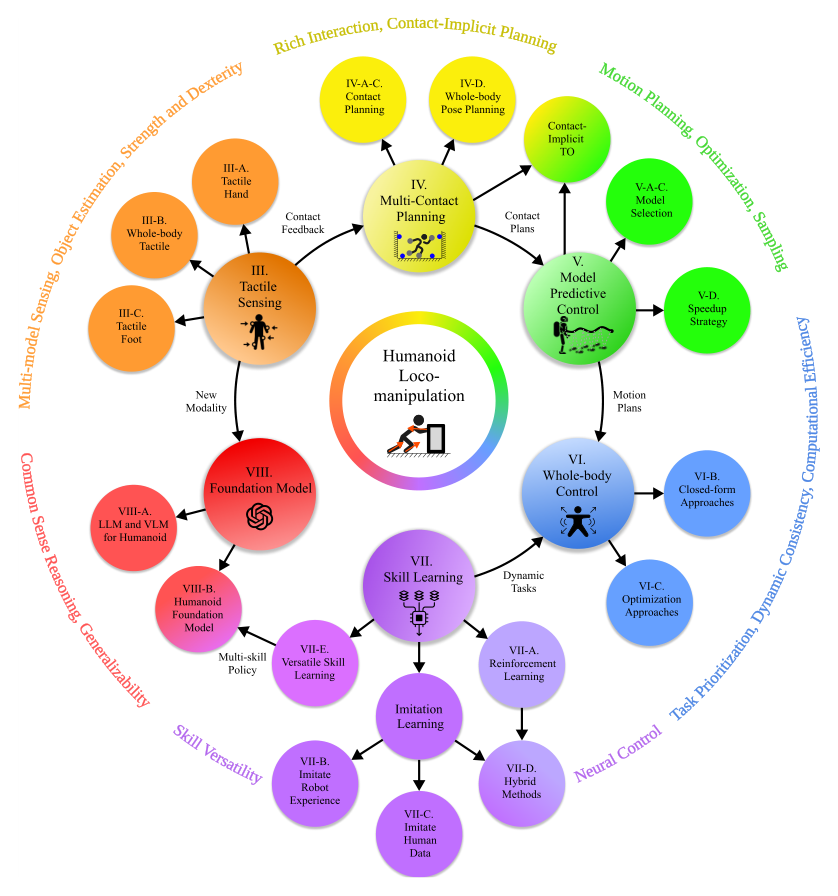

# Humanoid Loco-Manipulation Survey：人形运动与操作的控制、规划与学习综述

这篇综述的价值不在于给出一个新算法，而是把长期分散在接触规划、运动规划、MPC/WBC、强化学习、模仿学习、基础模型和触觉感知中的工作放到一条系统链上。它还做了一个重要澄清：移动操作关心机器人边移动边操作，whole-body manipulation关心如何把手、胸、腿等所有可用表面变成接触，whole-body loco-manipulation则同时要求两者。

> **综述框架图：** Figure 2，PDF第3页。中间是人形loco-manipulation任务，两条方法主线分别是模型规划/控制与学习式技能/基础模型，全身触觉作为接触闭环的潜在缺口。来源：[原论文](https://arxiv.org/abs/2501.02116)。

## 传统链路是怎样分层的

接触规划决定什么时候用哪只脚、哪只手或身体哪个部位接触什么；运动规划/最优控制在这些模式下求身体、物体和力的轨迹；MPC在短视界内持续重规划；WBC用较高频率将轨迹变成满足动力学、接触锥和关节限制的力矩/位置命令。高保真模型带来约束可解释性，也带来接触组合爆炸和在线计算压力；这就是为什么实际系统常用形心MPC + 局部全身控制的预测-反应层级。

## 学习方法并没有与模型方法形成二选一

RL能在仿真里通过大量试错学到扰动恢复和难手工设计的动态行为，但高维、稀疏奖励的loco-manip纯探索成本高；模仿学习用人类或规划器示范缩小搜索空间，但又受重定向、物理可行性和数据覆盖限制。综述明确指出，sim-to-real RL仍依赖仿真动力学模型，它与模型控制不矛盾。更有希望的组合是：规划/约束给结构和安全边界，学习策略处理模型误差、鲁棒性和高维经验。

## 为什么综述把触觉单独拎出来

全身loco-manip中，许多关键状态不能从视觉和关节编码器可靠推断：手掌是否即将滑移、胸部接触承受多大法向/切向力、脚底压力中心是否已越界。全身触觉可用于接触检测、力估计、模式切换和反应控制，但目前传感器耐久性、校准、带宽、覆盖面积与统一控制架构都不成熟。这一缺口说明仅扩大视觉-语言模型并不会自动解决接触交互。

## 读完这篇应该留下的判断表

对任何loco-manip系统，至少问五件事：谁选接触序列？谁同时规划机器人和物体？低层用什么频率保持平衡与约束？视觉不可见的接触怎样观测？失败时能否在线重规划而非继续播放轨迹？只有展示“边走边拿”而没回答这些问题，不足以证明形成了可泛化的全身移动操作系统。

还应把实验证据拆成四层：仿真中是否改变了物体状态，真机是否在闭环感知下完成，物体位姿或动力学变化后是否仍成功，失败后是否能检测并重试。输入端要注明物体状态来自真值、视觉、触觉还是本体历史；输出端要注明是末端目标、全身轨迹、关节位置还是力矩。这样才能把只做规划、只做控制和已经形成完整系统的工作放在同一张表中比较。

综述也提醒读者不要用“端到端”掩盖接口：即使视觉策略直接输出动作，底层仍存在执行器、接触保护和状态估计；即使模型控制约束清楚，上层也仍需感知与任务语义。真正成熟的路线通常是责任边界明确、失败信息可以向上回流，而不是所有模块都消失。

## 原文

[论文](https://arxiv.org/abs/2501.02116)
